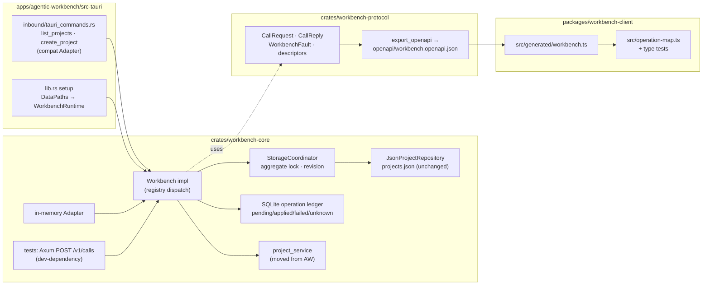

# Implementation Plan: Workbench Seam 도입 (서버-클라이언트 전환 1a)

**Branch**: `037-workbench-seam` | **Date**: 2026-09-26 | **Spec**: [spec.md](spec.md)

**Input**: Feature specification from `/specs/037-workbench-seam/spec.md`

**Note**: This template is filled in by the `/speckit-plan` command. See `.specify/templates/plan-template.md` for the execution workflow.

## Summary

AW의 Tauri command 71개를 한 번에 바꾸지 않고, 정본 설계([서버-클라이언트 전환 조사](../../docs/client-server-architecture-research.md))가 권한 **깊은 `Workbench` 인터페이스(`call`·`events`)** 를 `crates/workbench-protocol`(계약)과 `crates/workbench-core`(구현)로 신설한다. 프로젝트 도메인 하나만 core로 옮겨 `project.list`·`project.create`·`system.describe` 세 operation을 통과시키고, 기존 `list_projects`/`create_project` Tauri command는 같은 `Workbench.call`을 쓰는 얇은 호환 어댑터로 바꾼다. 변경 요청은 `rusqlite`(WAL) operation ledger에 **intent-first**(`pending` → JSON 원자 저장 → `applied`)로 기록해 멱등성·중단 복구·동시성을 보장하고, 계약 정의에서 OpenAPI 3.1과 TypeScript 타입을 생성해 커밋하며 CI가 drift를 잡는다. 프론트엔드·저장 형식·운영 HTTP 노출은 바꾸지 않는다.



## Technical Context

**Language/Version**: Rust 1.98.1(로컬), CI `rustup stable`; TypeScript 5.x, Node 22

**Primary Dependencies**: 기존 — `tauri` 2, `serde`/`serde_json`, `tokio` 1.52, `axum` 0.7, `tower-http` 0.5, `uuid`, `chrono`. 신규 — `utoipa` 5.x(`preserve_order`), `async-trait` 0.1, `rusqlite` 0.40(`bundled`), `sha2` 0.10, `thiserror` 2; `openapi-typescript` 7.13.0(devDep). 상세는 [research.md](research.md) 정리표.

**Storage**: `projects.json`(기존 형식·위치 유지, temp+rename 원자 저장; 읽기 경로는 쓰지 않고 `.bak` 복구는 aggregate lock 안에서만) + `<app_data_dir>/workbench/ledger.sqlite`(신규, WAL, 단일 writer 연결; `schema_version`·`operation_ledger`·`aggregate_revision`)

**Testing**: `cargo test --workspace --all-targets`(contract suite는 `crates/workbench-core/tests/`), `cargo clippy -- -D warnings`, `cargo fmt --check`; `pnpm check-types`, `vitest`(타입 테스트 `*.test-d.ts`); CI drift 단계 `pnpm generate:contracts && git diff --exit-code`

**Target Platform**: macOS Apple Silicon 데스크톱(현재 릴리스 기준). SQLite `bundled`로 Windows/Linux 컴파일 경로는 유지하되 검증 범위 밖

**Project Type**: Tauri desktop app + Cargo workspace crates + pnpm workspace package

**Performance Goals**: `project.list` in-memory 호출 p95 5ms 미만(수동 벤치), 사용자 체감 +50ms 이내(SC-001); `project.create` 응답까지 ledger 2 commit + JSON 1 write

**Constraints**: 프론트엔드 파일 변경 0(FR-014); `projects.json` 형식 불변(FR-002·FR-011); Tauri command 시그니처·오류 문구 불변; 운영 빌드에 HTTP 포트 없음; 의존성 major 업그레이드 없음

**Scale/Scope**: operation 3개, Tauri command 2개 교체(+`update_project`/`delete_project` 저장 배선만 조정), 신규 crate 2개, 신규 package 1개, 신규 테이블 3개, contract fixture 약 12개

## Constitution Check

*GATE: Must pass before Phase 0 research. Re-check after Phase 1 design.*

- **Monorepo Boundary First** — **PASS**. 재사용 Rust는 `crates/workbench-protocol`·`crates/workbench-core`, 재사용 TS는 `packages/workbench-client`, 앱 전용 배선은 `apps/agentic-workbench/src-tauri`에 둔다. 앱 간 직접 import 없음. 공유 crate의 소비자는 지금 AW 하나지만, 헌장 I의 "common fixture/test가 재사용성을 검증"하는 조건을 `crates/workbench-protocol/fixtures/` + 세 Adapter 공통 contract suite가 충족한다(spec Constitution Alignment). 정본 설계가 서버·CLI·TUI 소비자를 예정하고 있다.
- **Feature-Sliced Frontend Architecture** — **N/A**. 프론트엔드 변경 없음. `packages/workbench-client`는 생성 타입과 `operation-map.ts`만 담고 어떤 앱도 import하지 않는다.
- **Hexagonal Tauri Backend Architecture** — **PASS**. core crate 내부도 `domain`(Project, ProjectDraft, ProjectError, ProjectRepository port)·`application`(project_service, Workbench 구현·dispatch·authorization·idempotency)·`infrastructure`(JsonProjectRepository, SqliteOperationLedger, StorageCoordinator)·`ports`(OperationLedger, AggregateLock trait)로 나눈다. `domain`·`ports`는 Tauri·파일시스템·rusqlite에 의존하지 않는다. Tauri command는 `ProjectInput → CallRequest` 변환과 `CallReply → Result<_, String>` 변환만 하고 저장·업무 로직을 갖지 않는다. protocol crate는 `ports`를 두지 않고 wire 타입만 갖는다. AW 앱은 기존 관례대로 top-level `ports` 모듈을 쓰므로, core crate도 top-level `ports`를 쓴다(헌장 III의 "일관된 위치").
- **Shared Core Before Shared UI** — **PASS**. 공유는 계약·core만이다. UI 공유 없음.
- **Atomic Cross-App Verification** — **PASS**. `crates/*` 변경의 소비자는 `apps/agentic-workbench/src-tauri`뿐이다. 검증: `cargo test -p workbench-protocol -p workbench-core -p agentic-workbench`, `cargo clippy --workspace --all-targets -- -D warnings`. `packages/workbench-client`는 소비자가 없으므로 자체 `check-types`·`test`로 끝난다. hushline·ask-code는 `packages/agent-client`를 쓰고 이 패키지는 건드리지 않는다.
- **Documentation and Storybook** — **PASS**. `docs/workbench-seam.md`(신규, 한국어, Mermaid: 세 경로와 Seam, intent-first 상태 전이)와 `docs/client-server-architecture-research.md`에 1a 완료 상태 각주를 추가한다. Storybook 대상 없음.
- **Testing and Safety** — **PASS**. 순수 로직(입력 정규화·지문·상태 전이·Fault 매핑·authorization)은 유닛 테스트, 세 Adapter는 fixture 기반 contract suite, ledger는 crash point 주입 테스트(R6), 동시성은 R12 테스트, revision 영속성은 `revision_retention`(R5), 복구 쓰기의 직렬화는 `recovery_under_lock`(R14). 파일 접근은 `DataPaths`가 정한 앱 데이터 디렉터리 아래 두 파일로 한정되고 사용자 프로젝트 디렉터리에 쓰지 않는다. 모든 호출은 `AuthenticatedPrincipal`을 요구하며 입력으로 위조할 수 없다(R7).

**Gate 결과**: 위반 없음. Complexity Tracking 불필요.

## Project Structure

### Documentation (this feature)

```text
specs/037-workbench-seam/
├── plan.md              # This file
├── research.md          # Phase 0 output
├── data-model.md        # Phase 1 output
├── quickstart.md        # Phase 1 output
├── contracts/
│   ├── workbench-call.md          # call/reply/fault, 세 operation, 테스트 HTTP 경로
│   └── tauri-compat-commands.md   # 불변 Tauri command 계약과 오류 매핑
├── checklists/requirements.md
└── tasks.md             # Phase 2 output (/speckit-tasks — NOT created by /speckit-plan)
```

### Source Code (repository root)

```text
crates/workbench-protocol/                 # 신규: wire 계약만 (Tauri·저장 의존 없음)
├── Cargo.toml                             # serde, serde_json, utoipa(preserve_order), async-trait, thiserror
├── src/
│   ├── lib.rs
│   ├── call.rs                            # CallRequest, CallReply, RequestId, IdempotencyKey, OperationId
│   ├── fault.rs                           # WorkbenchFault, FaultCode, Outcome
│   ├── principal.rs                       # AuthenticatedPrincipal, PrincipalKind, Scope
│   ├── descriptor.rs                      # OperationDescriptor, OperationKind, Effect, DescribeOutput
│   ├── workbench.rs                       # #[async_trait] trait Workbench { call, events }, EventStream(placeholder)
│   ├── operations/
│   │   ├── mod.rs                         # 정적 registry 목록 → oneOf 조립
│   │   ├── project.rs                     # ProjectListInput/Output, ProjectCreateInput/Output, Project DTO
│   │   └── system.rs                      # SystemDescribeInput/Output
│   ├── openapi.rs                         # utoipa OpenApi + registry로 CallRequest oneOf 조립
│   └── bin/export_openapi.rs              # openapi.json을 stdout으로 (결정적 출력)
├── openapi/workbench.openapi.json         # 커밋되는 생성물
└── fixtures/                              # contract suite 공용 시나리오 JSON
    ├── project-list-*.json
    ├── project-create-*.json
    ├── system-describe-*.json
    └── fault-*.json

crates/workbench-core/                     # 신규: Workbench 구현
├── Cargo.toml                             # workbench-protocol, rusqlite(bundled), sha2, tokio, async-trait, thiserror
│                                          # [dev] axum 0.7, reqwest, tempfile, tokio(macros)
├── src/
│   ├── lib.rs                             # pub use WorkbenchRuntime, DataPaths, InMemoryWorkbench
│   ├── domain/
│   │   ├── project.rs                     # Project, ProjectDraft (AW에서 이동)
│   │   └── project_error.rs               # ProjectError (Display = 기존 문구)
│   ├── ports/
│   │   ├── project_repository.rs          # ProjectRepository (AW에서 이동, 오류 타입만 ProjectError로)
│   │   ├── operation_ledger.rs            # OperationLedger trait: begin/complete/fail/find/reconcile
│   │   └── aggregate_lock.rs              # AggregateLock trait (coordinator가 구현)
│   ├── application/
│   │   ├── project_service.rs             # list/create/update/delete (AW에서 이동, ProjectError 반환)
│   │   ├── authorization.rs               # scope 검사, describe 필터
│   │   ├── idempotency.rs                 # 정규화·지문·상태 전이 규칙(순수)
│   │   ├── registry.rs                    # OperationId → handler 매핑, 입력 스키마 검증
│   │   ├── handlers/{project_list,project_create,system_describe}.rs
│   │   └── workbench_runtime.rs           # Workbench impl: authz → validate → ledger → handler → reply
│   └── infrastructure/
│       ├── data_paths.rs                  # DataPaths { app_data_dir } + projects_file()/ledger_file()
│       ├── json_store.rs                  # AW json_store 기반. load는 읽기 전용(손상 → PrimaryCorrupt), recover_from_backup은 lock 안 temp+rename (R14)
│       ├── json_project_repository.rs     # JsonProjectRepository::new(&DataPaths)
│       ├── sqlite_ledger.rs               # SqliteOperationLedger: migration, WAL pragma, 단일 연결
│       └── storage_coordinator.rs         # aggregate Mutex(읽기·쓰기·복구 공통) + revision 캐시(aggregate_revision 테이블)
└── tests/
    ├── support/{mod,http_harness,fixtures}.rs
    ├── contract_suite.rs                  # in-memory + HTTP에 같은 fixture
    ├── ledger_crash_points.rs             # R6 세 지점 중단·재시작·reconcile
    ├── concurrency.rs                     # R12
    ├── revision_retention.rs              # R5: TTL GC·재시작 뒤 revision 연속성, stale expectedRevision 거절
    ├── recovery_under_lock.rs             # R14: 손상 primary + 동시 read/create, 복구가 mutation을 덮지 않음
    └── list_latency.rs                    # R13 (#[ignore])

apps/agentic-workbench/src-tauri/src/
├── lib.rs                                 # setup: DataPaths → WorkbenchRuntime → app.manage(Arc<...>)
├── inbound/
│   ├── tauri_commands.rs                  # list_projects/create_project → compat 함수 호출; update/delete는 runtime의 repository 사용
│   └── workbench_compat.rs                # 신규: ProjectInput→CallRequest, CallReply/Fault→Result<_,String>, desktop principal
├── application/project_service.rs         # 삭제 (core로 이동)
├── domain/{project,project_repository}.rs # 삭제 (core로 이동), re-export 필요 시 `pub use workbench_core::domain::project::*`
└── infrastructure/json_project_repository.rs  # 삭제 (core로 이동)

packages/workbench-client/                 # 신규: 생성 타입 골격
├── package.json                           # generate, check-types, test; devDeps openapi-typescript, vitest, typescript
├── tsconfig.json
└── src/
    ├── index.ts                           # export type * from "./generated/workbench"; export * from "./operation-map"
    ├── generated/workbench.ts             # 커밋되는 생성물
    ├── operation-map.ts                   # OperationMap 조건부 타입, call<K> 시그니처 타입
    └── operation-map.test-d.ts            # 상관 타입 컴파일 테스트

docs/
├── workbench-seam.md                      # 신규
└── client-server-architecture-research.md # 1a 완료 각주

.github/workflows/quality.yml              # generate:contracts + git diff --exit-code 단계
package.json                               # "generate:contracts" 스크립트
Cargo.toml                                 # 변경 없음 (crates/* glob)
```

**Structure Decision**: 정본이 정의한 배포 단위 중 037에 필요한 `workbench-protocol`·`workbench-core`·`packages/workbench-client`만 만든다(grill 결정 1). `workbench-server`는 3단계, `workbench-client` Rust crate는 6단계. 프로젝트 도메인은 AW에서 core로 **이동**하며(grill 결정 2) AW에는 compat 함수와 조립부만 남는다. 다른 9개 `Json*Repository`는 그대로 두고 038에서 같은 방식으로 옮긴다(R4).

## Complexity Tracking

> Constitution Check에 위반이 없어 비어 있다.

| Violation | Why Needed | Simpler Alternative Rejected Because |
|-----------|------------|-------------------------------------|
| — | — | — |

## Phase 0: Research — 완료

[research.md](research.md)에서 R1~R13을 결정했다. Technical Context에 NEEDS CLARIFICATION 항목은 남지 않았다. 핵심 결정: OpenAPI `oneOf`는 registry에서 프로그램적으로 조립하고 `discriminator` object를 쓰지 않는다(R1); `rusqlite` 0.40 bundled + 단일 writer 연결(R2); `async-trait`(R3); `DataPaths`는 프로젝트 저장소에만 적용하고 `update_project`/`delete_project`도 runtime의 같은 repository·lock을 쓰게 배선만 바꾼다(R4); aggregate revision은 만료되지 않는 `aggregate_revision` 테이블에 `applied`와 같은 트랜잭션으로 보존(R5, 리뷰 반영); intent-first 6단계와 reconciler 규칙(R6); 저장 파일 `.bak` 복구는 읽기 경로에서 분리해 aggregate lock 안에서만 수행하고 query도 같은 lock을 잡음(R14, 리뷰 반영); principal 2종(R7); HTTP harness는 core dev-deps(R8); `ProjectError` Display가 기존 문구 보존(R9); fixture 공유로 세 경로 동일성 검증(R10); 생성물 커밋 + CI drift(R11).

## Phase 1: Design — 완료

- [data-model.md](data-model.md): Operation·CallRequest/Reply·Fault·Principal·Ledger row·Aggregate revision과 SQLite DDL, 상태 전이.
- [contracts/workbench-call.md](contracts/workbench-call.md): `Workbench.call` wire 계약, 세 operation의 input/output, Fault 코드 부분집합, 멱등성 규칙, 테스트 HTTP 경로.
- [contracts/tauri-compat-commands.md](contracts/tauri-compat-commands.md): 불변 Tauri command 시그니처, Fault→String 매핑, 보존할 문구.
- [quickstart.md](quickstart.md): 빌드·테스트·drift 검사·수동 확인 절차.
- Agent context 갱신 스크립트(`update-agent-context.sh`)는 이 저장소 `.specify/scripts/bash/`에 없어 건너뛴다. AGENTS.md·CLAUDE.md 변경도 필요 없다.

### Constitution Check — 설계 후 재평가

- **Monorepo Boundary First** — PASS 유지. data-model·contracts가 crate 경계와 일치한다. `workbench-core`의 `json_store.rs`는 AW `infrastructure/json_store.rs`의 복제다. 038에서 나머지 저장소가 옮겨 오면 AW 쪽을 삭제해 중복이 해소된다(임시 중복, tasks에 후속 표시).
- **Hexagonal Tauri Backend Architecture** — PASS 유지. `ports/`에 trait과 시그니처 타입만, `infrastructure/`에 rusqlite·파일 구현. `workbench_compat.rs`는 `inbound/`에 두고 변환만 한다.
- **Atomic Cross-App Verification** — PASS 유지. quickstart의 검증 명령이 세 crate와 AW를 모두 포함한다.
- **Testing and Safety** — PASS 유지. contracts에 authorization 시나리오와 crash point 시나리오가 명시됐다.
- 나머지 항목은 설계로 달라지지 않았다.

## 리스크와 대응

| 리스크 | 대응 |
|---|---|
| utoipa 5 `ToSchema` 출력이 `openapi-typescript`에서 판별 union으로 읽히지 않음 | **해소(2026-09-26 실측)**: registry 순회로 조립한 `oneOf`가 openapi-typescript 7.13.0에서 판별 union으로 생성됨. `json!` 대안 불필요. newtype만 수동 `PartialSchema`(research R1 spike 결과) |
| `rusqlite` bundled 첫 빌드가 CI 시간을 늘림 | **실측**: 로컬 Apple Silicon debug에서 core 의존성 포함 약 11초. 캐시 단계 불필요 |
| `update_project`/`delete_project`가 037 범위 밖인데 저장 경로가 바뀜 | 배선만 바꾸고 기존 단위 테스트를 유지해 동작 동일성 확인. 계약(operation)은 만들지 않음 |
| `project-{nanos}` id를 `pending` 전에 예약하므로 시계 역행 시 충돌 가능 | 기존과 동일한 생성 규칙 유지(형식 호환). ledger `reserved_resource_id` unique 제약으로 충돌을 오류로 드러냄 |
| reconciler가 readiness 전에 돌아 앱 기동을 늦춤 | `pending` row 수는 정상 운영에서 0~수 건. 기동 시간 측정을 quickstart 수동 항목에 포함 |

## Codex adversarial review 반영 (2026-09-26)

| 지적 | 결함 | 반영 |
|---|---|---|
| TTL GC가 revision의 근거를 지움 (high) | revision을 `MAX(operation_ledger.revision)`으로 유도했는데 24h 뒤 GC·재시작이 이를 0으로 되돌려 stale `expectedRevision`이 통과 | `aggregate_revision` 테이블(만료 없음)을 `applied`와 같은 트랜잭션으로 갱신. grill 결정 4를 수정(spec Assumptions 반영). `revision_retention` 테스트 추가. research R5 재작성 |
| lock 없는 읽기가 stale backup을 덮어씀 (high) | AW `json_store::load_json`이 읽기 경로에서 `fs::copy(.bak → primary)`를 lock 없이 수행. 동시 create의 성공 결과를 늦은 복구가 덮을 수 있음 | core `json_store`는 `load`(읽기 전용)와 `recover_from_backup`(lock 안, temp+rename) 분리. 모든 읽기가 aggregate lock을 잡음. contract §3 규칙 5 수정. `recovery_under_lock` 테스트 추가. research R14 신설 |

2회차(구현 후, 2026-09-26):

| 지적 | 결함 | 반영 |
|---|---|---|
| 저장 뒤 ledger `complete` 실패를 `notApplied`로 보고 (high) | JSON 저장 성공 후 SQLite `complete`가 실패하면 일반 오류 분기가 row를 `failed`로 닫고 `notApplied`를 반환. reconciler는 `pending`만 보므로 저장된 프로젝트가 영구히 "적용 안 됨"으로 남고, 같은 키 재시도는 거짓 실패, 새 키는 중복 생성 | `Locked::SavedButUnconfirmed` 분기 신설: `fail()`을 호출하지 않고 row를 `pending`으로 남기며 `unavailable` + `outcome: unknown`(retryable) 응답. 재시작 시 reconciler가 `applied`로 확정. `test-hooks`에 `FailPoint::LedgerComplete` 추가, `ledger_complete_failure_after_save_is_reported_unknown_and_reconciled` 테스트 |
| 구조 무효 JSON을 "정상"으로 판정해 복구 불가 (medium, 회귀) | `recover_from_backup`이 primary·backup을 `serde_json::Value`로만 검증해 `[{"id":"x"}]` 같은 파일을 healthy로 봄. AW 원본은 typed `T`로 파싱했음 | `recover_from_backup<T: DeserializeOwned>`로 바꿔 `load`와 같은 타입(`Vec<Project>`)으로 primary·backup을 검증. `recovery_shape_tests` 3개 추가 |
| 200 응답 스키마가 `project.list` 결과(배열)를 거절 (medium) | `CallReply.Complete.output`이 `value_type = Object` → 생성물 `{"type":"object"}`, TS `Record<string, never>` | `output`·`input`·`body`를 `value_type = Value`(임의 JSON)로. golden 테스트 `generic_reply_envelope_accepts_any_output_and_uses_camel_case`, TS test-d `toBeUnknown()` 추가 |
| (점검 중 추가 발견) `Accepted.execution_id`가 snake_case로 생성 | serde `rename_all_fields`를 utoipa derive가 인식하지 않음 | variant 단위 `#[serde(rename_all = "camelCase")]`로 교체 → 생성물 `executionId`. 같은 golden 테스트로 고정 |

## 038 이후로 넘기는 것

- 나머지 Tauri command 이관, 나머지 9개 `from_app` 저장소의 `DataPaths` 전환, AW `json_store.rs` 삭제(이관 시 R14의 load/recover 분리를 각 저장소에 적용 — 현재 AW 원본은 같은 결함을 가진다)
- `project.update`/`project.delete` operation과 stale-revision 시나리오의 실제 사용자 경로
- outbox 테이블(2단계 migration v2), `events` 구현(037은 시그니처와 `unsupported` 응답만)
- 실제 토큰 발급·검증, Host/Origin/CORS(3단계)
