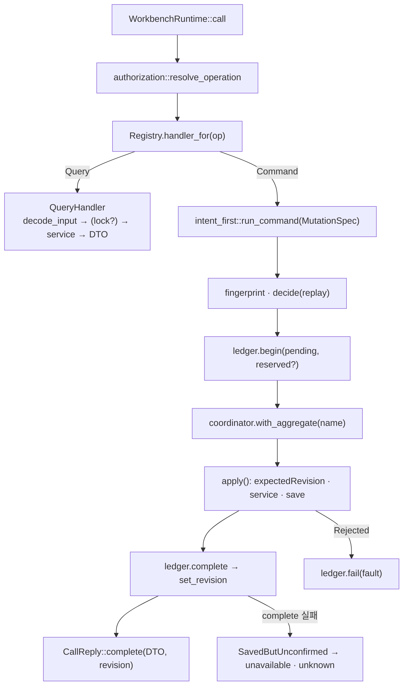

# Data Model: 나머지 도메인의 Workbench 이관 (1b)

**Spec**: [spec.md](spec.md) | **Research**: [research.md](research.md) | **Glossary**: [`crates/workbench-core/CONTEXT.md`](../../crates/workbench-core/CONTEXT.md)

037 [data-model.md](../037-workbench-seam/data-model.md)의 계약 봉투(`CallRequest`/`CallReply`/`WorkbenchFault`/principal/ledger DDL)는 변경 없이 그대로다. 여기서는 038이 **추가**하는 것만 적는다.

## 1. 계약 확장 — `workbench-protocol`

### OperationId (32)

기존 `project.list`·`project.create`·`system.describe` + 아래 29개. serde 이름은 spec FR-001 표와 같다.

| 도메인 | 조회 | 변경 |
|---|---|---|
| project | — | `project.update`, `project.delete` |
| savedPrompt | `savedPrompt.list` | `savedPrompt.create`, `savedPrompt.update`, `savedPrompt.delete` |
| goal | `goal.get` | `goal.create`, `goal.update`, `goal.clear`, `goal.recordProgress` |
| agentRunSettings | `agentRunSettings.get` | `agentRunSettings.save` |
| git | `git.listRemotes`, `git.listBranches`, `git.listWorktrees` | `git.createWorktree`, `git.deleteWorktree` |
| worktree | `worktree.listChanges`, `worktree.getChanges`, `worktree.getFileDiff`, `worktree.listFiles`, `worktree.readTextFile`, `worktree.listHistory`, `worktree.getGraph`, `worktree.getCommitDetail`, `worktree.getCommitFileDiff` | — |
| agent | `agent.list`, `agent.listProviderSessions` | — |

### Scope (13)

기존 3 + `savedPrompt:read`·`savedPrompt:write`·`goal:read`·`goal:write`·`agentRunSettings:read`·`agentRunSettings:write`·`git:read`·`git:write`·`worktree:read`·`agent:read`. `desktop()` = 전부(operation 32개), `test_readonly()` = 모든 `:read` + `system:describe`(조회 19개 = 038 조회 17 + `project.list` + `system.describe`; 변경 13개 제외).

### OperationSpec 표 (`operations/mod.rs`)

| operation | kind | effect | idempotent | scopes |
|---|---|---|---|---|
| 조회 17개 | Query | Read | false | 해당 `:read` |
| 변경 12개 | Command | Modify | true | 해당 `:write` |

### input / output 타입 (`operations/{project,saved_prompt,goal,agent_run_settings,git,worktree,agent}.rs`)

최상위 input은 `deny_unknown_fields`, 중첩 DTO는 원본 serde 속성 유지(R2). `null` 출력은 `EmptyOutput`(schema `type: "null"`).

| operation | input | output |
|---|---|---|
| `project.update` | `ProjectUpdateInput { id, name, workingDirectory, description? }` | `ProjectDto` |
| `project.delete` | `ProjectDeleteInput { id }` | `null` |
| `savedPrompt.list` | `{}` | `SavedPromptDto[]` |
| `savedPrompt.create` | `SavedPromptCreateInput { label, prompt }` | `SavedPromptDto` |
| `savedPrompt.update` | `SavedPromptUpdateInput { id, label, prompt }` | `SavedPromptDto` |
| `savedPrompt.delete` | `SavedPromptDeleteInput { id }` | `null` |
| `goal.get` | `GoalGetInput { workingDirectory }` | `GoalDto \| null` |
| `goal.create` | `GoalCreateInput { workingDirectory, objective, tokenBudget? }` — **upsert**: 같은 worktree의 기존 목표(진행 포함)를 교체 | `GoalDto` |
| `goal.update` | `GoalUpdateInput { workingDirectory, objective?, status?, tokenBudget?: number \| null }` — `tokenBudget`은 3상태(없음/`null`/값), 원본 `Option<Option<usize>>`와 같은 serde 처리 | `GoalDto` |
| `goal.clear` | `GoalClearInput { workingDirectory }` | `null` |
| `goal.recordProgress` | `GoalRecordProgressInput { workingDirectory, tokensUsed, timeUsedSeconds }` | `GoalDto` |
| `agentRunSettings.get` | `AgentRunSettingsGetInput { workingDirectory }` | `AgentRunSettingsDto \| null` |
| `agentRunSettings.save` | `AgentRunSettingsSaveInput { settings: AgentRunSettingsDto }` | `AgentRunSettingsDto` |
| `git.listRemotes` | `GitListRemotesInput { workingDirectory }` | `GitRemoteDto[]` |
| `git.listBranches` | `GitListBranchesInput { workingDirectory }` | `GitBranchDto[]` |
| `git.listWorktrees` | `GitListWorktreesInput { workingDirectory, includeStatus? }` | `GitWorktreeDto[]` |
| `git.createWorktree` | `GitCreateWorktreeInput { workingDirectory, path, branch?, reference? }` (`path` 빈 문자열 허용 → 서버 기본값) | `null` |
| `git.deleteWorktree` | `GitDeleteWorktreeInput { workingDirectory, path }` | `null` |
| `worktree.listChanges` | `WorktreeListChangesInput { workingDirectory }` | `WorktreeChangeDto[]` |
| `worktree.getChanges` | `WorktreeGetChangesInput { workingDirectory }` | `GitWorktreeChangesDto` |
| `worktree.getFileDiff` | `WorktreeGetFileDiffInput { workingDirectory, path }` | `GitWorktreeFileDiffDto` |
| `worktree.listFiles` | `WorktreeListFilesInput { workingDirectory, scope?: WorktreeFileListScopeDto }` | `WorktreeFileEntryDto[]` |
| `worktree.readTextFile` | `WorktreeReadTextFileInput { workingDirectory, path }` | `WorktreeTextFileDto` |
| `worktree.listHistory` | `WorktreeListHistoryInput { workingDirectory, maxCount?, offset?, cursor? }` | `GitCommitHistoryDto` |
| `worktree.getGraph` | `WorktreeGetGraphInput { workingDirectory, maxCount?, offset?, cursor? }` | `GitCommitGraphDto` |
| `worktree.getCommitDetail` | `WorktreeGetCommitDetailInput { workingDirectory, commitHash }` | `GitCommitDetailDto` |
| `worktree.getCommitFileDiff` | `WorktreeGetCommitFileDiffInput { workingDirectory, commitHash, path }` | `GitFileDiffDto` |
| `agent.list` | `{}` | `AgentDescriptorDto[]` |
| `agent.listProviderSessions` | `AgentListProviderSessionsInput { agentId, cwd? }` | `ProviderSessionDto[]` |

### DTO 미러 목록 (R1)

원본과 필드·serde 속성이 같다. wire 동일성 테스트 대상.

| DTO | 원본 | 필드 |
|---|---|---|
| `SavedPromptDto` | AW `SavedPrompt` | `id`, `label`, `prompt` |
| `GoalDto`, `GoalStatus` | AW `ThreadGoal`, `GoalStatus` | `workingDirectory`, `objective`, `status`, `tokenBudget?`, `tokensUsed`, `timeUsedSeconds`, `createdAt`, `updatedAt` |
| `AgentRunSettingsDto`, `AgentCommandOverridesDto`, `AgentProfileDto`, `AgentRunSettingsRalphLoopDto`, `AgentRunSessionMode`, `PermissionMode`, `ContextSizePreset` | AW `AgentRunSettings`…, acp-agent-core `PermissionMode`·`ContextSizePreset` | 원본 29 필드 그대로(`serde(default)` 유지) |
| `GitRemoteDto` / `GitBranchDto` | AW | 각 3 필드 |
| `GitWorktreeDto`, `GitWorktreeStatus` | AW `GitWorktree` | `path`, `head?`, `branch?`, `status`, `pruneReason?`, `canDelete` |
| `WorktreeChangeDto`, `WorktreeChangeType` | AW `WorktreeChange` | `path`, `oldPath?`, `changeType`, `binary`, `diff?`, `content?`, `truncated` |
| `GitWorktreeChangesDto`, `GitChangedFileDto`, `GitChangedFileGroup`, `GitWorktreeFileDiffDto` | git-core | 원본 그대로 |
| `WorktreeFileEntryDto`, `WorktreeTextFileDto`, `WorktreeFileListScopeDto`, `WorktreeFileListKind` | AW | 원본 그대로(`scope.kind` default `all`) |
| `GitCommitHistoryDto`, `GitCommitPageDto`, `GitCommitSummaryDto` | git-core | 원본 그대로 |
| `GitCommitGraphDto`, `GitGraphCommitDto`, `GitGraphLayoutHintsDto`, `GitGraphRefDto`, `GitGraphRefKind` | git-core | 원본 그대로 |
| `GitCommitDetailDto`, `GitCommitFileChangeDto`, `GitFileDiffDto` | git-core | 원본 그대로 |
| `AgentDescriptorDto`, `AgentOptionDescriptorDto` | acp-agent-core | `id`, `label`, `command`, `runtimeVersion?`, `models`, `efforts`, `contextSizes` |
| `ProviderSessionDto` | AW `ProviderSession` | `agentId`, `id`, `cwd?`, `title?`, `file`, `messageCount`, `createdAt?`, `updatedAt?`, `model?`, `branch?`, `source?` |

## 2. 도메인 타입 — `workbench-core/domain` (AW에서 이동)

| 모듈 | 타입 | 규칙(서비스 이동 시 유지) |
|---|---|---|
| `saved_prompt` | `SavedPrompt`, `SavedPromptDraft` | `label`·`prompt` trim 후 필수("Button label is required." / "Prompt is required."), id `saved-prompt-{nanos}`(기존 형식) |
| `goal` | `ThreadGoal`, `GoalStatus`, `GoalDraft`, `GoalUpdate`, `GoalProgressUpdate` | `workingDirectory`·`objective` 필수, 진행 기록은 saturating add, 예산 초과 시 상태 전이(기존 로직) |
| `agent_run_settings` | `AgentRunSettings`, `AgentCommandOverrides`, `AgentProfile`, `AgentRunSettingsRalphLoop`, `AgentRunSessionMode`, `AgentCommandSource`, `CommandResolutionResult` | built-in 프로필 최소 1개 활성, ralph loop 상한(`MAX_RALPH_*`) |
| `git_remote`, `git_branch`, `git_worktree` | `GitRemote`, `GitBranch`, `GitWorktree`, `GitWorktreeStatus`, `GitWorktreeCreateDraft` | `Working directory is required.` / `Worktree path is required.`; branch 기본 `worktree-{nanos:x}`, path 기본 `<parent>/<repoName>-worktrees/<branch>`(기존 `default_worktree_path`) |
| `worktree_change`, `worktree_file` | `WorktreeChange`, `WorktreeChangeType`, `WorktreeFileEntry`, `WorktreeTextFile`, `WorktreeFileListScope`, `WorktreeFileListKind` | 미리보기 512KB, 실제 경로 기준 root 검사, 숨김·제외 디렉터리 규칙 |
| `provider_session` | `ProviderSession`, `ProviderKind`, `SessionScope`, `provider_kind_for` | 상한 50, 손상 항목 건너뜀 |
| (재사용) | git-core `Git*`, acp-agent-core `AgentDescriptor`·`PermissionMode`·`ContextSizePreset` | 변경 없음 |

### 오류 enum (R7)

`SavedPromptError { Required(&'static str), NotFound, Storage(String), StoreCorrupt(String), Clock(String) }`, `GoalError { Required, NotFound, Storage, StoreCorrupt }`, `AgentRunSettingsError { Required, NoBuiltInProfile, Storage, StoreCorrupt }`, `GitError { Required(&'static str), GitNotFound(String), CommandFailed(String), Io(String), WorktreeNotFound, WorktreeHasChanges, StatusUnresolved, Unresolvable(&'static str), Clock(String) }`, `WorktreeFileError { Required, NotADirectory, OutsideWorktree, NotRegularFile, NotUtf8, NotFound(String), Io(String) }`, `ProviderSessionError { Storage(String) }` (구현 기준 2026-09-27 — `GitNotFound`는 오늘 문구를 싣고, 빈 `agentId`는 오류가 아니라 빈 목록이다). 각 `Display`는 §2 규칙 열의 문구. 각 enum에 `fault(&RequestId) -> WorkbenchFault` 매핑 함수(코드 표는 research R7).

## 3. 포트 — `workbench-core/ports`

기존 `ProjectRepository`, `OperationLedger`, `AggregateLock` + 이동: `SavedPromptRepository { load, save, recover_from_backup }`, `GoalRepository`, `AgentRunSettingsRepository`(오류 타입만 enum으로), `GitRemoteProvider`, `GitBranchProvider`, `GitWorktreeProvider`, `WorktreeChangeProvider`, `WorktreeFileProvider`, `WorktreeGitProvider`, `ProviderSessionRepository`(오류 `ProviderSessionError`). git-core의 `GitWorktreeStatusReader`·`GitHistoryReader`는 그대로 사용.

## 4. 저장 모델 — `workbench-core/infrastructure`

### 저장 파일 (형식·위치 불변)

| aggregate | 파일 (`DataPaths`) | 내용 |
|---|---|---|
| `projects` | `<app_data_dir>/projects.json` | `Project[]` |
| `saved-prompts` | `<app_data_dir>/saved-prompts.json` | `SavedPrompt[]` |
| `goals` | `<app_data_dir>/goals.json` | `ThreadGoal[]` |
| `agent-run-settings` | `<app_data_dir>/agent-run-settings.json` | `AgentRunSettings[]` |

전부 `JsonCollectionStore<T>`(R3): `load` 읽기 전용, `save` temp+rename+`.bak`, `recover_from_backup::<Vec<T>>` lock 안.

### ledger — schema v2 (R16, 2026-09-26 Codex 리뷰 반영)

새 컬럼 없음. `aggregate` 값에 위 4개와 동적 `git-worktrees:<canonical repo root>`가 들어간다.

**예약(`reserved_resource_id`)** (구현 기준 2026-09-27): 서버가 새 id를 만드는 생성(`project.create` → `project-*`, `savedPrompt.create` → `saved-prompt-*`), **삭제**(`project.delete`·`savedPrompt.delete`는 대상 id, `goal.clear`는 `workingDirectory`), 그리고 `git.createWorktree`·**`git.deleteWorktree`**(해석된 worktree 절대 경로 — 상대 경로는 `workingDirectory` 기준으로 절대화)가 값을 가진다. 삭제의 예약은 재시작 판정(대상 부재 = applied)의 증거이자 진행 중 같은 대상 변경과의 배제다. upsert(`goal.create`·`agentRunSettings.save`)·수정은 `NULL`. 예약은 **`pending` 동안만 배타**이고 종료 상태에서 해제된다(값은 증거로 남는다).

```sql
-- MIGRATION_V2 (v1 파일은 첫 기동에서 자동 승격)
DROP INDEX IF EXISTS operation_ledger_reserved;
CREATE UNIQUE INDEX IF NOT EXISTS operation_ledger_reserved_pending
  ON operation_ledger (aggregate, reserved_resource_id)
  WHERE reserved_resource_id IS NOT NULL AND state = 'pending';
INSERT INTO schema_version (version, applied_at) VALUES (2, <now>);
```

| 상태 전이 | 예약 |
|---|---|
| `begin` → `pending` | 잡음. 같은 (aggregate, 자원)에 `pending`이 있으면 `DuplicateReservation` |
| → `applied` / `failed` / `unknown` | 해제(index 조건에서 빠짐). 같은 자원의 다음 변경은 새 실행 |

`DuplicateReservation`: 서버 생성 id는 새 id로 3회 재시도, 호출자가 준 자원(삭제 대상 id·worktree 경로)은 `conflict` outcome `unknown` retryable.

### 재시작 판정 규칙 (R6)

| operation | pending → applied 조건 | 결과 JSON |
|---|---|---|
| `project.create`·`savedPrompt.create` | 예약 id가 파일에 있음(이 실행만 만들 수 있는 id) | 저장된 항목 DTO |
| `project.delete`·`savedPrompt.delete`·`goal.clear` | 대상이 파일에 없음 | `null` |
| `git.createWorktree` | 경로가 `git worktree list --porcelain`에 있음 | `null` |
| `git.deleteWorktree` | 경로가 목록에 없음(목록을 읽을 수 없거나 비면 `unknown`) | `null` |
| upsert 2개(`goal.create`는 같은 worktree의 기존 목표를 교체, `agentRunSettings.save`)·수정 4개 | — 관찰로 구별 불가 | 항상 `unknown` |

## 5. 실행 모델 — `workbench-core/application`



- `handlers/`: operation 32개 = 파일 32개(도메인별 디렉터리). 조회는 `project_list.rs` 형태, 변경은 `MutationSpec`을 만들어 `intent_first::run_command`에 넘긴다. `MutationSpec.reservation`은 `None`(upsert·수정·삭제) / `ServerGenerated(id 생성 closure)`(재시도 3회) / `CallerProvided(자원)`(충돌 시 즉시 `conflict` unknown) 셋 중 하나다(R16).
- `reconcilers/`: operation별 `Reconciler` 구현을 `build_registry`가 handler와 함께 등록, `bootstrap`이 `reconcile_pending`에서 `record.key.operation`으로 dispatch.
- `StorageCoordinator`: `with_aggregate`(R4), aggregate별 revision.

## 6. command 인벤토리 (71) — `docs/workbench-seam.md`로 복사

| # | command | 분류 | operation / 이유 |
|---|---|---|---|
| 1 | `list_projects` | 이관됨(037) | `project.list` |
| 2 | `create_project` | 이관됨(037) | `project.create` |
| 3 | `update_project` | 이관됨(038) | `project.update` |
| 4 | `delete_project` | 이관됨(038) | `project.delete` |
| 5–8 | `list/create/update/delete_saved_prompt(s)` | 이관됨(038) | `savedPrompt.*` |
| 9–13 | `get/create/update/clear_goal`, `record_goal_progress` | 이관됨(038) | `goal.*` |
| 14–15 | `get/save_agent_run_settings` | 이관됨(038) | `agentRunSettings.*` |
| 16–18 | `get_appearance_preferences`, `set_font_size_step`, `adjust_font_size_step` | 데스크톱 유지 | 클라이언트별 표현 상태(정본 배치표) |
| 19–20 | `get/save_worktree_workspace_layout` | 데스크톱 유지 | panel layout은 클라이언트별 표현 상태 |
| 21–25 | `list_git_remotes`, `list_git_branches`, `list_git_worktrees`, `create_git_worktree`, `delete_git_worktree` | 이관됨(038) | `git.*` |
| 26–36 | `list_worktree_changes`, `get_worktree_changes`, `get_worktree_file_diff`, `list_worktree_files`, `read_worktree_text_file`, `list_worktree_git_history`, `get_worktree_git_graph`, `get_worktree_commit_detail`, `get_worktree_commit_file_diff` | 이관됨(038) | `worktree.*` |
| 37–38 | `start/stop_worktree_watcher` | 2단계로 이연 | 창 label로 이벤트 대상 결정, Tauri 이벤트 발행 |
| 39 | `list_agents` | 이관됨(038) | `agent.list` |
| 40 | `list_agent_tool_command_candidates` | 2단계로 이연 | `window.label()`로 소유 run 결정 |
| 41 | `list_provider_sessions` | 이관됨(038) | `agent.listProviderSessions` |
| 42–44 | `open_external_url`, `open_worktree_window`, `open_settings_window` | 데스크톱 유지 | 네이티브 창·OS 셸(정본 배치표) |
| 45–51 | `start_agent_run`, `cancel_agent_run`, `send_prompt_to_run`, `steer_prompt_to_run`, `cancel_current_prompt_and_send_to_run`, `set_run_permission_mode`, `respond_agent_permission` | 2단계로 이연 | run 소유자 = 창 label, `TauriRunEventSink` |
| 52–55 | `sync_agent_workspace`, `send_agent_exchange`, `acknowledge_agent_exchange`, `list_agent_exchanges` | 2단계로 이연 | 창 label 기반 workspace registry, 이벤트 발행 |
| 56–73 | orchestration 18개 (`bootstrap_orchestration_workspace` … `recover_orchestration_workspace`) | 2단계로 이연 | 창 label·MCP 상태·메모리 journal 결합. 조회 2개(`list_recoverable_orchestration_workspaces`, `replay_orchestration_runtime_events`)도 도메인을 쪼개지 않기 위해 함께 이연 |

(합계: 이관됨 31 = 037 2 + 038 29, 이연 32, 유지 8. 위 초안의 묶음 연번은 정확하지 않다 — `lib.rs` 등록 순서 그대로 펼친 71행 정본은 [docs/workbench-seam.md](../../docs/workbench-seam.md#command-인벤토리-71).)

## 7. Tauri compat 매핑 (029 command)

각 command: `*Input`(기존 struct, `pub(crate)`) → `serde_json::Value` → `call_query`/`call_command` → `Out`. 오류는 `Fault.message`만. 시그니처·반환 타입은 [contracts/tauri-compat-commands.md](contracts/tauri-compat-commands.md).

## 8. TypeScript 생성 타입 — `packages/workbench-client`

`OperationId` 32개 union, `OperationMap` 32키. `index.ts`가 새 DTO 타입(`SavedPrompt`, `Goal`, `AgentRunSettings`, `GitRemote`, `GitBranch`, `GitWorktree`, `WorktreeChange`, `GitWorktreeChanges`, `WorktreeFileEntry`, `WorktreeTextFile`, `GitCommitHistory`, `GitCommitGraph`, `GitCommitDetail`, `GitFileDiff`, `AgentDescriptor`, `ProviderSession`)을 re-export. test-d: 32키 정확성, 도메인별 대표 상관 타입, `null` 출력(`goal.get` → `Goal | null`), `@ts-expect-error` 3건.
