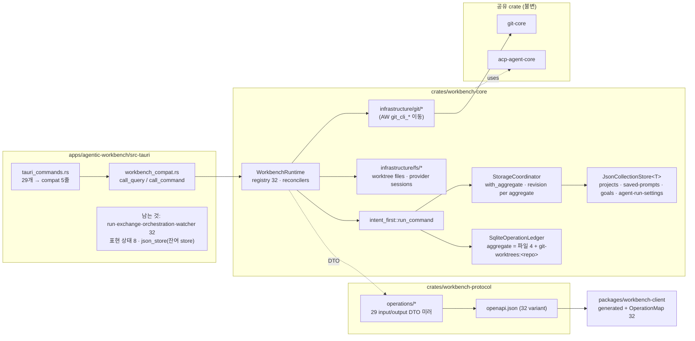

# Implementation Plan: 나머지 도메인의 Workbench 이관 (서버-클라이언트 전환 1b)

**Branch**: `038-workbench-domains` | **Date**: 2026-09-26 | **Spec**: [spec.md](spec.md)

**Input**: Feature specification from `/specs/038-workbench-domains/spec.md`

**Note**: This template is filled in by the `/speckit-plan` command. See `.specify/templates/plan-template.md` for the execution workflow.

## Summary

037이 프로젝트 도메인에 만든 `Workbench` Seam 뒤로 **29개 Tauri command**(프로젝트 수정·삭제, saved prompt, goal, agent 실행 설정, Git·worktree·파일 조회, worktree 생성·삭제, agent catalog·provider 세션)를 도메인 단위로 옮긴다. 도메인 모델·규칙·포트·JSON/Git/파일 어댑터는 `workbench-core`로 이동하고, wire DTO 29 operation분은 `workbench-protocol`에 미러로 정의해 OpenAPI·TS 타입을 재생성한다. 변경 12개는 `project_create.rs`에서 추출한 **intent-first 공통 runner**를 거치고, 재시작 판정은 서버가 id를 만드는 생성=예약 id 증거·삭제/Git=종료 상태·upsert(`goal.create` 포함)/수정=불명 규칙을 따른다. ledger는 schema v2로 올려 자원 예약을 `pending` 동안만 배타로 바꾼다(Codex 리뷰 반영). 이벤트·창 정체에 묶인 32개는 2단계로 이연하고 표현 상태 8개는 데스크톱에 남기며, 71개 전부의 분류를 `docs/workbench-seam.md` 인벤토리로 고정한다. 프론트엔드·저장 형식·운영 HTTP 노출은 바꾸지 않는다.



## Technical Context

**Language/Version**: Rust 1.98.1(로컬), CI `rustup stable`; TypeScript 5.x, Node 22

**Primary Dependencies**: 037 그대로(`utoipa` 5, `rusqlite` 0.40 bundled, `async-trait`, `sha2`, `thiserror` 2, `openapi-typescript` 7.13). `workbench-core`에 추가: `git-core`(path), `acp-agent-core`(path), `anyhow`, `walkdir`(research R11). major 업그레이드 없음.

**Storage**: 저장 파일 4개(`projects.json`·`saved-prompts.json`·`goals.json`·`agent-run-settings.json`, 형식·위치 불변, `JsonCollectionStore<T>` — load 읽기 전용, 복구는 lock 안) + `workbench/ledger.sqlite`(**schema v2**: 예약 unique index를 `state = 'pending'` 한정 partial index로 교체, v1 파일은 첫 기동에서 자동 승격; 컬럼 변경 없음, aggregate 값이 늘어남). 사용자 Git 저장소·파일시스템은 읽기(+worktree 생성·삭제)만.

**Testing**: `cargo test --workspace --all-targets`(contract suite fixture ≈ 90개 × in-memory·HTTP, crash point, 동시성, git 재시작 판정, wire 동일성), `cargo clippy -- -D warnings`, `cargo fmt --check`; `pnpm check-types`, vitest test-d; CI drift 단계(기존)

**Target Platform**: macOS Apple Silicon 데스크톱. Git CLI 필수(오늘과 같음)

**Project Type**: Tauri desktop app + Cargo workspace crates + pnpm workspace package

**Performance Goals**: 조회·변경 모두 사용자 체감 +50ms 이내(SC-001). 변경은 ledger 2 commit + JSON 1 write(037 `project.create`와 같은 자릿수). Git 조회는 오늘과 같이 `spawn_blocking`.

**Constraints**: 프론트엔드 파일 변경 0(FR-013); 저장 파일 형식 불변(FR-002); Tauri command 시그니처·오류 문구 불변(contracts); `git-core`·`acp-agent-core` 변경 없음(grill Q6); 운영 HTTP 없음; 32개 command·8개 표현 상태 command는 손대지 않음

**Scale/Scope**: operation +29(총 32), scope +10(총 13), Tauri command 29개 교체, DTO 미러 약 45 타입, 도메인 이동 파일 약 30개(domain 9·port 10·service 10·adapter 7), 삭제되는 AW 파일 약 30개, fixture 약 75개 추가, 문서 2건 갱신

## Constitution Check

*GATE: Must pass before Phase 0 research. Re-check after Phase 1 design.*

- **Monorepo Boundary First** — **PASS**. 이동 대상은 전부 `crates/workbench-core`(재사용 Rust)로 가고 AW에는 compat와 조립부만 남는다. `crates/git-core`·`crates/acp-agent-core`는 소비만 하며 확장하지 않는다(grill Q6, [`docs/adr/0002`](../../docs/adr/0002-git-adapters-live-in-workbench-core.md)). 앱 간 import 없음. 공유 crate의 소비자는 AW 하나지만 037과 같이 protocol fixture + 세 경로 contract suite가 재사용성을 검증한다.
- **Feature-Sliced Frontend Architecture** — **N/A**. 프론트엔드 변경 없음(`git diff --stat origin/main -- apps/agentic-workbench/src` = 0이 완료 조건).
- **Hexagonal Tauri Backend Architecture** — **PASS**. core 안에서 `domain`(모델·오류 enum)·`ports`(저장소·provider trait, 시그니처 타입만)·`application`(서비스·handler·intent-first runner·reconciler)·`infrastructure`(JSON store, git CLI, fs, sqlite)를 유지한다. AW `ports/`에서 `provider_session_repository`가, AW `domain/`에서 `*_repository`·`*_provider` 9개가 core `ports/`로 모여 "포트는 한 곳" 규칙이 오히려 강화된다. Tauri command는 입력 변환→`Workbench.call`→결과 변환만 한다(FR-002). AW `domain/mod.rs`는 이동한 모듈을 `pub use workbench_core::domain::*`로 재노출해 남은 코드(run·orchestration이 `AgentRunSettings`·`ProviderSession`을 참조)의 import 경로를 유지한다.
- **Shared Core Before Shared UI** — **PASS**. 공유는 core·계약만. UI 공유 없음.
- **Atomic Cross-App Verification** — **PASS**. `crates/workbench-*` 변경의 소비자는 AW 하나: `cargo test -p workbench-protocol -p workbench-core -p agentic-workbench` + `cargo clippy --workspace --all-targets -- -D warnings`. `git-core`·`acp-agent-core`는 바뀌지 않으므로 git-explorer·hushline 재검증은 해당 없음(변경 0을 `git diff --stat origin/main -- crates/git-core crates/acp-agent-core`로 확인). `packages/workbench-client`는 소비자 없음, 자체 `check-types`·`test`.
- **Documentation and Storybook** — **PASS**. `docs/workbench-seam.md` 갱신(상태·인벤토리 71·적용 절차·Mermaid 갱신), `docs/client-server-architecture-research.md` 각주. 도메인 문서(`CONTEXT-MAP.md`, `crates/workbench-core/CONTEXT.md`, ADR 3건)는 grill에서 작성 완료. Storybook 대상 없음.
- **Testing and Safety** — **PASS**. 순수 로직(정규화·지문·상태 전이·오류 매핑·DTO 변환)은 유닛 + wire 동일성 fixture; 세 경로는 contract suite; ledger는 crash point·`FailPoint` 주입; 파일 접근은 `fs::canonicalize` 기반 root 검사·512KB 상한·UTF-8 처리를 core 어댑터에 그대로 이동(fixture `outside-worktree`·`truncated`·`non-utf8`로 고정); 앱 데이터 쓰기는 `DataPaths` 4파일 + ledger로 한정; 사용자 저장소 쓰기는 `git worktree add/remove/prune`만. run/session/permission owner 검증은 이 범위에 없음(2단계).

**Gate 결과**: 위반 없음. Complexity Tracking 불필요.

## Project Structure

### Documentation (this feature)

```text
specs/038-workbench-domains/
├── plan.md                                # This file
├── research.md                            # R1~R15
├── data-model.md                          # 계약 확장·DTO·도메인·저장·재시작 판정·인벤토리 71
├── quickstart.md                          # 검증 절차
├── contracts/
│   ├── workbench-operations.md            # 29 operation 계약, fixture 형식, crash 시나리오
│   └── tauri-compat-commands.md           # 불변 command 29개와 변환 규칙
├── checklists/requirements.md
└── tasks.md                               # /speckit-tasks 출력 (이 명령이 만들지 않음)
```

### Source Code (repository root)

```text
crates/workbench-protocol/
├── src/
│   ├── call.rs                            # OperationId +29, ALL = 32
│   ├── principal.rs                       # Scope +10, desktop()/test_readonly() 갱신
│   ├── operations/
│   │   ├── mod.rs                         # OPERATIONS 32, schema_for 32
│   │   ├── project.rs                     # + ProjectUpdateInput, ProjectDeleteInput
│   │   ├── saved_prompt.rs                # 신규: inputs + SavedPromptDto
│   │   ├── goal.rs                        # 신규: inputs(tokenBudget 3상태) + GoalDto, GoalStatus
│   │   ├── agent_run_settings.rs          # 신규: inputs + AgentRunSettingsDto 및 중첩 DTO, PermissionMode, ContextSizePreset
│   │   ├── git.rs                         # 신규: git.* inputs + GitRemoteDto, GitBranchDto, GitWorktreeDto
│   │   ├── worktree.rs                    # 신규: worktree.* inputs + WorktreeChange/File/Git DTO 미러(git-core 15)
│   │   ├── agent.rs                       # 신규: AgentListProviderSessionsInput + AgentDescriptorDto, ProviderSessionDto
│   │   └── common.rs                      # 신규: EmptyOutput(null), nullable helper
│   └── openapi.rs                         # 변경 없음(registry 순회); 골든 테스트가 32 variant 확인
├── openapi/workbench.openapi.json         # 재생성·커밋
└── fixtures/                              # +≈75: saved-prompt-*, goal-*, agent-run-settings-*, git-*, worktree-*, agent-*, system-describe-* 갱신

crates/workbench-core/
├── Cargo.toml                             # + git-core, acp-agent-core, anyhow, walkdir
├── CONTEXT.md                             # (grill에서 작성) 용어 변경 시 갱신
├── docs/adr/0001-end-state-reconciliation-for-external-side-effects.md
├── src/
│   ├── domain/
│   │   ├── saved_prompt.rs · goal.rs · agent_run_settings.rs        # AW에서 이동
│   │   ├── git_remote.rs · git_branch.rs · git_worktree.rs           # AW에서 이동
│   │   ├── worktree_change.rs · worktree_file.rs · provider_session.rs
│   │   └── errors/{saved_prompt,goal,agent_run_settings,git,worktree_file,provider_session}_error.rs   # thiserror, Display = 기존 문구
│   ├── ports/
│   │   ├── saved_prompt_repository.rs · goal_repository.rs · agent_run_settings_repository.rs   # + recover_from_backup
│   │   ├── git_remote_provider.rs · git_branch_provider.rs · git_worktree_provider.rs
│   │   ├── worktree_change_provider.rs · worktree_file_provider.rs · worktree_git_provider.rs
│   │   └── provider_session_repository.rs
│   ├── application/
│   │   ├── saved_prompt_service.rs · goal_service.rs · agent_run_settings_service.rs   # AW에서 이동, 오류 enum
│   │   ├── git_remote_service.rs · git_branch_service.rs · git_worktree_service.rs
│   │   ├── worktree_changes_service.rs · git_worktree_changes_service.rs · worktree_file_service.rs · worktree_git_service.rs
│   │   ├── list_provider_sessions.rs
│   │   ├── intent_first.rs                # 신규: MutationSpec, run_command (project_create에서 추출)
│   │   ├── dto.rs                         # 신규: 도메인 ↔ protocol DTO 변환 + wire_parity 테스트
│   │   ├── reconcilers/{mod,json_create,json_delete,git_worktree}.rs   # 신규: Reconciler trait + 규칙 3종
│   │   ├── handlers/
│   │   │   ├── project/{update,delete}.rs
│   │   │   ├── saved_prompt/{list,create,update,delete}.rs
│   │   │   ├── goal/{get,create,update,clear,record_progress}.rs
│   │   │   ├── agent_run_settings/{get,save}.rs
│   │   │   ├── git/{list_remotes,list_branches,list_worktrees,create_worktree,delete_worktree}.rs
│   │   │   ├── worktree/{list_changes,get_changes,get_file_diff,list_files,read_text_file,list_history,get_graph,get_commit_detail,get_commit_file_diff}.rs
│   │   │   ├── agent/{list,list_provider_sessions}.rs
│   │   │   └── mod.rs                     # build_registry: handler 32 + reconciler 등록
│   │   └── workbench_runtime.rs           # bootstrap: 저장소 4개·Adapters 조립, reconcile dispatch
│   └── infrastructure/
│       ├── data_paths.rs                  # + saved_prompts_file, goals_file, agent_run_settings_file
│       ├── json_collection_store.rs       # 신규: generic load/save/recover (json_store 위)
│       ├── json_saved_prompt_repository.rs · json_goal_repository.rs · json_agent_run_settings_repository.rs
│       ├── storage_coordinator.rs         # with_aggregate, revision per aggregate, 상수 4개, git aggregate 이름 함수
│       ├── sqlite_ledger.rs               # SCHEMA_VERSION = 2, MIGRATION_V2(예약 index pending 한정), v1→v2 승격
│       ├── git/{cli_remote_provider,cli_branch_provider,cli_worktree_provider,cli_worktree_change_provider,cli_worktree_git_provider}.rs   # AW git_cli_* 이동, GitError
│       └── fs/{worktree_file_provider,provider_session_repository}.rs   # AW fs_* 이동
└── tests/
    ├── support/{fixtures,git_repo,http_harness,mod}.rs   # + Seed 확장, git_repo 빌더, {{repo}} 치환
    ├── contract_suite.rs                  # 변경 없음(fixture 자동 로드)
    ├── ledger_crash_points.rs             # + 038 시나리오 6
    ├── concurrency.rs                     # + 저장 단위별 20건, git 동시 생성
    ├── revision_retention.rs · recovery_under_lock.rs   # aggregate 4개로 확장
    ├── git_reconcile.rs                   # 신규: 종료 상태 규칙
    ├── reservation_lifecycle.rs           # 신규: 예약 해제(만들고 지우고 다시 만들기·실패 뒤 재시도·동시 생성·v1 승격)
    └── list_latency.rs                    # + 3 operation

apps/agentic-workbench/src-tauri/src/
├── inbound/
│   ├── tauri_commands.rs                  # 29개 본문 → compat 호출; *Input struct는 유지(pub(crate))
│   └── workbench_compat.rs                # call_query / call_command generic, 변환 함수, fixture 테스트
├── domain/mod.rs                          # 이동한 9 모듈 → pub use workbench_core::domain::*
├── ports/mod.rs                           # provider_session_repository 제거(재노출)
├── application/mod.rs · infrastructure/mod.rs   # 이동한 모듈 제거
├── infrastructure/perf_log.rs             # + log_async_command
├── 삭제: domain/{saved_prompt,goal,agent_run_settings,git_remote,git_branch,git_worktree,worktree_change,worktree_file,provider_session,*_repository,*_provider}.rs(git_worktree_changes.rs·worktree_git.rs 재노출은 core 경유로 유지)
│        application/{saved_prompt,goal,agent_run_settings,git_*,worktree_*,list_provider_sessions}*.rs
│        infrastructure/{json_saved_prompt,json_goal,json_agent_run_settings}_repository.rs, git_cli_*.rs, fs_worktree_file_provider.rs, fs_provider_session_repository.rs
└── infrastructure/json_store.rs           # 유지(appearance·orchestration·session window·layout·acp session 저장소가 사용)

packages/workbench-client/src/
├── generated/workbench.ts                 # 재생성·커밋
├── operation-map.ts                       # 새 DTO alias
├── operation-map.test-d.ts                # 32키·도메인 상관 타입·nullable
└── index.ts                               # re-export 추가

docs/
├── workbench-seam.md                      # 상태·범위·인벤토리 71·절차
└── client-server-architecture-research.md # 038 완료 각주
```

**Structure Decision**: 037이 만든 두 crate와 패키지 안에서 **도메인별 디렉터리**(handlers/, infrastructure/git/, infrastructure/fs/, operations/*.rs)로 늘린다. 새 crate·새 패키지는 만들지 않는다(grill Q6: `workbench-git` 분리 기각). AW는 compat와 남은 32+8개 command, 그리고 잔여 store가 쓰는 `json_store.rs`만 갖는다.

## Complexity Tracking

> Constitution Check에 위반이 없어 비어 있다.

| Violation | Why Needed | Simpler Alternative Rejected Because |
|-----------|------------|-------------------------------------|
| — | — | — |

## Phase 0: Research — 완료

[research.md](research.md) R1~R16. Technical Context에 NEEDS CLARIFICATION 없음. 핵심: protocol DTO 미러 + wire 동일성 테스트(R1); 최상위 input만 `deny_unknown_fields`(R2); generic `JsonCollectionStore<T>` + 도메인별 port(R3); `with_aggregate`와 동적 `git-worktrees:<repo>` aggregate, Git 변경은 `expectedRevision` 거절(R4); intent-first runner 추출 후 기존 037 테스트 무수정 통과로 행위 보존 증명(R5); 재시작 판정 3규칙 — 서버 생성 id의 생성=예약 id 증거, 삭제·Git=종료 상태, upsert·수정=불명(R6, Codex 리뷰로 `goal.create`를 upsert로 재분류); 오류 enum·FaultCode 표(R7); fixture `gitRepo` seed와 `{{repo}}` 치환(R8); scope 10개(R9); compat generic + perf 로그 유지(R10); core 의존 추가(R11); Git·파일 조회는 lock 없음(R12); 예약은 `pending` 동안만 배타 — ledger schema v2(R16, Codex 리뷰 반영).

## Phase 1: Design — 완료

- [data-model.md](data-model.md): OperationId 32·Scope 13·OperationSpec, input/output 표, DTO 미러 목록, 이동 도메인·오류 enum, 포트, 저장 모델(aggregate 4 + 동적), 재시작 판정 표, 실행 모델 Mermaid, **command 인벤토리 71**, compat·TS 생성 타입.
- [contracts/workbench-operations.md](contracts/workbench-operations.md): 공통 규칙 7, operation별 scope/kind/실패 코드, 보존 문구 골든, fixture 형식과 필수 집합, crash 시나리오 6.
- [contracts/tauri-compat-commands.md](contracts/tauri-compat-commands.md): 불변 시그니처 29, 변환 규칙, perf 로그, 검증.
- [quickstart.md](quickstart.md): 8절 검증 절차(수동 확인 10항목 포함).
- Agent context 갱신 스크립트는 이 저장소에 없어 건너뛴다(037과 같음). CLAUDE.md·AGENTS.md 변경 불필요.

### Constitution Check — 설계 후 재평가

- **Monorepo Boundary First** — PASS 유지. 037 plan이 "임시 중복"으로 표시한 core `json_store.rs`↔AW `json_store.rs`는 038 뒤에도 남는다: AW 쪽은 이관하지 않는 5개 저장소(appearance·orchestration·session window state·layout·acp session)가 쓴다. 이 잔여 중복은 2단계(orchestration 이관)와 표현 상태 저장소 정리에서 해소되며, tasks에 후속 표시한다.
- **Hexagonal Tauri Backend Architecture** — PASS 유지. AW `domain/mod.rs` 재노출은 import 경로 호환용이며 AW에 로직을 남기지 않는다. `ports/`에 trait과 시그니처 타입만.
- **Atomic Cross-App Verification** — PASS 유지. quickstart §1이 세 crate와 AW를 모두 포함하고 §8이 공유 crate 변경 0을 확인한다.
- **Testing and Safety** — PASS 유지. contracts §4에 안전 규칙 fixture(`outside-worktree`·`truncated`·`non-utf8`)와 §6 crash 시나리오가 명시됐다.
- 나머지 항목은 설계로 달라지지 않았다.

## 리스크와 대응

| 리스크 | 대응 |
|---|---|
| DTO 미러 45개의 serde 속성이 원본과 어긋나 wire가 바뀜 | `dto::wire_parity` 테스트가 도메인 값 → JSON과 DTO → JSON을 비교(None/Some/default/빈 컬렉션 포함). input은 AW `*Input`과 같은 JSON으로 역직렬화 확인 |
| `agentRunSettings.save` 입력에 `deny_unknown_fields`가 프론트 여분 필드로 실패 | R2: 최상위 봉투만 엄격, 중첩 `AgentRunSettingsDto`는 원본 관용 규칙 유지. 프론트 TS `AgentRunSettings` 타입의 필드 집합을 fixture로 고정 |
| intent-first runner 추출이 `project.create` 행위를 바꿈 | 리팩터링 먼저, 037 crash point·동시성·멱등성 테스트를 **수정 없이** 통과시킨 뒤 새 handler 추가 |
| Git fixture의 커밋 해시가 환경마다 다름 | 고정 author/committer/날짜로 결정적 생성(R8). 그래도 다른 값(`modifiedMs`)은 `ignoreFields` |
| 수정·upsert operation의 재시작 판정이 항상 `unknown` | 좁은 창(JSON 저장 뒤 확정 전)에 한정, 사용자는 재조회로 실제 상태 확인. `goal.create`도 교체 semantics라 여기에 속함(Codex 리뷰 반영, R6) |
| `worktree.readTextFile` 등 사용자 파일 접근이 core로 가며 검증이 약화 | 어댑터 코드를 그대로 이동(변경 최소), 탈출·상한·UTF-8 fixture로 고정 |
| `git.createWorktree`가 같은 경로 동시 생성 시 예약 충돌 | 호출자가 준 경로는 재시도 없이 `conflict` outcome `unknown` retryable(R16). 테스트 `reservation_lifecycle::concurrent_same_path` |
| ledger v1→v2 승격이 실패하거나 기존 행을 깨뜨림 | 승격은 index 교체와 버전 행 삽입만(행 데이터 불변). v1 DDL로 만든 파일 fixture로 승격 테스트(R16 (d)). 실패 시 `BootstrapError`로 기동 중단 — 조용히 v1로 동작하지 않음 |
| 32 operation의 openapi.json 크기·생성 시간 | 로컬 실측을 tasks에 포함. 문제 시 `openapi-typescript` 옵션 조정(생성물 형식은 유지) |
| perf 로그 손실로 007 진단 회귀 | `log_async_command`로 `run_ms` 유지(R10) |

## Codex adversarial review 반영 (2026-09-26, 설계 단계)

| 지적 | 결함 | 반영 |
|---|---|---|
| 예약이 종료 뒤에도 배타적 (high) | v1 index `operation_ledger_reserved`는 상태와 무관하게 non-null 예약 전부에 unique. 재사용되는 자원 식별자(worktree 경로, 초안의 goal `workingDirectory`)를 예약하면 `applied`·`failed`는 24h GC 전까지, `unknown`은 영구히 같은 자원의 정당한 다음 변경을 `DuplicateReservation`으로 막음. 3회 재시도로는 해소 불가 | **R16 신설**: 예약은 `pending` 동안만 배타 — schema v2로 index를 `state = 'pending'` 한정 partial index로 교체, v1 파일 자동 승격. `DuplicateReservation`은 자원 출처로 분기(서버 id 재시도 / 호출자 경로는 `conflict` unknown retryable). `tests/reservation_lifecycle.rs` 4 시나리오. data-model §4·contracts 규칙 8·crash 시나리오 4건 추가 |
| 기존 goal이 교체 적용의 증거가 아님 (high) | `goal_service::create_goal`은 같은 worktree의 기존 목표를 `retain`으로 지우고 새 목표를 넣는 **교체**. 이관 전부터 있던 목표가 "goal이 있으면 applied" 규칙을 만족해, begin 뒤 저장 전 중단된 교체가 `applied`로 판정되고 이전 목표가 성공 결과로 재생됨 | **R6 수정**: `goal.create`를 upsert로 재분류 — 예약 없음, 재시작 판정 항상 `unknown`. 판정 표·contracts §2·규칙 9·crash 시나리오(기존 G1 + 다른 objective, AfterPending → unknown, 파일은 G1 유지) 추가. 지문·`createdAt` 대조 대안은 같은 objective 재설정을 구별 못해 기각 |

## 039(2단계) 이후로 넘기는 것

- run 8·exchange 4·orchestration 18·watcher 2 command 이관(`window_label` 분해, 이벤트 봉투와 함께, [`docs/adr/0001`](../../docs/adr/0001-defer-event-bound-commands-to-stage-2.md))
- AW `json_store.rs`와 잔여 5개 저장소의 load/recover 분리(orchestration은 2단계에서 이동, 표현 상태 저장소는 데스크톱 로컬로 별도 정리)
- 수정 operation의 재시작 판정 개선(저장이 SQLite로 갈 때)
- `worktree change` 이벤트(watcher)와 `worktree.getChanges`의 replay 계약
