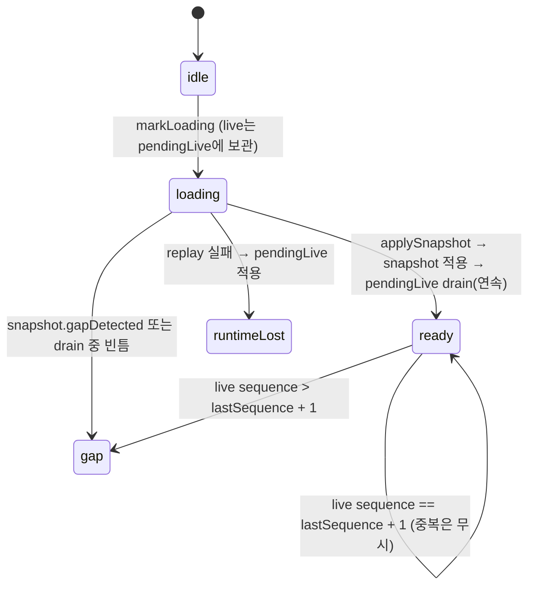

# Data Model: 039 이벤트 모델 통합 (2a)

용어는 [`crates/workbench-core/CONTEXT.md`](../../crates/workbench-core/CONTEXT.md) "이벤트" 절. 결정 근거는 [research.md](research.md).

## 1. protocol 타입 (`crates/workbench-protocol`)

| 타입 | 필드 | 비고 |
|---|---|---|
| `StreamCursor` (기존) | `streamId`, `epoch`, `afterSequence` | 알림용 스트림은 `afterSequence` 무시 |
| `Subscription` (기존) | `cursors: StreamCursor[]` | 최대 64개 |
| `EventEnvelope` (기존) | `eventId`, `streamId`, `epoch`, `sequence`, `schema`, `occurredAt`, `correlationId?`, `body` | `sequence`는 스트림 안에서 1부터 1씩 증가 |
| `GapNotice` (신규) | `streamId`, `epoch`(현재), `reason`, `firstSequence?`, `lastSequence?` | reason: `unknownStream`·`evicted`·`epochChanged`·`retentionExceeded`·`subscriberLagged`·`shutdown` |
| `EventItem` (신규) | `{ kind: "event", event }` \| `{ kind: "gap", gap }` | `EventStream`의 항목 |
| `EventStream` (교체) | `futures_core::Stream<Item = EventItem>` 래퍼 | drop = 구독 해제 |
| `EventFrame` (신규) | `hello{protocolVersion, epoch}` \| `subscribe{cursors}` \| `event{event}` \| `gap{…GapNotice}` \| `fault{fault}` | 테스트 WS·3단계 운영 WS 공용 |
| `EventSchemaDescriptor` (신규) | `schema`, `streamKind`, `class`(`state`\|`notification`), `requiredScopes` | `system.describe.eventSchemas` |
| `DescribeOutput` (확장) | + `epoch`, + `eventSchemas` | additive |
| `Scope` (확장) | + `run:read` | 14개. desktop·test_readonly 모두 보유 |

### 이벤트 스키마 registry (`events::EVENT_SCHEMAS`)

| schema | streamKind | class | 본문 DTO | 구독 가능(039) |
|---|---|---|---|---|
| `run.event.v1` | `run` | state | `RunEventDto`(acp-agent-core `RunEvent` 미러, 14 variant) | 예 |
| `worktree.changed.v1` | `worktree` | notification | `WorktreeChangedDto {workingDirectory, changedPath, kind: file\|git}` | 예 |
| `orchestration.workspaceUpdated.v1` | `orchestration` | state | `OrchestrationEventDto {workspaceId, revision, reason, taskId?, nodeId?}` | 아니오(2b) |
| `exchange.requested.v1` · `exchange.status.v1` | `exchange` | state | 2b에서 정의(039는 이름·분류만) | 아니오(2b) |

## 2. core (`crates/workbench-core`)

### `EventHub` (infrastructure, runtime이 소유)

```text
EventHub
├── epoch: String                          (bootstrap 시 uuid v4)
├── streams: Mutex<HashMap<StreamId, Arc<Mutex<StreamState>>>>
├── terminal_order: Mutex<VecDeque<StreamId>>   (run 정리 순서)
├── evicted: Mutex<EvictedRuns{order: VecDeque<RunId>, set: HashSet<RunId>}>  (제거 표식, ≤ 4,096)
├── subscriptions: AtomicUsize (동시 구독 수, 상한 256)
└── watchers: Mutex<HashMap<CanonicalPath, WatchEntry{refcount, handle}>>

StreamState
├── kind: Run | Worktree
├── class: State | Notification
├── sequence: u64                          (마지막 발행 번호)
├── journal: VecDeque<EventEnvelope>       (State만, ≤ 512)
├── terminal: bool
└── subscribers: Vec<SubscriberHandle{id, tx: mpsc::Sender<EventItem> (cap 1024)}>
```

| 동작 | 규칙 |
|---|---|
| `publish_run(run_id, event, terminal, deliver)` | 스트림 lock 안에서 sequence+1, journal push(512 초과 시 앞 삭제), 구독자 `try_send`(실패 → 그 구독자에 overflow 표시·제거), **`deliver(&envelope)` 호출(데스크톱 전달, 막히지 않음·hub 재호출 금지)**, unlock. terminal이면 `terminal_order`에 추가 후 보관 run 수 > 256이면 앞에서부터 스트림 제거 + `evicted`에 run id 기록 |
| `publish_notification(stream, schema, body)` | journal 없이 sequence+1과 전달만 |
| `subscribe(principal, cursors)` | 권한(kind→scope) → 동시 구독 수 확인 → 스트림별 lock에서 등록+high-water+cursor 판정(research R2 표) → `EventStream` 반환 |
| `replay_run(run_id, after)` | 오늘 `RuntimeEventSnapshot`과 같은 형태(호환 command용). 제거된 run이면 `{events: [], lastSequence: 0, terminal: true, gapDetected: true}` |
| 구독 시 run 스트림 판정 | 스트림 있음 → cursor 규칙 / `evicted`에 있음 → `Gap(evicted)`(cursor 0 포함) / 둘 다 없음 → cursor 0이면 live 대기, >0이면 `Gap(unknownStream)` |
| worktree 첫 구독 / 마지막 해지 | `watch_worktree` 시작 / handle drop |

`EventStream` 소비 순서: replay 목록 → 대기열 중 `sequence > high-water` → overflow 표시가 있으면 `Gap(subscriberLagged)` 후 종료.

### 포트

- `ports/event_publisher.rs`: `RunEventPublisher::publish_run(&self, run_id, &RunEvent, terminal, deliver: &mut dyn FnMut(&EventEnvelope)) -> EventEnvelope` — AW sink가 의존하는 좁은 인터페이스(runtime이 구현). `deliver`는 순번 부여와 같은 스트림 lock 안에서 불린다(research R6): 서로 다른 sink가 같은 run에 동시에 발행해도 창 전달 순서 = 순번 순서.

### 이동 파일

| 원래(AW) | 이동 뒤(core) |
|---|---|
| `infrastructure/in_memory_runtime_event_journal.rs` · `ports/runtime_event_journal.rs` | 삭제 — `infrastructure/event_hub/` 가 대체(단위 테스트는 hub로 이식) |
| `infrastructure/fs_worktree_watcher.rs` | `infrastructure/fs/worktree_watcher.rs` |

## 3. AW (`apps/agentic-workbench/src-tauri`)

| 파일 | 변화 |
|---|---|
| `infrastructure/tauri_run_event_sink.rs` | journal append 대신 `publish_run(…, deliver)` — `deliver` 안에서 삽입 payload(`{runId,event,sequence,epoch,streamId,eventId}`)를 대상 창에 `eval`(lock 안, 순번 순서 보장). worktree guard 검증은 `publish_run` 뒤 lock 밖. Tauri emit 제거 |
| `inbound/tauri_commands.rs` | `replay_orchestration_runtime_events`가 hub `replay_run` 사용. `start/stop_worktree_watcher`가 구독 task로 변경. `WorktreeWatcherState.handles: HashMap<label, tauri JoinHandle>` |
| `lib.rs` | `.manage(InMemoryRuntimeEventJournal)` 제거 |

## 4. 프론트 (`apps/agentic-workbench/src`)

| 파일 | 변화 |
|---|---|
| `entities/agent-run/model/types.ts` | `DeliveredRunEvent = RunEventEnvelope & {sequence, epoch, streamId, eventId}` |
| `entities/agent-run/api/agent-run-repository.ts` | `listenRunEvents` 콜백 타입만 `DeliveredRunEvent` |
| `features/agent-run/ui/agent-run-runtime-host.tsx` | `sequence: envelope.sequence` |
| `features/agent-run/model/agent-run-controller.ts` | **재수화 중 live 버퍼링**(research R7): 상태에 `pendingLive: SequencedRuntimeEvent[]`(run당 ≤ 512) 추가. `idle`·`loading`에서는 버퍼에만 넣고, `applySnapshot`이 snapshot 적용 뒤 버퍼를 `sequence` 순으로 drain(중복 제거·빈틈이면 `gap`). `ready`·`gap`에서 `sequence > lastSequence + 1`이면 적용 후 `gap`. 재수화 실패 시 버퍼를 적용하고 `runtimeLost` 유지 |
| `features/agent-run/model/agent-run-controller.test.ts` | research R7 regression 6건(특히 "replay 응답 전 live 11 도착 → 1–11 모두 반영") |

### 컨트롤러 상태 전이



## 5. TypeScript 생성 (`packages/workbench-client`)

`EventSchemaId` union, `EventMap`(schema → body), `EventFrame`, `GapNotice`, `EventEnvelope` re-export. test-d: `EventMap["run.event.v1"]`의 `type` 판별, `worktree.changed.v1` 본문을 run 본문으로 쓰면 오류.
