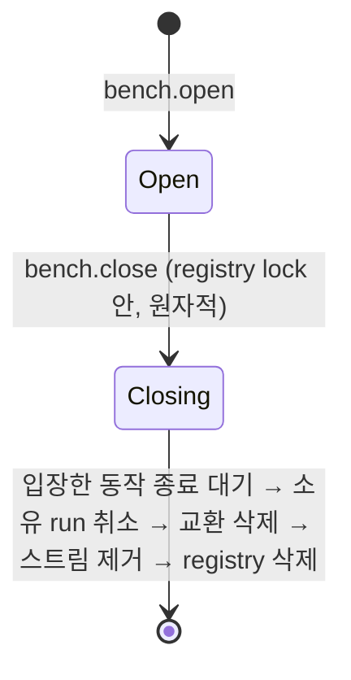

# Data Model: 040 작업대(Bench)와 run·교환 이관

모든 상태는 **메모리**다(재시작 시 사라짐). 예외는 `run.start`의 변경 기록(SQLite ledger)뿐이다. 용어는 `crates/workbench-core/CONTEXT.md`.

## 엔티티

### Bench (작업대)

| 필드 | 타입 | 규칙 |
|---|---|---|
| `id` | `BenchId`(uuid v4 문자열) | 서버 발급, 세대 안에서 유일 |
| `working_directory` | 실제 경로 문자열 | `bench.open` 입력을 `canonicalize`, 디렉터리여야 함 |
| `opened_by` | `PrincipalSubject` | 연 principal의 주체. 모든 `benchId` 입력 호출에서 동등 검사 |
| `opened_at` | RFC3339 | |
| `state` | `Open` \| `Closing` | registry lock 안에서만 바뀐다 |
| `admission` | read/write guard | 새 자원을 등록하는 동작이 read, 닫기가 write |
| `idempotency` | 작업대별 멱등 기록(아래) | 닫힐 때 통째로 버림 |

상태 전이:

- 입장(admission): `run.start`(소유 기록까지), `exchange.syncWorkspace`·`send`·`sendFromRun`, 과도기 orchestration run 기동. `Open`일 때만 가능(`Closing`이면 `notFound`). registry lock 안에서 `try_read_owned()`로 얻고 lock 밖에서 await.
- 입장하지 않는 동작: 기존 run 제어·조회 — 닫기를 막지 않는다.
- 닫기 불변식: `bench.close`가 `closed: true`로 반환한 시점에 그 작업대 소유의 살아 있는 run은 0개.
- 상한 256(`Closing` 포함).

### PrincipalSubject

| principal | `kind` | `subject` | scope |
|---|---|---|---|
| 데스크톱 | `desktop` | `desktop` | 전체(20) |
| 테스트 조회 전용 | `test` | `test:readonly` | `:read` 전부 + `system:describe` |
| 테스트 다른 주체 | `test` | `test:<name>` | 데스크톱과 같음(교차 주체 재현용) |
| agent(MCP) | `agent` | `agent:<runId>` | `exchange:read`, `exchange:write`, `presentation:write` |

새 scope 6개: `run:write`, `bench:read`, `bench:write`, `exchange:read`, `exchange:write`, `presentation:write`(`:read`/`:write` 규칙상 `presentation:write`는 쓰기로 분류).

### Run 소유 (RunEngine 안)

`run_id → BenchId`. `run.start`에서 기록, run 종료(`finish_run`·`cancel_run`)에서 삭제(acp-agent-core `AppState.run_owners`, 문자열 그대로). 살아 있는 run만 소유 조회가 된다.

### 교환 작업 영역 (작업대별)

| 항목 | 규칙 |
|---|---|
| `AgentWorkspaceSnapshot{bench_id, worktree_path, revision, focused_panel_id, panels}` | 패널 1–8, id 비지 않음·유일, focus는 패널 중 하나. 더 낮은 revision은 무시하고 현재 값 반환 |
| 교환 이력 | `VecDeque<AgentExchange>` 500개 FIFO |
| `AgentExchange{requestId, worktreePath, source, target, message, delivery, status, failureCode?, failureReason?, createdAt, updatedAt}` | **`windowLabel` 제거**. 요청 id 중복: 같은 payload → 기존 반환(이벤트 없음), 다른 payload → `duplicateConflict` |
| 상태 전이 | `Pending→Accepted/Rejected`, `Accepted→Delivered/Rejected/Failed/Cancelled`; terminal에서 같은 상태로의 전이는 변화 없음(**이벤트 없음**), 다른 상태는 `invalidTransition` |

### 세대 범위 멱등 기록 (작업대별)

키 `(subject, operation, idempotency_key)`.

| 계층 | 값 | 한도(작업대당) | 수명 |
|---|---|---|---|
| 결과 기록 | payload hash + 결과 JSON | 1,024(넘치면 오래된 것부터 요약으로 강등) | 작업대 |
| 요약 기록 | payload hash | 65,536(도달하면 새 command `rateLimited`) | 작업대 |
| `bench.open` 기록(주체별) | payload hash + `benchId` | 256 | 만든 작업대가 닫힐 때까지 |

판정: 결과 기록 적중 → 저장된 결과. 요약 적중 → 재실행 없이 `conflict`(`outcome: applied`). 다른 payload → `conflict`. 진행 중 같은 키 → 대기. agent 전용 operation의 기록은 run의 소유 작업대에 둔다.

### run.start 변경 기록

1단계 ledger 행: aggregate `run:<runId>`, reservation 배타, 결과 = `AgentRun` JSON. 기동 판정: `pending` → `unknown`(`RunStartReconciler`).

## 스트림

| 스트림 | 분류 | scope | 스키마 | 보관 |
|---|---|---|---|---|
| `run:<runId>` | 상태 복원용 | `run:read` | `run.event.v1` | 039(run당 512, 발행된 run 256) |
| `exchange:<benchId>` | 상태 복원용 | `exchange:read` | `exchange.requested.v1`(본문 `ExchangeRequestedDto`), `exchange.status.v1`(본문 `AgentExchangeDto`) | 작업대당 512, 작업대 닫힘에 제거 |
| `bench:<benchId>` | 알림용 | `bench:read` | `bench.titleRequested.v1`(본문 `{title}`) | 없음 |
| `worktree:<path>` | 알림용 | `worktree:read` | `worktree.changed.v1` | 039 |
| `orchestration:<id>` | — | — | 예약(041) | — |

## 포트 (core)

| 포트 | 구현 | 역할 |
|---|---|---|
| `RunEngine` | 운영 `AcpRunEngine`(AppState + AcpAgentRunner + JsonAcpSessionStore), 테스트 `ScriptedRunEngine` | run 시작·제어·소유 조회·소유 run 취소 |
| `DesktopBridge` | AW `TauriDesktopBridge`, 테스트 기록형 | 발행 결과를 작업대의 창에 전달(막히지 않음) |
| `RunTerminalHook` | AW(worktree 가드·orchestration 실패 처리, 041 전 과도기) | 종료 이벤트 후처리 |
| `RunLaunchDecorator` | AW(MCP 토큰·env·Main Coordinator principal) | `run.start` 요청 보강 |

`RuntimeAdapters`에 `run_engine: Option<Arc<dyn RunEngine>>`(None이면 bootstrap이 `AcpRunEngine` 생성), `desktop: Option<Arc<dyn DesktopBridge>>`, `terminal_hook`, `launch_decorator`, `bench_limits` 추가.

## 데스크톱 어댑터 (AW)

`DesktopBenches{by_label, by_bench, closed_labels}` + label별 lock — 창 label ↔ `BenchId`. `ensure(label, hint_path)`(single-flight, 닫힌 label이면 실패), `close(label)`(창 `Destroyed`, 같은 label lock 안에서 닫힌 표시 → `bench.close` → 대응 제거). 창 label은 이 표 밖으로 나가지 않는다.
