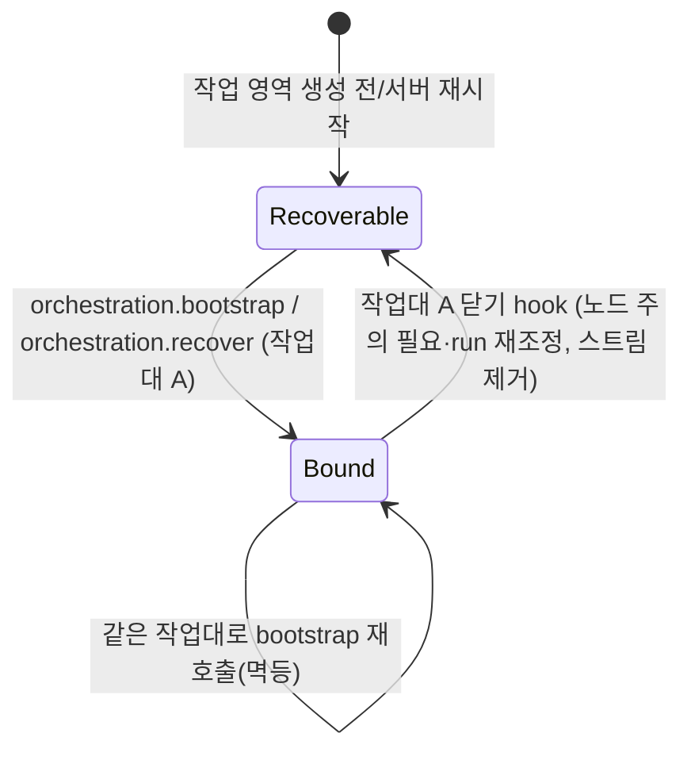

# Data Model: 041 orchestration 작업대 이관

용어는 `crates/workbench-core/CONTEXT.md`(작업대·이벤트). 영속 상태는 **orchestration 저장소 하나**(`orchestration-sessions.json`, 형식 유지)뿐이고, 묶임(binding mutex)·scheduler·worktree 감시·revision watch는 메모리다.

## 엔티티

### orchestration 작업 영역 (`OrchestrationSession`, 영속)

| 필드 | 규칙 |
|---|---|
| `id` | uuid, 불변 |
| `worktreePath` | 실제 경로, worktree당 작업 영역 1개 |
| `boundWindowLabel` | **041: 읽을 때 무시, 쓸 때 생략**(serde default + skip). 이전 빌드는 없으면 `None`으로 읽음 |
| `nodes` | Main 1 + 자식 ≤ 7, 노드별 `currentRunId`·`assignedTaskId` |
| `generations` | coordinator 세대(run id 포함). 마지막 세대의 run만 coordinator 권한 |
| `tasks` | 과제별 `revision`·`attempt`·상태 |
| `reports`·`commands`·`coordinatorNotifications`·`dispatches` | 오늘과 같음 |
| `idempotencyRecords` | `actorKey` = **호출 주체**(041, 이전 = 창 label). 작업 영역 범위 |
| `revision` | 작업 영역 변경마다 +1 |
| `schemaVersion` | 2 유지 |

protocol DTO(`OrchestrationSessionDto`)는 `boundWindowLabel`이 없고 `eventStreamId: string | null`(현재 묶임 스트림)이 있다. AW 호환 command는 결과에 `boundWindowLabel`을 다시 채운다(contracts/tauri-compat.md).

### 작업대 묶임 (`OrchestrationBinding`, 메모리)

| 필드 | 규칙 |
|---|---|
| `workspace_id` | 작업 영역당 최대 1 묶임 |
| `bench_id` | 작업대당 최대 1 작업 영역 |
| `binding_id` | 묶일 때마다 새 uuid. 스트림 key |

상태 전이(풀기 = 작업대 닫기 async hook: 소유 run 취소 뒤 binding mutex 안에서 표 제거 + release `update` → 마지막 이벤트 → 스트림 제거):

- 이미 다른 작업대에 묶인 작업 영역 묶기 → 거절("The workspace cannot be bound to this window.").
- 작업대가 이미 다른 worktree 작업 영역에 묶임 → 거절("The window is already bound to another worktree.").
- 묶기·풀기는 전역 binding mutex 안에서 저장소 `update`와 묶임 표 변경을 한 번에 한다(묶기는 작업대 입장권을 쥔 채, research R3). 새로 만들기·worktree로 찾는 복구도 같은 mutex로 직렬화된다.

### 저장 경계 (research R1)

| 층 | 범위 | 종류 | 쥐는 동안 |
|---|---|---|---|
| 작업대 입장권(040) | 작업대 | read guard | 묶기(찾기·만들기·표 삽입), 자식 기동(엔진 `start` 반환까지) |
| binding mutex | 묶임 표 전체 | 동기 mutex | 묶기·풀기의 `update` + 표 변경(await 없음) |
| 저장소 aggregate lock | `orchestration-sessions` 전체 | 동기 mutex(`StorageCoordinator`, `spawn_blocking`) | load → 수정 → save 한 번(await 없음) |

- 순서는 위에서 아래로만. operation 범위 작업 영역 lock은 없다(research R2): 같은 작업 영역의 교차는 `update` 안의 상태 조건으로 판정한다.
- `notify_coordinator`·`waitChildTasks`·엔진 `send`/`cancel`·작업대 닫기 대기 중에는 어떤 lock도 쥐지 않는다.
- run 종료 처리·작업대 닫기 hook은 lock을 기다리지 않고 조건부 `update` 한 번만 한다.

### agent 역할 (메모리 도출, research R7)

| 역할 | 조건 | 허용 operation |
|---|---|---|
| coordinator | 어떤 작업 영역의 `activeCoordinatorGenerationId` 세대가 Active이고 그 `runId` == 주체 run | coordinator 10개 |
| 자식 | 어떤 작업 영역의 노드 `currentRunId` == 주체 run이고, orchestration이 기동한 배정 과제의 현재 시도(기동 전 Launching 기록 포함) | 자식 6개(자기 과제만) |
| 없음(수동 채택 자식 포함) | 그 외 | 거절(`forbiddenActor`/`scopeMismatch`, 오늘 문구) |

### worktree 감시 (메모리)

`run_id → {workspace_id, task_id, attempt, fingerprint}`. 자식 기동 시 등록, run 종료 이벤트에서 꺼내 비교 → 바뀌었으면 과제 실패(오늘 사유). 종료 처리는 lock을 기다리지 않고 `(taskId, attempt, runId)` 조건부 `update`를 `spawn_blocking`으로 띄운다. 창 label 없음.

### scheduler (메모리)

런타임당 1개. 용량 = `max(전체 run 한도 − 1, 1)`. `active` 집합 + FIFO 대기열. 재시작에 사라지고 `orchestration.recover`가 재구성.

## 스트림

| 스트림 | 분류 | scope | 스키마 | 보관 |
|---|---|---|---|---|
| `orchestration:<bindingId>` | 상태 복원용 | `orchestration:read` | `orchestration.workspaceUpdated.v1`(본문 `OrchestrationEventDto`) | 묶임당 256, 묶임 끝(작업대 닫기)에 제거 표식 |

구독 권한: 묶임의 작업대를 연 주체만. 모르는 id `notFound`, 끝난 묶임 `Gap(evicted)`, agent·다른 주체 `forbidden`.

## 포트 (core)

| 포트 | 구현 | 역할 |
|---|---|---|
| `OrchestrationRepository`(`read`/`update`) | core `JsonOrchestrationRepository` + aggregate lock | 저장 경계 |
| `AgentWorker` | core `EngineAgentWorker`(작업대 입장 + `RunLaunchDecorator` + `RunEngine`) | 자식 run 기동·전송·중단·취소 |
| `DesktopBridge` | AW `TauriDesktopBridge`(+ `Orchestration` 전달) | 창 전달 |
| `RunLaunchDecorator` | AW(MCP env, run 묶인 토큰만) | 기동 요청 보강 |
| ~~`RunTerminalHook`~~ | 삭제(worktree 감시·과제 실패는 core) | — |

`RuntimeAdapters.orchestration: OrchestrationConfig{max_concurrent_children, child_agent_profile}`(AW가 환경 변수로 채움, 테스트는 직접 지정).
