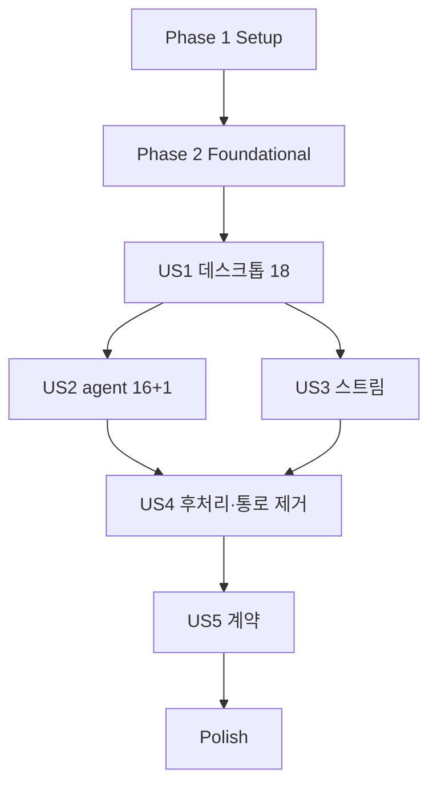

# Tasks: orchestration을 작업대 기준으로 이관 (서버-클라이언트 전환 2b-2)

**Input**: `specs/041-workbench-orchestration/` — spec.md, plan.md, research.md(R1–R18, 설계 리뷰 OCR H1–H9·M1–M6·Codex C1 반영), data-model.md, contracts/, quickstart.md, reviews/design-review.md

**Tests**: TDD. 저장소 전체 동시성(R1), liveness 5종(R2), 출처 검증 음성(R18), 역할·스트림·권한 테스트를 해당 구현보다 먼저 작성하고 실패를 확인한다.

## Format: `[ID] [P?] [Story] Description`

- **[P]**: 다른 파일, 미완료 의존 없음
- **[Story]**: US1–US5 (spec.md)

## Path Conventions

- core: `crates/workbench-core/src`, protocol: `crates/workbench-protocol/src`, AW: `apps/agentic-workbench/src-tauri/src`, fixture: `crates/workbench-protocol/fixtures`
- 디스크: `CARGO_INCREMENTAL=0`

### 공통 규칙

- 저장소 lock(aggregate `orchestration-sessions`) 안에서 await·엔진·전달·다른 lock 금지. `read`/`update`는 async 문맥에서 `spawn_blocking`(R1).
- operation 범위 작업 영역 lock 없음. 교차는 `update` 안 상태 조건으로(R2). lock 순서: 작업대 입장권 → binding mutex → 저장소 lock.
- run 종료 처리·작업대 닫기 hook은 lock을 기다리지 않는다(R2-3, R3).
- 오류 문구는 오늘과 바이트 동일(`OrchestrationError` JSON, 도구 오류 `{code,message}`). 새 문구는 contracts에 있는 것만.
- 화면(`apps/agentic-workbench/src`)·`crates/acp-agent-core`·`packages/agent-client` diff 0.
- 커밋은 논리 단위마다. push·PR은 구현 뒤 OCR·Codex 리뷰 2건을 마친 다음.

---

## Phase 1: Setup

- [X] T001 기준선 기록: `cargo test --workspace --all-targets`·`pnpm run check-types`·`pnpm run test` 결과를 이 파일 Notes에 적는다
- [X] T002 [P] 오늘 동작 캡처: orchestration command 18개의 오류 JSON 문자열·창 문구 3개·도구 오류(`forbiddenActor`·`scopeMismatch`)·`replay` Missing/Evicted 형태를 research 사실 요약과 대조해 차이를 Notes에 적는다(`inbound/tauri_commands.rs`, `infrastructure/mcp/orchestration_tool.rs`, core `infrastructure/event_hub/mod.rs`)
- [ ] T003 [P] fixture 생성기: scratchpad `gen_041_fixtures.py <group>`(040 `gen_040_fixtures.py` 형식, 그룹 desktop·agent·stream), `add_ops.py`에 orchestration 그룹 추가

---

## Phase 2: Foundational (Blocking Prerequisites)

### protocol (research R5·R6·R13, contracts/workbench-orchestration.md)

- [X] T004 `crates/workbench-protocol/src/principal.rs`: `Scope::OrchestrationRead`(`orchestration:read`)·`OrchestrationWrite`(`orchestration:write`) 추가(22개), 데스크톱 전체, readonly `:read`, `AGENT_SCOPES`에 두 scope 추가, 단위 테스트 갱신
- [X] T005 `crates/workbench-protocol/src/operations/orchestration.rs`(신규): 미러 DTO — `OrchestrationSessionDto`(boundWindowLabel 없음, `eventStreamId: Option<String>`), 노드·세대·과제·보고·명령·알림·분배·멱등 기록·요청(`BindMainRunRequest`·`DelegateGoalRequest`·`SetPresentationRequest`·`TaskActionRequest`·`CoordinatorHandoffRequest`·`DispatchPromptRequest`·`DeliverTaskCommandInput`)·결과(`DelegateGoalOutcome`·`PromptDispatchDto`·`TaskCommandDto`·`TaskReportDto`)·agent 도구 입력 16종·`AgentRoleDto`. 입력 최상위 `deny_unknown_fields`
- [X] T006 `crates/workbench-protocol/src/operations/run.rs`: `RunReplayInput{benchId, runId, afterSequence}`·`RunReplayDto`
- [X] T007 `crates/workbench-protocol/src/operations/mod.rs`·`call.rs`: operation id 35개(데스크톱 17 `orchestration.*` + `run.replay` + agent 17), descriptor(scope, `idempotencyScope: epoch`), `schema_for`. OPERATIONS 85
- [X] T008 `crates/workbench-protocol/src/events/mod.rs`: `StreamKind::Orchestration` 구독 가능, `required_scope = OrchestrationRead`, 분류 상태 복원용. hub 테스트(`event_hub/mod.rs` 구독 거절 테스트) 기대 갱신

### core 이동과 저장 경계 (research R1·R3·R13)

- [X] T009 AW `domain/agent_orchestration.rs` → core `domain/agent_orchestration.rs`로 이동(`boundWindowLabel`: `#[serde(default, skip_serializing)]`, 도메인 로직에서 창 label 사용 제거는 US1에서). 이전 빌드 호환 단위 테스트: 필드 있는 JSON 읽기 → 무시, 쓰기 → 필드 없음
- [X] T010 [P] core `ports/orchestration_repository.rs`: 계약만 — `OrchestrationTransaction{sessions(), commit()}`, `OrchestrationRepository{type Tx, begin(), snapshot()}`. `ports/agent_worker.rs`·`ports/coordinator_notification.rs` 이동(창 label 필드 제거는 US1·US2)
- [X] T011 core `infrastructure/orchestration/store_boundary.rs`(경로별 경계 lock registry·`BoundaryTx`·`SessionStorage`), `infrastructure/fs/orchestration_store.rs`(JSON, `legacy_json_store`로 `.bak` 복구 보존), `infrastructure/orchestration/memory_store.rs`(테스트용). 서비스·명령·알림 전달을 transaction으로 전환(await 단계는 블록으로 경계 분리). `StorageCoordinator`는 쓰지 않음(research R1 구현 메모)
- [X] T012 [P] **테스트 먼저** core `tests/orchestration_concurrency.rs`: (a) 작업 영역 2개 이상(다른 worktree)에 thread 8개로 변경 100회 이상 동시 → 모든 변경·revision 합 보존, (b) 같은 작업 영역에 화면 변경 + 보고 동시 100회 이상 → 손실 0. 저장소 lock 없이(임시 우회 플래그 또는 lock 없는 fake 저장소) 실패함을 확인하고 Notes에 기록
- [X] T013 core `application/orchestration/binding.rs`: `OrchestrationBindings`(workspace↔bench↔binding_id, 전역 std mutex = binding mutex), 묶기·풀기 API(클로저로 저장소 `update` 동반), 단위 테스트
- [X] T014 [P] core `application/orchestration/roles.rs`: 역할 판정(coordinator = `activeCoordinatorGenerationId` 세대 Active + run 일치, 자식 = orchestration 기동 과제 시도의 `currentRunId`(Launching 포함), 수동 채택 자식 제외), 단위 테스트
- [X] T015 [P] core `application/orchestration/revision_watch.rs`: 작업 영역 id별 `tokio::sync::watch<u64>`, `update`가 작업 영역을 바꾸면 알림
- [X] T016 core `infrastructure/event_hub/mod.rs`: run 스트림 소유 작업대 메타(첫 발행/대기 생성 시 기록, 스트림 제거 시 함께 삭제), 조회 함수, orchestration journal 256, 단위 테스트
- [X] T017 core `application/bench_service.rs`: `BenchCloseHook`을 async(`Arc<dyn Fn(String) -> BoxFuture<'static, ()>>`)로 바꾸고 `finish_close`에서 await(소유 run 취소 뒤, 스트림 제거 전). 기존 교환 hook 적응, 테스트 통과
- [ ] T018 core `tests/support`: 가짜 엔진에 orchestration 자식 기동·send·cancel(종료 이벤트 inline 발생 옵션) 지원, `BenchHarness`에 orchestration 헬퍼(bootstrap·bind·create task), fixture 실행기에 principal `agent:<run>` 역할 준비 단계

**Checkpoint**: protocol·저장 경계·묶임·역할·watch·hub 메타·async hook 준비. T012 green은 US1 T024 이후.

---

## Phase 3: User Story 1 - orchestration 작업 영역이 작업대에 묶인다 (Priority: P1) 🎯 MVP

**Goal**: 데스크톱 18개 동작이 작업대 기준 `Workbench.call`로 동작, 창 닫기 = 작업대 닫기로 복구 가능 전환.

**Independent Test**: 메모리·HTTP 두 경로 fixture(작업대 열기 → bootstrap → bindCoordinator → delegate → 과제 → 닫기 → 다른 작업대 bootstrap 재개 → recover 재조정), 교차 작업대·교차 주체 거절.

### Tests for User Story 1 ⚠️ (먼저 작성, 실패 확인)

- [ ] T019 [P] [US1] fixture `orchestration-desktop-*`(생성기 desktop 그룹): 18개 operation 정상 경로, 작업대 없음·다른 주체·다른 작업대 작업 영역 거절, 창 문구 3개, 작업 영역 없음 오류 JSON(`details.orchestrationError`)
- [ ] T020 [P] [US1] **출처 검증 음성 테스트**(R18) core `tests/orchestration_provenance.rs`: 다른 작업대 run으로 `bindCoordinator`·`handoffCoordinator` → `forbidden` "run is owned by another bench."·작업 영역 불변, 이어 그 run의 `run.replay`·`run:<id>` 구독 거절, 같은 run 두 작업 영역 삽입 → `conflict`
- [ ] T021 [P] [US1] **liveness ④⑤**(R2·R3) core `tests/orchestration_liveness.rs`: ④ 자식 기동(가짜 엔진 지연) 중 작업대 닫기 → 제한 시간 안에 닫기 완료, 남은 run 0, 과제 대기/실패, ⑤ 같은 복구 가능 작업 영역을 두 작업대가 동시에 재개 200회 → 매번 정확히 하나만 묶임(재개 없는 bootstrap은 오늘처럼 작업대마다 새 작업 영역이라 경합 대상이 아니다)
- [ ] T022 [P] [US1] core `tests/orchestration_flow.rs`: 작업대 닫기 → 작업 영역 복구 가능·노드 주의 필요 → 다른 작업대 `bootstrap` 재개 → `recover` 재조정 → 대기 명령·알림 재전달, 서버 재시작 뒤 전부 복구 가능

### Implementation for User Story 1

- [X] T023 [US1] AW `application/orchestration_service.rs` → core `application/orchestration/service.rs`: 모든 메서드를 저장소 `update` 한 번 안의 상태 검사·변경으로 재작성(R1), 창 label 인자 → 작업대 id(묶임 조회) + 행위자 주체(R4), `session_for_window_mut`·`assert_scope` → 묶임 기반, 창 문구 3개 유지
- [X] T024 [US1] R18 출처 검사: `bind_main_run`·`handoff_coordinator`가 엔진 `active_owner_of(run) == bench` 확인. 끝난 run id 재사용은 `run.start`가 거절(`duplicate run id: <id>`) — 삽입 시 유일성 검사는 도달 불가라 두지 않는다(research R18). T012·T020 green 확인
- [X] T025 [US1] AW `application/orchestration_command_service.rs` → core `application/orchestration/command_service.rs`: 3단계(Pending→Dispatching `update`, lock 없이 worker 호출, 결과 `update`)
- [X] T026 [US1] core `application/handlers/orchestration/desktop.rs`: 데스크톱 17 handler(`epoch_handler`, 작업대 주체 검사, `spawn_blocking` 저장소 호출, fault 매핑 `details.orchestrationError`), `bootstrap`·`recover`는 입장권 + binding mutex(R3), `delegateGoal`은 coordinator run에 엔진 `send_prompt`
- [X] T027 [US1] core `application/handlers/run/mod.rs`: `run.replay`(R17 허용 조건 1·2, Evicted·Missing 형태)
- [X] T028 [US1] core 작업대 닫기 hook(`application/orchestration/mod.rs` 등록): binding mutex 안에서 표 제거 + release `update`(오늘 `release_window` 규칙) → 마지막 이벤트 → 스트림 제거
- [ ] T029 [US1] AW `inbound/tauri_commands.rs`·`inbound/workbench_compat.rs`: orchestration command 18개를 compat로(`DesktopBenches` ensure/조회, `Workbench.call`, 결과에 `boundWindowLabel` 재구성·`eventStreamId` 제거, 오류 JSON 재구성, 작업대 없는 창은 오늘 결과), `replay`는 항상 `RunReplay`
- [ ] T030 [US1] AW `lib.rs`: 창 `Destroyed`의 `release_window` 제거(작업대 닫기가 처리), `OrchestrationService` 조립 제거, `list_recoverable`의 사라진 창 정리 제거
- [ ] T031 [US1] AW orchestration 서비스·도메인·저장소·명령 서비스 테스트를 core로 이동(기대값 유지, 창 label 입력 → 작업대 id), AW 통합 `tests/orchestration_delegation.rs`를 core 흐름 테스트로 이전
- [ ] T032 [US1] 게이트(fmt·clippy·test·describe/contracts 재생성)·커밋 `feat(aw): migrate orchestration workspaces behind benches with a whole-store write boundary (041 US1)`

**Checkpoint**: 화면 동작이 작업대 기준, 창 label 없는 서비스.

---

## Phase 4: User Story 2 - agent가 orchestration 도구를 서버 계약으로 부른다 (Priority: P2)

**Goal**: MCP 도구 16개 → agent operation, 역할은 서버 상태.

**Independent Test**: agent fixture(역할별 허용·거절), MCP 결과 형태 동일.

### Tests for User Story 2 ⚠️

- [ ] T033 [P] [US2] fixture `orchestration-agent-*`(생성기 agent 그룹): coordinator 10개·자식 6개 정상, 이전 세대 coordinator·다른 과제 자식·수동 채택 자식·작업 영역 없는 run 거절(`details.toolError`), 입력 `reporterRunId` ≠ principal 거절, `getAgentRole` 결과
- [X] T034 [P] [US2] **liveness ①②** `tests/orchestration_liveness.rs`: ① coordinator 알림 전달이 Main 턴(가짜 엔진이 턴 안에서 `collectChildResults`·`waitChildTasks`를 부름)을 기다리는 동안 교착 없음, ② `waitChildTasks` 대기 중 자식 `reportResult` → 대기가 즉시 깨어나 결과 반환(30초 전에)
- [X] T035 [P] [US2] 자식 첫 턴 테스트: 기동 직후(바인딩 완료 전) 자식이 `getOwnTask`·`reportProgress` → 허용(Launching 기록, R7)

### Implementation for User Story 2

- [X] T036 [US2] core `infrastructure/orchestration/engine_agent_worker.rs`: `EngineAgentWorker`(Launching `update` → 입장권 → `RunLaunchDecorator` → `RunEngine::start(owner = 작업대)` → 결과 `update`, 입장 실패 시 과제 되돌림), send·interrupt·cancel은 lock 없이 엔진 호출
- [X] T037 [P] [US2] AW `application/orchestration_scheduler.rs` → core `application/orchestration/scheduler.rs`(런타임당 1개, 용량 `RuntimeAdapters.orchestration`), 테스트 이동
- [X] T038 [P] [US2] AW `application/coordinator_notification_dispatcher.rs` → core `application/orchestration/notification_dispatcher.rs`(3단계, lock 없이 `notify_coordinator`), 테스트 이동(`processed_collection_wins_over_late_delivery_completion` 유지)
- [X] T039 [US2] core `application/handlers/orchestration/agent.rs`: agent 16 + `getAgentRole` handler(주체 run 일치, 역할 판정, run id는 principal에서, `waitChildTasks`는 lock 없이 `read` + revision watch, 최대 30초), 도구 오류 `details.toolError`
- [ ] T040 [US2] AW `infrastructure/mcp/orchestration_tool.rs`: 16개 도구 → `Workbench.call`(agent principal), 결과·오류 오늘 형태, 도구 쪽 runId 검사 유지. `infrastructure/mcp/mod.rs` `tools/list`는 `getAgentRole`로
- [ ] T041 [US2] AW `infrastructure/mcp/capability_registry.rs`: token → run id(역할 주장 제거), 재시도·재배정·교대 시 폐기 유지. `tauri_desktop_bridge.rs` decorator: `resolve_agent_run_launch_principal` 제거, run 묶인 토큰만. `RuntimeAdapters.orchestration`에 환경 변수 주입(`lib.rs`)
- [ ] T042 [US2] AW MCP·worker 테스트 이동/갱신, 게이트·커밋 `feat(aw): route MCP orchestration tools through agent operations with server-derived roles (041 US2)`

---

## Phase 5: User Story 3 - orchestration 갱신이 그 작업대에만 한 번 전달된다 (Priority: P3)

### Tests for User Story 3 ⚠️

- [X] T043 [P] [US3] core `tests/orchestration_stream.rs`: 묶임 스트림 순번, 다른 주체·agent 구독 거절, 모르는 id `notFound`, 작업대 닫기 → `Gap(evicted)`, 재묶임 → 새 `eventStreamId`, run 스트림 구독·`run.replay` 권한(허용 조건 1·2, 다른 작업대 거절, Evicted 형태), 다른 작업대 창 전달 0·같은 창 1회

### Implementation for User Story 3

- [X] T044 [US3] core orchestration 발행: 서비스 `update` 뒤(변경된 작업 영역마다) `hub.publish`(`orchestration:<bindingId>`), 명령·알림 전달 단계·release 포함. 묶이지 않은 작업 영역은 발행 없음
- [X] T045 [US3] core `application/workbench_runtime.rs` `authorize_bench_streams` 확장: orchestration 스트림(묶임의 작업대 주체), run 스트림(R17, 발행 전 대기는 엔진 소유 등록된 run만)
- [ ] T046 [US3] core `ports/desktop_bridge.rs` `DesktopDelivery::Orchestration{bench_id, payload}`, AW `infrastructure/tauri_desktop_bridge.rs` 전달(`orchestration-workspace-updated-fallback` + reason별 상세 fallback, 한 번), AW `infrastructure/tauri_orchestration_event_sink.rs`·`ports/orchestration_event_sink.rs` 삭제(parity 테스트는 protocol DTO로 이동)
- [ ] T047 [US3] 게이트·커밋 `feat(aw): open per-binding orchestration streams and authorize run replay by bench (041 US3)`

---

## Phase 6: User Story 4 - 창 없는 서버에서 orchestration 후처리가 돈다 (Priority: P4)

### Tests for User Story 4 ⚠️

- [ ] T048 [P] [US4] **liveness ③** + 후처리 테스트 `tests/orchestration_flow.rs`: ③ `cancelTask`가 엔진 취소 → 종료 처리를 같은 task에서 inline 호출해도 교착 없음, worktree 변경 자식 종료 → 과제 실패(오늘 사유), scheduler 한도 초과 과제 대기 → 자리 나면 진행, 복구 시 재조정·대기 전달

### Implementation for User Story 4

- [ ] T049 [US4] core worktree 감시: 기동 시 지문 등록(`EngineAgentWorker`), `WorkbenchRunSink` 종료 처리에서 조건부 `update`(`(taskId, attempt, runId)`)를 `spawn_blocking`으로(lock 대기 없음)
- [ ] T050 [US4] core 복구 흐름(`orchestration.recover`): `reconcile_runtime`·`scheduler.reconcile`·`reconcile_pending`·`recover_interrupted`·백그라운드 `dispatch_pending`
- [ ] T051 [US4] 과도기 통로 제거(R14): core `WorkbenchRuntime::run_sink`·`admit` 공개 제거(테스트 전용이면 `cfg(test)`/support로), `run_engine().acp_registry()`·`acp_session_store()` 공개 제거, AW `RunTerminalHook`(비면 포트 삭제), `desktop_benches::label_for`의 서버 방향 사용 제거, AW `acp_agent_worker_adapter.rs` orchestration 부분·`McpServerState` scheduler 삭제, projector 삭제
- [ ] T052 [US4] 경계 grep(quickstart §2) 0건 확인, 게이트·커밋 `feat(aw): run orchestration post-processing in the server and remove 040 interim paths (041 US4)`

---

## Phase 7: User Story 5 - 계약 조회·생성 타입 (Priority: P5)

- [ ] T053 [US5] `crates/workbench-protocol/src/openapi.rs`: 새 component·operation variant, golden 갱신
- [ ] T054 [US5] describe fixture 3개 재생성(scratchpad `gen_describe.py`: 데스크톱 85, readonly, agent)
- [ ] T055 [US5] `pnpm run generate:contracts`, `packages/workbench-client/src/operation-map.ts`·`index.ts` alias(`OrchestrationSession`·`OrchestrationTask`·`RunReplay` 등), `operation-map.test-d.ts`(`OperationMap["orchestration.bootstrap"]`·`EventMap["orchestration.workspaceUpdated.v1"]`·오용 `@ts-expect-error`, id union 85)
- [ ] T056 [US5] check-types·client test·drift, 커밋 `feat(workbench-protocol): generate orchestration contracts (041 US5)`

---

## Phase 8: Polish & Cross-Cutting Concerns

- [ ] T057 [P] `docs/workbench-seam.md`: 인벤토리(이관 63, 이연 0, 유지 8), "orchestration (041)" 절(묶임·저장 경계·lock 규칙·역할·스트림·재생 권한, Mermaid), 2단계 완료·3단계 안내, ADR 링크. `docs/client-server-architecture-research.md` 진행 각주 "041(2b-2) 완료"
- [ ] T058 [P] core ADR `crates/workbench-core/docs/adr/0006-orchestration-store-is-one-serialized-aggregate.md`, `0007-agent-orchestration-roles-come-from-server-state.md`
- [ ] T059 전체 게이트(quickstart §1·§2), 결과 Notes
- [ ] T060 앱 스모크(quickstart §3): 가능한 항목만 수행, UI 항목은 리뷰어 수동으로 정직하게 기록
- [ ] T061 SC-001–008 증거·spec 대비 어긋난 점 Notes, PR 본문 초안(scratchpad), 커밋 `docs(aw): record 041 orchestration migration status`

---

## Dependencies & Execution Order



- US2는 US1의 서비스 이동에, US4는 US2(worker·scheduler)와 US3(발행)에 기댄다.
- 병렬: Foundational T010 ∥ T012 ∥ T014 ∥ T015, US1 테스트 T019–T022, US2 T037 ∥ T038, Polish T057 ∥ T058.

## Parallel Example: User Story 1

```text
T019 fixture 생성 ∥ T020 출처 음성 테스트 ∥ T021 liveness ④⑤ ∥ T022 흐름 테스트
```

## Implementation Strategy

- MVP = US1(작업대 기준 데스크톱 18개 + 저장소 전체 경계). 이 시점에 lost update 결함이 사라지고 창 label 없는 서비스가 된다.
- 이후 US2(agent) → US3(스트림) → US4(후처리·통로 제거) → US5(계약) → Polish.
- 각 스토리 끝에서 전체 게이트와 커밋.

## Notes

- [P] = 다른 파일, 미완료 의존 없음
- 기준선·실측 기록:
  - (T001, 2026-09-27) 기준선(main `c8b41a4`): `cargo test --workspace --all-targets` 626 passed / 0 failed / 7 ignored(그중 AW 145), `pnpm run check-types` 13/13·`pnpm run test` 12/12(040 측정, main 불변).
  - (T002) 오늘 동작은 research 사실 요약·contracts와 대조 완료 — 차이 없음. 설계 리뷰가 바로잡은 두 문구(도구 오류 `forbiddenActor`·`scopeMismatch`, 토큰 폐기 시점)는 contracts에 반영됨.
  - (Foundation 이동 1단계) orchestration 도메인·포트 4·서비스 4·저장소를 core로 `git mv`(테스트 37개 함께 이동, 기대값 불변). core는 edition 2021이라 AW의 let chain 5곳을 중첩 `if let`/`is_some_and`로 풀었다(동작 동일). 저장소는 AW `json_store`의 `load_json`·`save_json`을 tauri 의존만 빼고 `infrastructure/fs/legacy_json_store.rs`로 복사해 `.bak` 복구·오류 문자열을 보존. AW는 `domain`·`ports`·`application`·`infrastructure` mod에서 core 모듈을 재노출(shim)하고 저장소는 임시 `orchestration_repository(app)`로 연다 — US1–US4 compat 전환에서 제거. `boundWindowLabel` serde 생략(T009 일부)은 서비스가 아직 창 label로 조회하므로 US1 묶임 전환과 함께 적용.
  - (Foundation protocol) scope 22개(`orchestration:read`·`orchestration:write`, agent 6개). 미러 DTO는 scratchpad `gen_orch_dto.py`가 core 도메인·요청 타입 48개를 `…Dto`로 생성(`operations/orchestration_dto.rs`, serde 속성 그대로, 세션은 `boundWindowLabel` 대신 `eventStreamId`). operation 등록은 `add_ops_041.py`(모듈 경로 component 지원) — 이 단계에서 데스크톱 17 + `run.replay` = 68개. **분할**: agent operation 17개와 입력 타입은 도구 로직을 옮기는 US2(T039)에서, `StreamKind::Orchestration` 구독 개방은 구독 권한 검사(T045)와 함께 US3에서 한다(권한 검사 없이 구독을 먼저 열지 않기 위해). 이 단계의 scope는 `orchestration:read`로 확정. describe fixture는 `gen_describe_041.py`로 재생성(데스크톱 68·readonly 28·agent 26).
  - (Foundation 묶임, T009·T013) 세션의 `bound_window_label`을 영속하지 않는 `bound_bench_id`(`#[serde(skip)]`)로 바꾸고(옛 `boundWindowLabel`은 읽을 때 무시·쓸 때 생략, 테스트 통과), 묶임 표(`application/orchestration/binding.rs`, 묶일 때마다 새 묶임 id, 변화 목록 반환)와 **묶임 저장소**(`infrastructure/orchestration/bound_repository.rs`)를 추가했다. 묶임 저장소는 binding mutex(표 mutex)를 저장소 경계보다 먼저 잡아 transaction 동안 쥐고, `begin`에서 표 값을 세션에 채우며, `commit`에서 파일 저장 성공 뒤 표를 갱신하고 변화를 observer(US3 스트림 수명)에 알린다. 이 방식으로 서비스는 "묶인 키로 작업 영역 찾기" 로직을 그대로 쓰고 키만 창 label → 작업대 id로 바뀐다. core 식별자에서 `window_label`을 모두 `bench_id`로 바꿨다(`session_for_bench_mut`·`get_for_bench`·`release_bench`). 화면 문구 3개는 유지. AW 과도기 경로는 컴파일만 맞췄다(US1 compat에서 교체).
  - (US1 core, 2026-09-27) `OrchestrationRuntime`(AW command 18개 흐름 이동, 작업대 키), `EngineAgentWorker`(RunEngine에 `queue_prompt`·`send_and_wait` 추가), core worktree 감시·종료 hook, async 작업대 닫기 hook(복구 가능 전환), 데스크톱 handler 17 + `run.replay`. 흐름 테스트 `orchestration_flow.rs` 6개. 테스트가 확인한 **오늘 동작**(계약 문서 정정): 재개 없는 bootstrap은 같은 worktree라도 작업대마다 새 작업 영역을 만들고, 복구 가능 목록은 실제 작업(과제·세대·자식·분배)이 있는 작업 영역만 보여 주며, `recover`는 이미 묶인 작업 영역을 재조정할 뿐 묶지 않는다(묶기는 `bootstrap`의 `resumeWorkspaceId`). liveness ⑤는 "같은 복구 가능 작업 영역을 두 작업대가 동시에 재개 → 하나만 성공"으로 **200회**(T021 기준 그대로, 회차마다 작업대를 닫아 상한 256 안에서) 시험. R18(사용자 점검 뒤 정정): 작업대 닫기 뒤 **끝난 run id 재사용**으로 한 run id가 복구 가능한 작업 영역과 새 run 양쪽을 가리키는 경로가 실제로 있었다 — `run.start`가 끝난 run id 재사용을 거절하도록 했고(hub 발행 이력·제거 표식·작업 영역 기록, 멱등 재시도는 영향 없음), 그 결과 삽입 시 유일성 검사는 도달 불가라 두지 않으며 계약에서 conflict 문구를 지웠다. 테스트 `ended_run_ids_cannot_be_reused_across_close_and_recover`.
  - (T014) 역할 판정은 `application/orchestration/agent_tools.rs`의 `resolve_role`·`OrchestrationRuntime::agent_role`에 두었다(도구 처리와 같은 모듈). 기동 중 자식은 런타임의 launching 표(`remember_launching`·`forget_launching`)로 인정한다.
  - (T015·T039) `RevisionWatch`는 `BoundOrchestrationRepository`의 commit이 저장 성공 뒤 바뀐 작업 영역만 알린다. `waitChildTasks`는 구독 → 읽기 → `timeout_at(changed())` 순서라 읽기와 대기 사이에 온 보고도 깨운다(poll 없음). 변이 검증: commit 알림을 끄면 `report_result_wakes_a_waiting_coordinator`·`concurrent_report_and_wait_never_miss_the_notification`이 실패함을 확인했다.
  - (T026·T039) handler는 `handlers/orchestration/mod.rs`(데스크톱 17 + `run.replay`)와 `handlers/orchestration/agent.rs`(agent 17)에 있다. agent 입력은 `{runId, arguments}`(오늘 도구 인자를 그대로 `arguments`에) — principal run ≠ `runId`면 `forbidden`, 역할 불일치 → `forbiddenActor`, 묶이지 않은 작업 영역 → `scopeMismatch`(`details.toolError`).
  - (T034·T035) `tests/orchestration_agent.rs`: ① Main 턴(가짜 엔진 `turn_hook`)이 `collectChildResults`·`waitChildTasks`를 불러도 교착 없음, ② 대기 중 `reportResult` → 5초 안에 깨어남, 보고·대기 동시 출발 42회 모두 놓침 없음, 첫 턴(`start_hook`) `getOwnTask`·`reportProgress` 허용.
  - (T016·T045) run 소유 작업대는 hub `run_owners`에 둔다: `run.start`·자식 기동이 엔진 호출 전에 claim(실패 시 되돌림), 발행하는 sink가 확정(`assign_run_owner`), 보관 한도로 스트림이 제거될 때 함께 지운다. research R17의 "엔진에 소유가 등록된 run만 발행 전 대기"는 seam `events`가 동기라 엔진 async 조회 대신 이 claim으로 구현했다. 구독 권한은 주체 기준(스트림에 작업대 문맥이 없음), `run.replay`는 입력 작업대 기준(더 좁음). 이벤트 fixture 실행기는 언급된 run을 principal 작업대 소유로 등록하고(`unownedRuns`·`foreignRuns`로 예외), `stream-kind-not-available` → `orchestration-unknown-binding-not-found`, 새 `run-unowned-not-found`·`run-other-bench-forbidden`.
  - (T027 보완, 사용자 점검) `run.replay`의 Evicted 판정은 응답 모양(`terminal && gapDetected && 빈 이벤트`) 추론 대신 hub 실제 제거 표식(`is_evicted`)으로 바꿨다. 테스트: 다른 작업대의 기동 중(소유 등록·미발행) run 재생·구독 거절, 보관 한도로 실제 제거된 run은 어느 작업대든 Evicted 형태. 정직한 기록: 옛 추론식으로 되돌려도 두 테스트는 통과한다 — 현재 hub에서는 미발행 run이 Missing(`terminal: false`)이라 모양이 겹치지 않기 때문이다. 이 변경은 두 상태가 우연히 구별되는 것에 기대지 않게 하는 구조적 수정이다.
  - (T043·T044) `tests/orchestration_stream.rs`: 묶임 스트림 순번(재생 포함), 다른 주체·agent 거절·모르는 묶임 notFound, 이벤트마다 창 전달 1회, 작업대 닫기 → `Gap(evicted)`·닫힌 뒤 전달 0, 재개 → 새 `eventStreamId`, run 스트림 소유·복구 작업 영역 허용. 발행은 저장 뒤·binding mutex 밖이라 그 사이 묶임이 바뀌었으면 버린다(새 묶임은 `orchestration.get`으로 따라잡음). 작업대 닫기 release에는 마지막 이벤트를 두지 않는다 — 묶임이 풀리는 commit에서 스트림이 제거되어 구독자는 `Gap(evicted)`를 받는다(T028 설명의 "마지막 이벤트"는 두지 않음).

