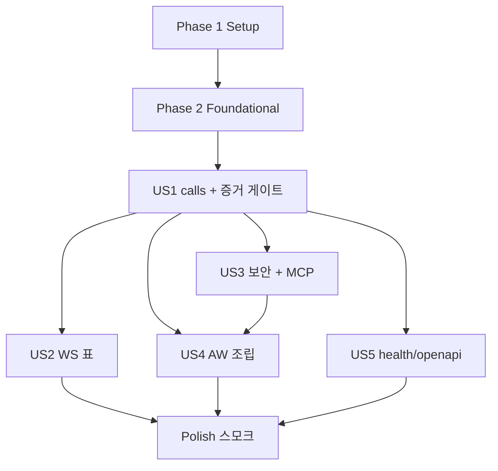

# Tasks: Workbench HTTP/WebSocket 어댑터 (042, 3단계)

**Input**: `specs/042-workbench-http/` — spec.md, plan.md, research.md(R1–R17, 설계 리뷰 OCR D1–D5·Codex C1 반영), data-model.md, contracts/workbench-http.md, quickstart.md, reviews/design-review.md

**Tests**: TDD. 보안 거절·연결 단절 재시도(R17)·중단 증거(R13)·WS 경계 경합 시험을 해당 구현보다 먼저 작성해 실패를 확인한다. **R13·R17 증거가 통과하기 전에는 해당 변경 operation을 네트워크에 공개하지 않는다**(router의 공개 집합 `ExposurePolicy`로 막는다).

**Organization**: 사용자 스토리별(US1 P1 … US5 P5). 검증 명령은 한 번 실행해 로그를 남기고 원 명령 종료 코드를 기록한다.

**테스트 위치**: 실제 런타임(`WorkbenchRuntime`·가짜 엔진)이 필요한 HTTP 시험은 `crates/workbench-core/tests/http_*.rs`에 둔다(core가 server를 dev-의존으로 쓴다 — server가 core를 dev-의존하면 순환). server 크레이트에는 순수 단위 시험만.

## Format: `[ID] [P?] [Story] Description`

- **[P]**: 다른 파일, 미완료 의존 없음 → 병렬 가능
- **[Story]**: US1–US5

## Path Conventions

- 새 크레이트: `crates/workbench-server/`
- core 테스트: `crates/workbench-core/tests/`
- AW: `apps/agentic-workbench/src-tauri/src/`

---

## Phase 1: Setup

- [X] T001 기준선 기록: `cargo test --workspace --all-targets --no-fail-fast`·`cargo clippy --workspace --all-targets -D warnings`·`pnpm run check-types`·`pnpm run test`를 한 번씩 실행해 종료 코드·통과 수를 이 파일 Notes에 적는다
- [X] T002 `crates/workbench-server/Cargo.toml` 신설(workbench-protocol, axum 0.7 `ws`, tower-http 0.5 `cors`·`limit`, tokio, sha2, uuid, serde, serde_json, base64 — lock에 있는 버전만), 루트 `Cargo.toml` workspace members 등록, `src/lib.rs` 빈 모듈 골격, `cargo check -p workbench-server` 통과

---

## Phase 2: Foundational (모든 스토리의 선행)

- [X] T003 [P] `crates/workbench-server/src/origin.rs`: `OriginPolicy`(허용 출처 목록 정확 일치, `null` 거절, Origin 없음 = 통과 판정 분리), `HostPolicy`(`127.0.0.1:<port>`·`localhost:<port>` 정확 일치). 단위 테스트: 접두사·접미사·대소문자·포트 차이·`null`·빈 값
- [X] T004 [P] `crates/workbench-server/src/auth.rs`: 포트 `CredentialResolver { fn resolve(&self, bearer: &str, origin: Option<&str>) -> Option<AuthenticatedPrincipal> }`, `DesktopTokenIssuer`(256비트 무작위 URL-safe base64, SHA-256 해시 키 저장, 출처·클라이언트 인스턴스 묶음, TTL 15분·진단 10분, 상한 256, 발급 때 만료 정리), 합성 resolver(`ChainResolver`). 단위 테스트: 만료, 다른 Origin, Origin 없는 데스크톱 토큰 거절, 진단 토큰은 Origin 있으면 거절, 원문 미보관
- [X] T005 [P] `crates/workbench-server/src/tickets.rs`: `EventTicketStore`(256비트, TTL 30초, 1회용 원자적 `take`, principal·cursor·Origin 묶음, 상한 1,024, 고정 cursor 상한 1,024 — 설계 리뷰 D1). 단위 테스트: 재사용·만료·Origin 불일치·동시 take 두 번 중 하나만 성공
- [X] T006 [P] `crates/workbench-server/src/access_log.rs`: `AccessLog` sink trait(`requestId, operation, principalKind, status, latencyMs`), stderr 구현, 테스트용 수집 구현. URI query·헤더·본문 비기록
- [X] T007 `crates/workbench-server/src/lib.rs`: `ServerConfig{resolver, server_info, origins, access_log, exposure}`, `build_router(workbench, config)`, `serve(listener, router, shutdown)`, problem 응답(오늘 harness 형식, `AW-Protocol-Version` 헤더), Host·Origin 미들웨어, `DefaultBodyLimit` 1 MiB, `GET /health/live`. `ExposurePolicy`(공개 operation 집합; 공개 안 된 operation은 `403` `"operation is not exposed over the network."`) — 시작 값은 **조회 32개만**
- [X] T008 `crates/workbench-server/src/handshake.rs`: 포트 `ServerInfo{server_version, server_epoch(), storage_schema_version}`, 협상(교집합 없음 `409` `"protocol version is not supported."` + details), `contractHash` = OpenAPI JSON SHA-256, `instanceId`(프로세스 uuid)

---

## Phase 3: User Story 1 — 인증된 로컬 클라이언트가 네트워크로 서버 계약을 부른다 (P1) 🎯 MVP

**Goal**: 운영 router로 모든 operation을 in-process와 같은 결과로 부른다. 변경은 중단·재시작·연결 단절 증거가 있을 때만 공개한다.

**Independent Test**: 계약 suite가 운영 router로 통과. R13·R17 증거 시험 통과 뒤에만 변경 operation을 `ExposurePolicy`에 넣는다.

### Tests for User Story 1 (먼저 작성, 실패 확인)

- [X] T009 [P] [US1] **연결 단절 재시도(R17 공개 게이트)** `crates/workbench-core/tests/http_disconnect_retry.rs`: 효과 진행 중 클라이언트 연결을 끊고(요청 전송 뒤 응답 전에 소켓 drop) 서버·작업대를 유지한 채 같은 키로 재시도 → 저장된 결과, 효과 1회. 세 경로: `run.sendPrompt`(가짜 엔진 prompt 지연 → prompt 수), orchestration 파일 영속 변경(`delegateGoal` 또는 `setPresentation` — 저장 지연 주입 → revision 1회), `run.start`(가짜 엔진 기동 지연 → run 수). **종료 수명(사용자 검토 추가)**: 연결 단절 → 서버 종료 신호 → `serve`가 지연 효과 완료 뒤에만 반환, 효과 1회·멱등 기록 존재(재기동한 같은 런타임에 같은 키 → 저장된 결과), 종료 신호 뒤 새 호출 `503 unavailable`·효과 없음. 지연은 테스트용 drain 경고 간격보다 길게 둬 조기 반환하지 않음을 확인. 필요한 지연 주입을 `crates/workbench-core/tests/support/scripted_run_engine.rs`(`prompt_delay_ms`)와 test-hooks(저장 지연)에 추가
- [X] T010 [P] [US1] **중단 증거(R13) 영속 5개** `crates/workbench-core/tests/us1_crash_points.rs`(또는 새 `crash_points_updates.rs`): `project.update`·`project.delete`·`savedPrompt.update`·`goal.update`·`goal.clear` × 세 중단 지점(`AfterPending`·`AfterJsonSave`·`BeforeApplied`) → 재시작 판정(reconciler 있으면 applied/unknown 규칙, 없으면 unknown), 자동 재실행 없음, 같은 키 재요청 계약 응답
- [X] T011 [P] [US1] **재시작 뒤 재시도(R13)** `crates/workbench-core/tests/restart_retry.rs`: 세대 범위(`bench.close`·`run.sendPrompt`·`exchange.send`)·orchestration 변경(`bootstrap`·`bindCoordinator`·`delegateGoal`)을 적용 → `TestRuntime::restart` → 같은 키 재시도 → `notFound`(작업대 없음; `bench.close`는 종료 상태 멱등 `closed:false`), orchestration 파일은 변경 한 번만 반영. `bench.open`은 새 작업대 id·이전 id `notFound`(설계 리뷰 D2). 각 재시도를 HTTP로도 한 번 보내 같은 결과
- [X] T012 [P] [US1] `crates/workbench-core/tests/http_mixed_paths.rs`: in-process와 HTTP로 같은 대상(프로젝트 목록·orchestration 작업 영역)에 동시 변경 100회 이상 → 손실 0(SC-004)
- [X] T013 [P] [US1] `crates/workbench-core/tests/http_handshake.rs`: 협상 성공·비호환 409, 모든 응답 `AW-Protocol-Version`, 인증 없음 401

### Implementation for User Story 1

- [X] T014 [US1] `crates/workbench-server/src/routes/calls.rs`: `POST /v1/calls` — 인증 → `ExposurePolicy` → **`Workbench.call`을 `tokio::spawn`한 분리 task에서 실행하고 `JoinHandle`만 기다린다**(R17), problem 응답, 접근 기록. 종료 신호 뒤 새 호출 거절(`503 unavailable`), 받아들인 분리 호출 추적(`drain::DetachedCalls`)과 `serve`의 drain — **상한 없음**, 경고 간격(`drain_warn_after`, 기본 30초)마다 남은 수 기록 후 계속 대기(R17). 변이: drain을 첫 경고에서 반환하게 하면 단위 시험·T009 종료 수명 시험이 실패
- [X] T015 [US1] `crates/workbench-server/src/routes/handshake.rs` + `/v1/system/handshake` 등록
- [X] T016 [US1] `crates/workbench-core/tests/support/http_harness.rs`를 운영 router 래퍼로 교체: 고정 토큰 resolver(`test-desktop`·`test-readonly`·`test-noscope`·`test-desktop2`·`test-agent:<run>`), 허용 Origin 없음, 수집 기록, `ExposurePolicy::all()`(테스트는 전체), 기존 API(`spawn`·`call`·`token_for`) 유지. core `Cargo.toml` dev-dependency에 workbench-server
- [X] T017 [US1] 계약 suite가 운영 router로 통과(`contract_suite.rs` 변경 없음이 목표), 결과 Notes
- [X] T018 [US1] T009–T011 통과 확인 뒤 `ExposurePolicy::all()`을 운영 기본값으로(변경 53개 공개), **분리 실행 제거 변이**(T014의 spawn을 직접 await로)로 T009가 실패함을 확인해 Notes에 기록
- [X] T019 [US1] 커밋 `feat(workbench-server): network calls with detached execution and crash/disconnect evidence (042 US1)`

---

## Phase 4: User Story 2 — 이벤트를 네트워크로 구독하고 끊겼다 이어도 빠짐이 없다 (P2)

**Goal**: 1회용 표로 WebSocket 구독, 기록→실시간 빠짐 없음, 재연결.

**Independent Test**: 이벤트 suite가 표 흐름으로 통과, 경계 경합 1,000회, 표 1회성·만료·주체.

### Tests for User Story 2

- [X] T020 [P] [US2] `crates/workbench-core/tests/http_ws_boundary_race.rs`: 표로 구독하는 순간에 발행을 주입 1,000회 이상 → 빠짐·중복 0(SC-003)
- [X] T021 [P] [US2] `crates/workbench-core/tests/http_tickets_http.rs`: 표 재사용 401, 만료 401(짧은 TTL 설정), 다른 Origin 403, 다른 주체 표로는 그 주체 권한만, 재연결(새 표 + 마지막 cursor) 이어 받기, 권한 없는 스트림은 연결 뒤 `fault` 프레임(오늘 문구)

### Implementation for User Story 2

- [X] T022 [US2] `crates/workbench-server/src/routes/events.rs`: `POST /v1/event-tickets`(형식·고정 상한만), `GET /v1/events?ticket=`(Host·Origin → 표 take → upgrade → `hello` → `Workbench.events` → 프레임, `fault` 후 close, 수신 상한 64 KiB, 표 비기록)
- [X] T023 [US2] `crates/workbench-core/tests/support/http_harness.rs` WS 경로를 표 발급 → 연결로, `crates/workbench-core/tests/support/event_fixtures.rs` WS 실행기 적응(발급 fault는 경로 결과로), 이벤트 suite 통과(fixture 기대값 변경 없음)
- [X] T024 [US2] 039 contracts §6 대체 문서화(`specs/042-workbench-http/contracts/workbench-http.md` §4가 정본, `docs/workbench-seam.md` 이벤트 절 갱신), 커밋 `feat(workbench-server): ticketed WebSocket event subscriptions (042 US2)`

---

## Phase 5: User Story 3 — 원격 웹페이지·다른 주체로부터 보호 (P3)

### Tests for User Story 3

- [X] T025 [P] [US3] `crates/workbench-core/tests/http_security.rs`: 허용 안 된 Host, 허용 안 된·접두사만 같은·`null` Origin(호출·표 발급·WS 각각), 토큰 없음·잘못됨·만료, 데스크톱 토큰을 다른 Origin·Origin 없이, 1 MiB 초과 413, preflight 허용 출처만(credentials 없음) → 모두 거절, 뒤이은 조회로 상태 불변(SC-002). 수집 기록에 토큰·표 문자열 0건(SC-007)
- [X] T026 [P] [US3] AW `apps/agentic-workbench/src-tauri/src/infrastructure/mcp/title_tool.rs` 테스트: `http://127.0.0.1.evil.example`·`http://localhost.evil.example`·`null` 거절, 허용 목록 통과, Origin 없음 허용
- [X] T027 [P] [US3] AW MCP **연결 단절 재시도(R17)** 테스트: agent 도구 호출 중 연결 단절 → 같은 요청 재시도 → 효과 1회(`apps/agentic-workbench/src-tauri/src/infrastructure/mcp/mod.rs` 테스트 또는 core 쪽 동등 시험)

### Implementation for User Story 3

- [X] T028 [US3] `crates/workbench-server`: CORS(`AllowOrigin::list`, `GET, POST`, `authorization, content-type`, 노출 `AW-Protocol-Version`, credentials 없음, max-age 600), 보안 테스트 통과
- [X] T029 [US3] AW MCP 서버: `origin_allowed` → `workbench_server::origin::OriginPolicy`(정확 일치, WebView 출처 목록), 도구 호출(`handle_tool_call`)을 분리 task로 실행(R17), T026·T027 통과
- [X] T030 [US3] 커밋 `feat(workbench-server): exact host/origin, CORS, body limits; fix MCP origin prefix check (042 US3)`

---

## Phase 6: User Story 4 — 데스크톱과 agent가 짧은 자격 증명으로 연결 (P4)

### Tests for User Story 4

- [X] T031 [P] [US4] AW 단위: 합성 resolver — 데스크톱 토큰(출처 묶음), MCP 토큰 → `agent:<run>`, 폐기된 MCP 토큰 거절, 다른 run 거절(`apps/agentic-workbench/src-tauri/src/infrastructure/workbench_http.rs` 테스트)

### Implementation for User Story 4

- [X] T032 [US4] `apps/agentic-workbench/src-tauri/src/infrastructure/workbench_http.rs`: 합성 resolver(`DesktopTokenIssuer` + `CapabilityRegistry`), `ServerInfo`(APP_VERSION, 런타임 epoch, ledger `SCHEMA_VERSION`), 허용 출처(`http://localhost:1420`, `tauri://localhost`, `http://tauri.localhost`), 접근 기록 stderr
- [X] T033 [US4] AW `lib.rs`: 런타임 조립 뒤 `127.0.0.1:0` bind → `serve`(Tauri async), 실패는 기록하고 계속(FR-016), `RunEvent::Exit`에서 종료 신호(FR-017) — **신호만 보내고 즉시 종료하지 않는다**: `ExitRequested`에서 종료를 미루고(`prevent_exit`) 신호 → `serve` future 완료(분리 호출 drain)를 기다린 뒤 종료, drain 대기 중 경고 기록. 단위/통합 시험으로 지연 호출이 끝나기 전 종료 경로가 완료되지 않음을 확인, `WorkbenchHttpState` 관리
- [X] T034 [US4] AW `inbound/tauri_commands.rs`: `get_workbench_connection()` → `{baseUrl, token, expiresAt}`(호출 창 WebView URL 출처로 묶음), 핸들러 등록
- [X] T035 [US4] 커밋 `feat(aw): serve the Workbench over loopback HTTP from the desktop runtime (042 US4)`

---

## Phase 7: User Story 5 — 상태 확인과 계약 문서 (P5)

- [X] T036 [P] [US5] `crates/workbench-core/tests/http_health_openapi.rs`: live 무인증·정보 없음, ready·openapi 무인증 401, 인증 뒤 openapi == 커밋된 `crates/workbench-protocol/openapi/workbench.openapi.json`
- [X] T037 [US5] `routes/health.rs`·`routes/openapi.rs` 구현·등록, 커밋 `feat(workbench-server): readiness and OpenAPI endpoints (042 US5)`

---

## Phase 8: Polish & Cross-Cutting

- [X] T038 AW debug 전용 진단·probe(R12, 설계 리뷰 D3): `AW_HTTP_DIAGNOSTIC_FILE`(0600, 운영 발급기로 Origin 없는 진단 토큰), `AW_HTTP_WEBVIEW_PROBE_FILE`(메인 창 로드 뒤 `window.eval` probe → `invoke('get_workbench_connection')` → fetch handshake·`project.list`·표·WS `hello`·표 재사용 거절·무토큰 401 → `report_http_probe`), `invoke_handler`를 debug/release 두 벌로 조립. 결과에 토큰·표 문자열 없음
- [X] T039 release 유출 확인: `cargo build --release`(AW) 뒤 `strings`로 `AW_HTTP_DIAGNOSTIC_FILE`·`AW_HTTP_WEBVIEW_PROBE_FILE`·`report_http_probe` 0건, 결과 Notes
- [X] T040 앱 스모크(quickstart §3, 격리 identifier): (a) 끝점 진단, (b) WebView probe — **보고 때 (a)는 "끝점", (b)는 "데스크톱 연결"로 구분**, 재기동 뒤 반복, 캡처한 `origin`으로 허용 목록 확인. 스모크 뒤 격리 디렉터리·파일 삭제
- [X] T041 [P] docs: `docs/workbench-seam.md` 네트워크 어댑터 절(경로·인증·출처·표·실행 수명, Mermaid), `docs/client-server-architecture-research.md` 진행 각주, `crates/workbench-server/docs/adr/0001-…`·`0002-…`, `crates/workbench-server/CONTEXT.md` 필요 시(용어는 core CONTEXT 참조)
- [X] T042 전체 게이트(quickstart §1·§2) 한 번 실행·종료 코드 기록, SC-001–008 증거·spec 대비 어긋난 점 Notes, PR 본문 초안(scratchpad) — 미검증 범위(배포 Origin 실측, 화면 경로 전환은 4단계) 명시, 커밋 `docs(aw): record 042 HTTP adapter status`

---

## Dependencies & Execution Order



- US1의 T018(변경 공개)은 T009–T011 통과 뒤에만.
- US4는 US3의 `OriginPolicy`·MCP 분리 실행에 기댄다.
- 병렬: Foundational T003 ∥ T004 ∥ T005 ∥ T006, US1 시험 T009–T013, US3 시험 T025–T027.

## Parallel Example: User Story 1

```text
T009 연결 단절 재시도 ∥ T010 영속 5개 중단 증거 ∥ T011 재시작 뒤 재시도 ∥ T012 경로 혼합 ∥ T013 handshake
```

## Implementation Strategy

- MVP = US1(운영 router로 계약 호출 + 증거 게이트). 이 시점에 네트워크 경로가 in-process와 같고 중단·단절에도 안전하다.
- 이어서 US2(이벤트) → US3(보안·MCP) → US4(앱 조립) → US5 → Polish(스모크 두 증거).

## Notes

- [P] = 다른 파일, 미완료 의존 없음

### 실행 기록

- **T001 기준선**(main 2e7f359 위 worktree, 각 명령 한 번, 원 명령 종료 코드): `cargo test --workspace --all-targets --no-fail-fast` status=0(661 passed, 0 failed, 7 ignored) · `cargo clippy --workspace --all-targets -- -D warnings` status=0 · `pnpm install` status=0 · `pnpm run check-types` status=0 · `pnpm run test` status=0
- **T002**: `crates/workbench-server` 신설, Cargo.lock 변화는 이 패키지 추가뿐
- **T003–T008**: `cargo test -p workbench-server` status=0(단위 13), `cargo clippy -p workbench-server --all-targets -- -D warnings` status=0
- **시험 우선 편차**: `routes/calls.rs`·`handshake.rs`·`events.rs` 골격을 router 골격(T007)과 함께 먼저 작성했다. 그래서 US1·US2 시험의 "실패 확인"은 구현 전 실행 대신 변이로 입증한다 — T018 분리 실행 제거 변이(T009 실패), 경로 제거·표 원자성 제거 변이(해당 시험 실패). 결과는 각 작업 기록에 적는다
- **T016·T017**: harness를 운영 router 래퍼로 교체(WS도 표 발급 → 연결, T023 흐름을 함께 적용). `contract_suite.rs`·`event_fixtures.rs` 변경 없음. `cargo test -p workbench-core --all-targets --no-fail-fast` status=0(368 passed, 0 failed, 7 ignored)
- **T009 + 종료 수명(사용자 검토)**: `http_disconnect_retry.rs` 6개 status=0. 엔진 지연은 **효과 뒤**(`prompt_settle_ms`)에 둬 단절이 효과 뒤·멱등 기록 전에 오게 했다(C1 구간). `run.start`의 진행 중 재시도는 in-process와 같이 retryable conflict → 같은 키 재시도로 저장된 결과(contracts §3 문구를 실제 의미로 정정). 변이: M1 분리 실행 제거 → prompt·orchestration 단절 재시도·종료 drain 3건 실패(`run.start`는 ledger intent-first 보호로 통과 — 분리 실행이 아니라 ledger가 막는 경로), M2 drain 첫 경고 반환 → 종료 drain 시험·단위 시험 실패, M3 종료 뒤 수락 확인 제거 → 503 시험 실패. 로그 `scratchpad/042/m1.log`·`m2.log`·`m2u.log`·`m3.log`
- **drain 설계(사용자 검토 2)**: drain에 상한 없음. `drain_warn_after`(기본 30초)는 경고 간격일 뿐이고 `serve`는 받아들인 호출이 모두 끝난 뒤에만 반환한다. AW 종료 수명 연결은 T033
- **T009 증거 강화(사용자 검토 3)**: 시간 대기(50ms) 대신 요청별 효과 표지로 동기화 — 가짜 엔진이 효과 직후·settle 지연 전에 `prompt:<run>:<text>`·`start:<run>`을 기록하고, harness `send_then_disconnect`는 그 표지를 확인한 뒤에만 소켓을 drop한다(orchestration은 coordinator run에 간 goal 문구로 식별). 종료 시험도 같은 진입점에서 drop 직후 종료 신호. `run.start`는 효과 뒤 지연(`start_settle_ms`)으로 바꿨다. status=0(6), 깨끗한 바이너리 20회 반복 20/20, CPU 포화(`yes` × 12) 10회 10/10. 변이(같은 진입점): M1 분리 실행 제거 → prompt·orchestration **효과 2회**(C1 재현)·종료 drain 조기 반환 3건 실패, `run.start`는 통과(ledger 재조정이 보호), M2 drain 첫 경고 반환 → 종료 drain 실패. 로그 `m1b.log`·`m2b.log`·`t009-repeat.log`·`t009-load.log`. (반복 첫 시도는 M2 변이 뒤 재빌드 없이 돌린 바이너리여서 무효 — 재빌드 후 다시 실행)
- **T010**: `crash_points_updates.rs`(5 operation × 3 중단 지점 = 15건) status=0. 저장 전 중단은 모두 unknown, 저장 뒤 중단은 삭제형(`project.delete`·`goal.clear`, 종료 상태 reconciler)만 applied·같은 키 재생, 수정형은 unknown·`conflict`(`outcome: unknown`, 재시도 불가). 재시작·같은 키 재요청 모두 저장소를 바꾸지 않음. 기존 동작 증거라 처음부터 통과 — 변이로 검출력 확인: `goal.clear` reconciler 등록 제거 → `goal.clear @ AfterJsonSave` 실패(`t010-m.log`)
- **T011**: `restart_retry.rs` 3개 status=0. 재시작 뒤 같은 키: `run.sendPrompt`·`exchange.send`·orchestration `bootstrap`·`bindCoordinator`·`delegateGoal` → `notFound`, 효과(prompt·전달·파일 쓰기) 재발생 없음. `bench.close`는 종료 상태 멱등이라 `{closed:false, cancelledRuns:[]}`(처음 기대를 `notFound`로 잘못 적어 실패 → 실제 계약으로 정정, tasks 문구도 이 의미). `bench.open`은 새 작업대, 이전 id `notFound`(D2). 모든 재시도를 HTTP로도 보내 같은 결과. 기존 동작 증거이며 별도 변이는 두지 않았다
- **T012**: `http_mixed_paths.rs` status=0 — 프로젝트 생성 in-process 60 + HTTP 60 동시 → 120개 손실 0, orchestration `delegateGoal` 두 경로 각 20 동시(revision 경합은 conflict 후 새 revision 재시도) → 받아들인 40개 모두 작업 영역에 기록
- **T013**: `http_handshake.rs` status=0. **시험이 먼저 실패**: `/v1/calls`가 본문을 인증보다 먼저 해석해 자격 증명 없는 빈 본문에 `400` → 인증 먼저(본문이 올바르면 그 requestId를 unauthenticated 응답에 싣는다)로 고친 뒤 통과
- **T014·T015**: calls(분리 실행·drain·503·인증 우선)·handshake 경로. US1 게이트: `cargo test -p workbench-server -p workbench-core --all-targets --no-fail-fast` status=0(403 passed, 0 failed, 7 ignored), clippy 두 크레이트 status=0
- **T018 공개 근거(사용자 검토 4)**: 변경 53개 operation별 증거 표 = `reviews/exposure-evidence.md`(영속 ledger 14 / 세대 멱등 39, 범위 Bench·Open·RunOwner·None, 공유 코드 경로와 대표 시험, 한계). 표 작성 중 대표 시험으로 덮이지 않던 경로에 시험 추가: ledger 경로 단절(`disconnected_ledger_write_retry_applies_once`, `TestHooks::pause_at` — 효과 뒤·ledger 확정 전, 멱등성 키로 식별), agent 주체 RunOwner 단절(`disconnected_agent_child_creation_retry_starts_one_child`)·재시작(`agent_orchestration_commands_are_rejected_after_restart_without_effect`), orchestration 파일 끊긴 쓰기(`legacy_json_store` 단위). 분리 실행 제거 변이: D-E·D-O·D-A 효과 2회·D-S 조기 반환 실패, D-L·D-R 통과(L 경로는 `spawn_blocking`+ledger 보호). 그 뒤 `ExposurePolicy::network_default()` = 전체
- **US1 게이트(T018 뒤)**: `cargo test -p workbench-server -p workbench-core --all-targets --no-fail-fast` status=0(407 passed, 0 failed, 7 ignored), clippy 두 크레이트 status=0, `workbench-core --features test-hooks --lib` clippy status=0
- **T020**: `http_ws_boundary_race.rs` status=0 — 발행 스레드가 도는 동안 표 구독 1,000회, 매번 cursor 다음부터 10개 연속·중복 0(12.4초). 경계 원자성은 039 hub lock이 보장하고 HTTP 경로는 판정을 더하지 않는다(변이 없음)
- **T021**: `http_tickets.rs` status=0 — 재사용·임의 표·만료 401, 다른 Origin 403(표 소모), Origin 빠짐 403, 허용 밖 Origin 발급 403, cursor 1,025개 400, cursor 0개·scope 없는 주체는 연결 뒤 fault 프레임, 재연결 이어 받기, 표 비기록. 변이: `take`를 remove 대신 get → 재사용·Origin 두 시험 실패(`us2-m.log`)
- **T022·T023**: events 경로와 harness 표 흐름(T016 때 적용). 이벤트 suite 통과, fixture 변경 없음
- **T024**: `docs/workbench-seam.md` 네트워크 어댑터 절·이벤트 테스트 경로 갱신(039 §6 대체 명시)
- **T025·T028**: `http_security.rs` status=0 — 허용 밖 Host 3종, Origin 6종(접미사·포트·대소문자·`null`·빈 값)을 호출·표 발급·handshake·WS에서 403, 토큰 없음·위조·다른 Origin·Origin 제거·만료·무출처 토큰을 페이지에서 → 401, 1 MiB 초과 413, preflight 허용 출처만(credentials 없음, 노출 헤더 `aw-protocol-version`), 거절 뒤 프로젝트 0개, 기록에 토큰 문자열 0건. 변이: Host 검사 끔 → `evil.example` 200으로 실패, Origin을 접두사 비교로 → `http://localhost:14200` 200으로 실패
- **T026·T029**: AW MCP `origin_allowed` → 공유 `OriginPolicy`(`infrastructure/workbench_http.rs` `WEBVIEW_ORIGINS`) 정확 일치. 새 시험을 옛 접두사 구현에 돌리면 `http://127.0.0.1.evil.example`에서 실패(`aw-mcp-old.log`). AW `cargo test --lib mcp` status=0(22). 도구 호출은 `workbench_server::drain::spawn_accepted`로 분리 실행, 종료 중 새 호출은 503(JSON-RPC -32000)
- **T027(사용자 검토 5로 다시 함)**: 처음 기록한 "helper 취소 시험으로 대신"은 부족했다 — MCP 어댑터가 도구 호출마다 무작위 멱등성 키를 만들어(`orchestration_tool.rs` `request`, `agent_exchange_tool.rs` `call_as_agent`) agent의 재전송이 새 요청이 됐다. 수정: `mcp/retry_identity.rs` — 도구 인자 `requestId`에서 `mcp-`+SHA-256(run·operation·requestId) 키, 없으면 무작위(계약 §7에 명시). 도구 처리를 `AppHandle` 대신 runtime을 받게 바꾸고(`handle_tool_call(runtime, …)`), 가짜 엔진을 `workbench_core::testing`(`test-hooks`)으로 옮겨 AW 시험이 실제 `WorkbenchRuntime`으로 잰다. `mcp/retry_tests.rs` 6개: 같은 requestId 재전송(자식 1회, 다른 requestId는 새 자식), 동시 전송, 단절(운영 handler와 같은 `spawn_accepted`, 자식 기동 뒤 abort) 뒤 재전송 → 원 요청의 자식, 교환 3회 → 1건, 수집 requestId 재생, 제목 재전송 수렴. **수정 전 실행: 4건 실패**(재전송·동시·단절·교환 — 자식 2회 생성 등, `t027-before.log`), 수정 뒤 AW `cargo test --lib mcp` status=0(30, `t027-after.log`)
- **T027 보완(사용자 검토 6)**: `requestId` 없는 호출은 JSON-RPC id로 같은 wire 요청 재전송을 식별(명시 `requestId` 우선 → 유효 id(숫자·문자열 구분, run·operation·인자 범위) → 무작위). `handle_post`가 id를 어댑터까지 전달, 제목 도구도 같은 규칙. 사실 확인: `collect_child_results`는 보고서를 지우지 않고 generation 보고서 전체를 돌려주며 부작용은 알림 수집 표시(1회) — 그래서 무작위 키에서도 보고서 자체를 잃지는 않지만 재전송 사이 새 보고서가 오면 처음 결과와 다르다. 시험 `collection_without_a_request_id_is_identified_by_the_rpc_id`: 같은 id 7 재전송 → 처음 1건 유지(그 사이 보고서 추가), 문자열 `"7"`·새 id 8·id 없음 → 새 수집 2건. 변이(rpc 분기를 무작위로) → 이 시험 실패(`t027-rpc-m.log`). AW `cargo test --lib mcp` status=0(35)
- **T031·T032**: `infrastructure/workbench_http.rs` — 합성 resolver(`DesktopTokenIssuer` → `McpCapabilityResolver`: MCP 실행 토큰 → `agent:<run>`, Origin 있으면 거절, 폐기 즉시 무효), `AwServerInfo`(APP_VERSION·런타임 epoch·ledger `SCHEMA_VERSION`), 허용 출처 3개, stderr 기록, `ExposurePolicy::network_default()`. 단위: MCP 토큰 해석·폐기, 데스크톱 토큰 출처 묶음, 사용자 정의 scheme 출처 직렬화(`tauri://localhost`), 기동 실패 시 이유 응답
- **T033**: 기동은 런타임·MCP 조립 뒤 `127.0.0.1:0`, 실패는 기록하고 계속. 종료: `RunEvent::ExitRequested` → `ExitGate`가 첫 요청을 미루고(`prevent_exit`) `drain_for_exit`(HTTP 종료 신호 → `serve` 완료 = 받아들인 HTTP 호출 drain → MCP 도구 호출 drain, 상한 없음·경고 간격 기록) 뒤 같은 코드로 `app.exit`. 시험 `exit_waits_for_accepted_http_and_mcp_calls`: 연결이 끊긴 HTTP 호출(400ms)·MCP 호출(600ms)이 끝나기 전 종료 경로 미완료(경고 간격 20ms), 끝난 뒤 새 MCP 호출 거절·서버 내려감. `exit_gate_defers_until_drained`. **미검증**: Tauri 이벤트 루프에서의 실제 prevent_exit·재종료는 앱 스모크(T040)에서 확인
- **T034**: `get_workbench_connection(window)` → 호출 창 URL 출처로 묶인 `{baseUrl, token, expiresAt}`, 허용 밖 출처·기동 실패는 오류. 핸들러 등록(앱 manifest 없음 → 기본 허용)
- **US4 게이트**: AW `cargo test` status=0(115 passed), `cargo clippy --all-targets -- -D warnings` status=0
- **T033 보완(사용자 검토 7)**: 종료 시작 때 HTTP(`http_calls`, 상태가 쥔 추적기)·MCP 양쪽 수락을 **먼저** 닫고 받아들인 호출만 기다린다(이전에는 MCP close가 HTTP drain 뒤). 시험: HTTP 호출 700ms·MCP 호출 300ms, 종료 150ms 뒤 MCP 새 호출 거절·종료 미완료, 400ms에 이전 MCP 호출 완료·HTTP 아직 drain 중. 변이(MCP close를 뒤로) → "MCP accepted a new call while the HTTP drain was still running" 실패(`t033b-m.log`)
- **T036·T037**: `http_health_openapi.rs` status=0 — live 무인증·`{status:live}`만, ready·openapi 무인증 401, 인증 뒤 ready(serverEpoch)·openapi == 커밋된 `workbench.openapi.json`(JSON 동치). 경로는 T007에서 구현
- **T038**: `infrastructure/http_probe.rs`(`#[cfg(debug_assertions)]`) — 진단 파일(0600, 운영 발급기 "Origin 없음" 토큰 10분), 메인 창 `PageLoadEvent::Finished`에서 한 번 `window.eval` probe(`get_workbench_connection` → handshake·`project.list`·표·WS hello·표 재사용·무토큰; 상태 코드·프레임 종류·`location.origin`·instanceId만 보고), debug 전용 `report_http_probe`. `invoke_handler`는 `app_invoke_handler!` 매크로 두 벌(debug만 probe command). AW debug clippy status=0
- **T039**: `cargo build --release`(AW) status=0, `strings target/release/agentic-workbench`: `AW_HTTP_DIAGNOSTIC_FILE` 0 · `AW_HTTP_WEBVIEW_PROBE_FILE` 0 · `report_http_probe` 0 · probe 스크립트 조각 0, `get_workbench_connection` 1(운영 command). 대조: 현재 코드의 debug 바이너리에서는 1 · 1 · 2로 검출(grep 유효성)
- **T040 앱 스모크**(debug, 격리 identifier `com.yoophi.agentic-workbench.smoke042`, 3회 기동). 두 증거를 구분해 보고한다:
  - **(a) 끝점**(진단 토큰, Origin 없음): live 200 `{status:live}`, ready 무토큰 401, handshake 200(선택 1·epoch·instanceId), `project.list` 200, 표 200, WS `hello`, 같은 표 재사용 401, 진단 토큰+Origin 401 — 3회 모두 같음(`endpoint1–3.json`). 진단 파일 0600, 키 `baseUrl·expiresAt·token`만
  - **(b) 데스크톱 연결**(WebView probe, 운영 command 토큰, 실제 Origin): `origin: http://localhost:1420`(dev — 허용 목록에 있음), `get_workbench_connection` ok, handshake 200·`aw-protocol-version: 1`, `project.list` 200, 표 200, WS `hello`, 표 재사용 거절, 무토큰 401 — 3회 모두 같음. 결과·로그에 토큰 문자열 0건
  - **재기동**: 포트 64625 → 65100 → (3회차) 새 포트, instanceId 매번 새 값
  - **종료 경로에서 찾은 결함(수정)**: macOS 정상 종료(`NSRunningApplication.terminate` = 앱 메뉴 Quit과 같은 quit 이벤트, PID로 지정해 설치된 AW는 건드리지 않음)에서 `RunEvent::ExitRequested`가 오지 않아 drain 로그가 없었다(2회차). `RunEvent::Exit`에서도 drain을 기다리게 하고(`block_on`, drain은 tokio 작업자에서 진행), `shutdown`을 여러 경로가 함께 기다릴 수 있게 `served`를 watch 채널로 바꿨다(시험: 두 번째 종료 경로도 조기 반환하지 않음). 3회차 로그: `exit (event loop ending): closing new calls and draining accepted calls` → `exit: accepted calls drained`, 1초 안에 종료
  - **미검증**: 실제 앱에서 진행 중 호출이 있는 상태의 종료(agent 없이 오래 걸리는 호출을 만들 수 없음 — drain 대기 의미는 단위 시험 `exit_waits_for_accepted_http_and_mcp_calls`가 잰다), 배포 Origin(`tauri://localhost`) 실측(설계 리뷰 D4 — 4단계 전 release 번들 스모크로), Windows `http://tauri.localhost`
  - 정리: 격리 데이터 디렉터리·토큰 든 진단 파일 삭제(토큰 없는 probe·진단 결과만 scratchpad에 남김)
- **T041**: `docs/workbench-seam.md` 네트워크 어댑터 절(인증·출처·표·MCP 재시도 식별·데스크톱 조립·종료, Mermaid), 연구 문서 042 진행 각주, `crates/workbench-server/docs/adr/0001`(protocol만 의존)·`0002`(연결보다 오래 사는 호출). server CONTEXT.md는 새 용어가 core CONTEXT와 겹쳐 만들지 않았다
- **T042 전체 게이트**(각 한 번, 원 명령 종료 코드): `cargo test --workspace --all-targets --no-fail-fast` status=0(732 passed, 0 failed, 7 ignored; 기준선 661) · `cargo clippy --workspace --all-targets -- -D warnings` status=0 · `cargo fmt --all -- --check` status=0 · `pnpm run check-types` status=0 · `pnpm run test` status=0(turbo 12개 중 11개 캐시 재생 — 프런트 입력 변경 없음) · `git diff --stat main -- apps/agentic-workbench/src crates/acp-agent-core packages/agent-client` 0
- **SC 증거**: SC-001 계약·이벤트 suite가 운영 router로 통과(fixture 변경 0) · SC-002 `http_security.rs`·`http_tickets.rs`·AW `mcp_tokens_resolve_…revoked`, 거절 뒤 상태 불변 · SC-003 `http_ws_boundary_race.rs` 1,000회 · SC-004 `http_mixed_paths.rs` 160건 · SC-005 앱 스모크 (b) WebView probe 3회 기동 · SC-006 화면 diff 0(동작 변경은 AW Rust에 한정 — MCP 출처 정확 일치, 도구 재시도 식별, 종료 drain) · SC-007 `http_security.rs`·`http_tickets.rs` 기록 검사, 스모크 로그 토큰 0건 · SC-008 `reviews/exposure-evidence.md` 53개
- **spec 대비 어긋난 점**: (1) `run.start`의 진행 중 재시도는 기다림이 아니라 retryable conflict(in-process와 같음, contracts §3 정정) (2) `bench.close` 재시작 뒤 재시도는 `notFound`가 아니라 `closed:false`(종료 상태 멱등) (3) T027을 처음 helper 시험으로 대신했다가 사용자 검토로 MCP 재시도 식별 결함을 찾아 수정 (4) macOS Quit에서 `ExitRequested`가 오지 않는 것을 스모크에서 찾아 `Exit` 경로 drain 추가 (5) 가짜 엔진을 `workbench_core::testing`(`test-hooks`)으로 옮김
- **미검증 범위**: 배포 Origin `tauri://localhost`·Windows `http://tauri.localhost` 실측(4단계 전 release 번들 스모크), 실제 앱에서 진행 중 호출이 있는 종료, 화면의 HTTP 경로 전환(4단계), AW MCP 끝점 자체의 네트워크 단절(어댑터 seam 시험과 공유 `spawn_accepted`로 잼)
- **배포 Origin 실측(설계 리뷰 D4, 4단계 전)**: `tauri build --debug --no-bundle`(배포와 같은 `frontendDist`, 격리 identifier)로 띄운 앱의 WebView probe — `origin: tauri://localhost`(허용 목록에 있음), `get_workbench_connection` ok, handshake 200·`aw-protocol-version: 1`, `project.list` 200, 표 200, WS `hello`, 표 재사용 거절, 무토큰 401. cross-origin(`tauri://localhost` → `http://127.0.0.1`) fetch·CORS preflight·WebSocket이 모두 동작한다. macOS terminate 뒤 1초 안에 `exit (event loop ending)` → `exit: accepted calls drained`(작업대 일괄 닫기 포함 경로). 미측정: Windows `http://tauri.localhost`
- **구현 리뷰 뒤 추가 변경**(상세 `reviews/implementation-review.md` §1–§4): 기록 값 escape, 인증 우선 본문 읽기·본문 제한 시간, serve가 연결 task를 소유(유예 뒤 abort·join), 구독 추적·정리, hello를 구독 등록 뒤로, 종료 때 작업대 일괄 닫기로 권한 대기 해제(실제 ACP 재현). 최종 Codex 판정 approve. 최종 게이트: fmt 0 · clippy 0 · `cargo test --workspace --all-targets --no-fail-fast` 0(747 passed) · `pnpm run check-types` 0 · `pnpm run test` 0 · 화면·`acp-agent-core`·`agent-client` diff 0
