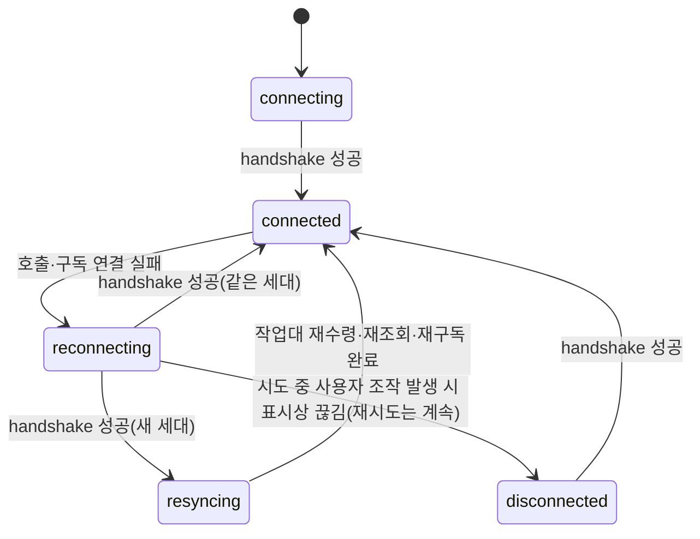

# Data Model: 043

## 연결 정보 (Connection)

| 필드 | 설명 |
|---|---|
| `baseUrl` | 루프백 끝점 |
| `token` | 짧은 데스크톱 자격 증명 — 창 출처와 **창 주체**(`desktop:window:<label>:<incarnation>`)에 묶임. 창이 닫히면 폐기 |
| `expiresAt` | 만료 시각. 80% 지점에 갱신 |

## 창 경로 (WindowTransport)

`http | compat` — 창 부팅 때 한 번 정해지고 바뀌지 않는다. `http`면 `declare_network_delivery`를 마쳤다.

## 연결 상태 (ConnectionState)

`disconnected`·`reconnecting` 동안의 변경 호출은 보내지 않는다(notApplied).

## 호출 결과 (CallOutcome)

| 종류 | 조건 | 화면 |
|---|---|---|
| `ok` | 응답 수신 | 결과 |
| `fault` | 서버 fault | 오늘 문자열(`faultToString`) |
| `notApplied` | 보내기 전 연결 없음 | "적용되지 않음" 문구 |
| `unknown` | 보낸 뒤 응답 유실 + (새 세대 또는 재시도 실패) | "적용 여부 불명" 문구 + 재조회 |

변경 호출은 `{operation, input, idempotencyKey, sentEpoch}`를 응답까지 보존한다. 같은 세대 재연결이면 한 번 재시도.

## 구독 상태 (StreamSubscription)

| 필드 | 설명 |
|---|---|
| `streamId` | `run:<id>` · `exchange:<bench>` · `bench:<bench>` · `orchestration:<binding>` · `worktree:<path>` |
| `epoch` | 받은 세대 |
| `appliedSequence` | 수신자에게 넘기기를 마친 마지막 순번 — 재연결 cursor |
| `queue` | 받았지만 아직 넘기지 않은 프레임(수신자 0명·처리 중) |
| `listeners` | 화면 수신자와 수신자별 `deliveredSequence`. `appliedSequence` = 최솟값. 0명이면 유예 뒤 해제 |
| `state` | `connecting`(표 발급·hello 전) · `live` · `recovering`(gap 복구 중) |

## 창 작업대 (WindowBench)

세션 창 하나 ↔ 작업대 id 하나. `ensure_window_bench`로 받는다. 새 세대면 다시 받는다. 닫기는 Rust가 창 Destroyed에서.
