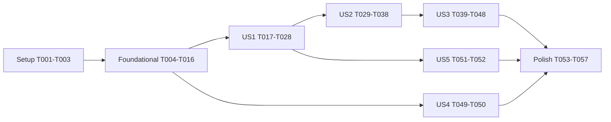

# Tasks: 데스크톱 화면을 Workbench 네트워크 경로로 전환 (043)

**Input**: `specs/043-frontend-http/` — plan.md, spec.md, research.md(R1–R12, 설계 리뷰 OCR D1–D10·Codex H1–H3 반영), data-model.md, contracts/client-contract.md, quickstart.md

**Tests**: 요청됨(TDD). 각 시험 작업은 구현 전에 작성하고 **실패를 먼저 확인**한다(실패 로그 보존). 검증은 한 번 실행·로그 저장·원 명령 종료 코드 기록. 기대값을 바꿔 통과시키지 않는다. 임의 sleep 금지 — 효과 표식·hello·명시적 신호로 동기화.

**Organization**: 사용자 스토리별. 커밋은 논리 단위, push·PR은 구현 후 OCR·Codex 리뷰 반영 뒤.

## Format: `[ID] [P?] [Story] Description`

- 경로 약어: `WC` = `packages/workbench-client/src`, `AWF` = `apps/agentic-workbench/src`, `AWT` = `apps/agentic-workbench/src-tauri/src`, `CORE` = `crates/workbench-core`

---

## Phase 1: Setup

- [X] T001 기준선 게이트 실행·기록(`pnpm test`, `pnpm check-types`(루트 turbo 전체; 필터 실행과 구분해 기록), `cargo test -p workbench-core -p workbench-server -p workbench-protocol --features test-hooks`, AW `cargo test`) — 로그·종료 코드를 `specs/043-frontend-http/reviews/baseline.md`에 기록
- [X] T002 호환 command 인벤토리 표 작성 — 저장소 함수 ↔ Tauri command ↔ Workbench operation ↔ 분류(서버 소유/데스크톱 표현) ↔ 호출 주체(창 주체 필요 여부, D2) 열, `specs/043-frontend-http/reviews/command-inventory.md`
- [X] T003 교환 상태 의미 확인(R8 "tasks 첫 단계에서 코드로 확인") — `AgentExchangeStatus` 전이(`Pending`·`Accepted`·ack 뒤)와 requested 이벤트 발행 시점을 `CORE/src/application/agent_exchange_service.rs`에서 확인해 `command-inventory.md`에 재조정 대상 상태를 확정 기록

---

## Phase 2: Foundational (모든 스토리의 선행)

**⚠️ 이 단계 완료 전 사용자 스토리 작업 금지**

### 시험 먼저

- [X] T004 [P] 창 격리 시험 `CORE/tests/window_isolation.rs` — 창 A 주체로 연 작업대를 창 B 주체로 `bench.*`·`run.*`·`exchange.*`·`orchestration.*` 호출·`Workbench.events` 구독 시 거절(`forbidden`), 같은 label 새 incarnation도 이전 incarnation 작업대 접근 거절. 실패 확인
- [X] T005 [P] 토큰 폐기 시험 `crates/workbench-server/tests/window_token_revocation.rs` — 창 incarnation에 묶인 토큰을 폐기하면 `/v1/calls`·event-ticket 401, 다른 창 토큰 영향 없음, 같은 label 재개 창의 새 토큰만 유효. 실패 확인
- [X] T006 [P] 보관 한도 재구독 시험 `CORE/tests/retention_resubscribe.rs` — 실제 event hub를 작은 journal 한도로 구성해 orchestration·교환·run 스트림에서 `RetentionExceeded`를 만들고, (a) `after = 0` 재구독은 다시 gap이며 live 미등록, (b) gap의 `lastSequence`로 연 표는 live 등록되어 이후 이벤트 수신을 단정(H1 근거 고정)

### 구현

- [X] T007 `AuthenticatedPrincipal::desktop_window(label, incarnation)` 추가 — `crates/workbench-protocol/src/principal.rs` (subject `desktop:window:<label>:<incarnation>`)
- [X] T008 토큰 발급에 주체를 묶고 incarnation 단위 폐기 API 제공 — `crates/workbench-server/src/auth.rs`(T005 통과)
- [X] T009 hub 보관 한도 설정을 시험에서 주입할 수 있게 노출(test-hooks) — `CORE/src/infrastructure/event_hub/mod.rs`(T006 통과, 운영 기본값 불변)
- [X] T010 창 incarnation 발급·보관(창 생성 시 발급, Destroyed 시 토큰 폐기·작업대 닫기) — `AWT/infrastructure/window_manager.rs`, `AWT/infrastructure/workbench_http.rs`
- [X] T011 창 주체로 작업대 열기 — `AWT/infrastructure/desktop_benches.rs`(T004 통과)
- [X] T012 호환 경로 command 전부를 호출 창 주체로 — `AWT/inbound/workbench_compat.rs`(T002 표의 주체 열 전부 반영), 기존 compat 시험 통과 확인
- [X] T013 `get_workbench_connection`이 창 주체 토큰·incarnation·epoch·만료 반환 — `AWT/infrastructure/workbench_http.rs`
- [X] T014 새 command `ensure_window_bench`, `declare_network_delivery`(incarnation 키) — `AWT/inbound/tauri_commands.rs`, `AWT/lib.rs` invoke handler 등록
- [X] T015 네트워크 전달 창 표(incarnation 키, 해당 창은 앱 내부 이벤트 전달 건너뜀) — `AWT/infrastructure/tauri_desktop_bridge.rs` + 단위 시험
- [X] T016 시험 host `CORE/examples/http_test_host.rs` — 운영 router·hub(작은 보관 한도), 고정 토큰·창 주체 두 개, 가짜 run engine(test-hooks), 시작 시 `{baseUrl, tokens}`를 stdout 한 줄 JSON, 종료는 stdin EOF. 시험 조작용 debug operation(보관 한도 초과 유발·교환 요청 발행)은 test-hooks 전용

**Checkpoint**: T004–T006 통과, compat 경로 회귀 없음

---

## Phase 3: User Story 1 — 서버 호출이 네트워크 경로를 거친다 (P1) 🎯 MVP

**Goal**: 서버 소유 조회·변경이 `POST /v1/calls`를 쓰고 결과·오류 문구가 호환 경로와 같다.

**Independent Test**: HttpTransport로 부팅한 화면에서 프로젝트 조회·run 시작이 되고, 저장소 동등성 시험이 두 transport에서 같은 결과.

### 시험 먼저

- [X] T017 [P] [US1] 호출 클라이언트 시험 `WC/call-client.test.ts` — 결과 네 가지(ok·fault·notApplied·unknown): 보내기 전 연결 없음=notApplied(fetch 미호출), 보낸 뒤 fetch 실패·응답 파싱 실패·5xx 연결 끊김=unknown; unknown이고 같은 epoch면 같은 멱등성 키로 1회 재시도해 저장 결과, 새 epoch면 재전송 0회; 401이면 자격 증명 1회 갱신 후 재시도. 실패 확인
- [X] T018 [P] [US1] 자격 증명 수명 시험 `WC/connection.test.ts` — 80% 갱신, 8시간 가상 시계 동안 만료 실패 0(SC-006), 갱신 실패 시 backoff. 실패 확인
- [X] T019 [P] [US1] 오류 문구 시험 `WC/fault-string.test.ts` — 호환 층 `faultToString`과 같은 문자열(기존 compat 매퍼 표 재사용). 실패 확인
- [X] T020 [P] [US1] 저장소 동등성 시험 `AWF/entities/*/api/*.parity.test.ts`(모듈별, T002 표 전부) — 같은 입력에 CompatTransport(가짜 invoke)와 HttpTransport(가짜 Workbench 서버) 결과·오류 문구 동일. 실패 확인

### 구현

- [X] T021 [P] [US1] `WC/fault-string.ts` (T019)
- [X] T022 [US1] `WC/connection.ts` — 자격 증명 수명·상태·backoff (T018)
- [X] T023 [US1] `WC/call-client.ts` — `createWorkbenchClient`, 멱등성 키 생성, 세 결과, 같은 세대 재시도 (T017)
- [X] T024 [US1] Transport 인터페이스·`CompatTransport`·`HttpTransport` — `AWF/shared/api/transport/`
- [X] T025 [US1] 저장소 모듈별 transport 경유로 이관(입출력 매퍼 포함) — `AWF/entities/*/api/*-repository.ts`, 모듈마다 T020 해당 시험 통과 후 커밋
- [X] T026 [US1] 부팅 경로 선택(R3, 창당 1회) — `AWF/app/bootstrap-transport.ts`, 앱 진입에서 transport 주입
- [X] T027 [US1] 기존 화면 시험을 두 transport로 매개변수화 — 화면 시험 harness(`AWF/test/`)에 HttpTransport(가짜 Workbench 서버, 실제 fetch 경로) 추가하고 기존 기대값 그대로 두 경로 실행(FR-012, SC-002)
- [X] T028 [US1] SC-001 확인 — 화면 코드의 서버 소유 `invoke` 호출 0개를 grep 기반 시험으로 고정(데스크톱 표현 목록은 허용 목록) `AWF/shared/api/transport/no-direct-invoke.test.ts`

**Checkpoint**: US1 단독으로 네트워크 경로 호출 동작

---

## Phase 4: User Story 2 — 이벤트를 구독으로 받는다 (P1)

**Goal**: run·교환·작업대 알림·orchestration·Worktree 이벤트를 WS 구독으로 받고, 네트워크 창에는 앱 내부 전달이 없다.

**Independent Test**: HttpTransport 화면에서 run 출력·교환 전달·orchestration 변경이 보이고 중복 0.

### 시험 먼저

- [X] T029 [P] [US2] 이벤트 클라이언트 기본 시험 `WC/event-client.test.ts` — 스트림당 WS 하나, 표 발급 cursor, hello 뒤 전달, 수신자 교체 대기열(상한 1,024 초과 시 재구독), 마지막 수신자 해제 유예. 실패 확인
- [X] T030 [P] [US2] 수신자 계약 시험 `WC/event-client.listeners.test.ts` — Promise 이행 뒤에만 그 수신자 `deliveredSequence` 전진, 순서대로 하나씩, Promise 거절·동기 예외 시 그 수신자만 `failed`→스냅샷 재동기 후 기준점 전진, 다른 수신자 계속, 재연결 cursor = 최솟값, 이미 성공한 수신자에게 재전달 없음, 수신자 교체 중 도착. 실패 확인
- [X] T031 [P] [US2] 교환 재조정 시험 `AWF/features/agent-run/model/exchange-reconciler.test.ts` — 원장 `requestId → routed/acked`: 요청 이벤트 수신=라우팅+ack 1회, 스냅샷 `Accepted`(T003 확정 상태) 미라우팅=라우팅+ack, 라우팅 뒤 ack 실패=ack만 재시도, 원장 없음(새로고침) 재조정=라우팅되더라도 run 전송 키 `exchange-delivery:<requestId>`. 실패 확인
- [X] T032 [P] [US2] 전달 끄기 시험 — `AWT/infrastructure/tauri_desktop_bridge.rs` 단위: 선언된 incarnation 창에는 네이티브 emit 0, 다른 창은 유지(SC-003 앱 측)

### 구현

- [X] T033 [US2] `WC/event-client.ts` — 스트림 상태·수신자 큐·settle 대기·부분 실패 재동기 hook(스트림별 스냅샷 함수 주입) (T029·T030)
- [X] T034 [US2] 화면 구독 이관 — run·교환 requested/status·bench 알림·orchestration·Worktree 구독 함수를 transport 경유로(`AWF/entities/agent-run/api/agent-exchange-repository.ts` 등 `listen*` 전부), 수신자는 Promise 반환 유지
- [X] T035 [US2] 교환 원장·재조정 모듈 `AWF/features/agent-run/model/exchange-reconciler.ts`, `worktree-agent-run-area.tsx` 교환 수신자를 재조정 경유로 교체 (T031)
- [X] T036 [US2] 교환 prompt run 전송에 멱등성 키 `exchange-delivery:<requestId>` 도출 — `AWF/features/agent-run/ui/agent-run-panel.tsx`의 external prompt 전송 경로와 run 호출 저장소
- [X] T037 [US2] 네트워크 창 부팅 시 `declare_network_delivery` 호출 — `AWF/app/bootstrap-transport.ts` (T032)
- [X] T038 [US2] 화면 통합(HttpTransport) — 기존 `worktree-agent-run-area.test.tsx` 등 이벤트 화면 시험을 HttpTransport(가짜 WS 서버)로도 실행, 추가로 orchestration 수신자 Promise 거절·동기 예외·수신자 교체 중 도착 시 화면이 스냅샷으로 복구되는 시나리오

**Checkpoint**: US1+US2로 네트워크 창 전체 동작(끊김 없는 조건)

---

## Phase 5: User Story 3 — 끊김·서버 재기동에서 회복 (P2)

**Goal**: 재연결·gap 복구·세대 재동기·응답 유실 규칙·연결 상태 표시.

**Independent Test**: 강제 끊김 100회에서 누락·중복 0, 보관 한도 초과 복구 누락 0, 교환 agent 전달 1회.

### 시험 먼저

- [X] T039 [P] [US3] 재연결 시험 `WC/event-client.reconnect.test.ts` — 가짜 WS 서버로 강제 끊김 100회 이상(받았지만 반영 전 끊김, 수신자 교체 중 끊김 포함) 누락·중복 0(SC-004), backoff 250ms→10s jitter(가상 시계), `subscriberLagged` 같은 cursor 재연결. 실패 확인
- [X] T040 [P] [US3] gap 복구 시험 `WC/event-client.gap.test.ts` — 보관 gap: gap `lastSequence`로 새 표→버퍼→스냅샷→스트림별 필터(run 순번, orchestration `revision`, 교환 `requestId`+`updatedAt`)→live; 복구 중 새 gap 재시작·3회 상한; hello만으로 성공 판정 안 함; `epochChanged` 전체 재동기 hook. 실패 확인
- [X] T041 [US3] **실제 042 hub 통합 suite** `WC/test/integration/retention-recovery.integration.test.ts` — vitest globalSetup이 `cargo run -p workbench-core --example http_test_host --features test-hooks`를 띄우고(stdout JSON 대기), 실제 `createEventClient`·`createWorkbenchClient`로 orchestration·교환·run 스트림 보관 한도 초과를 유발해 복구 뒤 변경 누락 0(SC-004c), 교환 요청 유실 뒤 재조정으로 ack 1회. 실패 확인. `WC/vitest.integration.config.ts`, `package.json` script `test:integration`
- [X] T042 [P] [US3] 응답 유실 시험(실제 서버) `WC/test/integration/call-retry.integration.test.ts` — 시험 host에서 응답 전 연결 끊김 주입(test-hooks), 같은 세대 재시도 효과 1회, host 재기동(새 epoch) 뒤 자동 재전송 0(SC-004b). 실패 확인
- [X] T043 [P] [US3] 교환 agent 전달 1회 시험 `CORE/tests/exchange_delivery_once.rs` — 가짜 ACP agent prompt 수로: 같은 `exchange-delivery:<requestId>` 키 run 전송 두 번 → agent 1회(SC-004d 서버 측 근거). 실패 확인

### 구현

- [X] T044 [US3] 재연결 루프·backoff·`subscriberLagged` 처리 — `WC/event-client.ts`, `WC/connection.ts` (T039)
- [X] T045 [US3] 보관 gap live-first 복구·버퍼·스트림별 스냅샷 병합 — `WC/event-client.ts` + 스냅샷 어댑터 `WC/snapshots.ts`(run.replay·orchestration.get·exchange.list) (T040·T041)
- [X] T046 [US3] 세대 변경 재동기 — 창 전체 재조회·`ensure_window_bench` 재호출, 새 세대 자동 재전송 금지 확인 `AWF/app/bootstrap-transport.ts`, `AWF/shared/api/transport/http-transport.ts` (T042)
- [X] T047 [US3] 교환 재조정 트리거 연결(구독 시작·gap 복구 스냅샷·같은 세대 재연결 뒤) — `AWF/features/agent-run/model/exchange-reconciler.ts` (T041·T043)
- [X] T048 [US3] 연결 상태 표시 위젯·story — `AWF/widgets/connection-status/`(ui, model, `*.stories.tsx`, 시험), 문구 외 기존 화면 불변

**Checkpoint**: US3 시험 전부 통과

---

## Phase 6: User Story 4 — 창·작업대 수명 (P3)

**Independent Test**: 두 세션 창이 서로의 작업대를 볼 수 없고, 창을 닫으면 작업대가 닫히고 토큰이 무효.

- [X] T049 [P] [US4] 두 창 화면 통합 시험 — 시험 host 두 창 주체로 `AWF` 저장소 경로에서 다른 창 작업대 조작·구독 거절 문구, 창 닫힘(토큰 폐기) 뒤 호출 401→화면 오류 `WC/test/integration/window-isolation.integration.test.ts`. 실패 확인 후 통과
- [X] T050 [US4] 창 닫기 수명 — Destroyed 시 네트워크 전달 표 제거·토큰 폐기·작업대 닫기 순서 시험 `AWT/infrastructure/window_manager.rs` 시험 모듈

---

## Phase 7: User Story 5 — 네트워크 경로 불가 시 오늘 경로 (P3)

**Independent Test**: 끝점 기동 실패 주입 시 창이 호환 경로로 부팅, 이후 자동 전환 없음.

- [X] T051 [P] [US5] 부팅 선택 시험 `AWF/app/bootstrap-transport.test.ts` — 연결 정보 실패·handshake 실패=Compat(진단 기록), 성공=Http 후 끊겨도 Compat 전환 0회, 한 창 호출·이벤트 같은 경로. 실패 확인
- [X] T052 [US5] 끝점 기동 실패 주입(debug env) — `AWT/infrastructure/workbench_http.rs`, 부팅 진단 기록 `AWF/app/bootstrap-transport.ts` (T051, SC-007)

---

## Phase 8: Polish & 실제 앱 검증

- [X] T053 debug probe 확장 — 앱 transport로 프로젝트 조회·run 시작·출력 수신·WS 강제 종료·자동 재연결·이어 받기 단정 `AWT/infrastructure/http_probe.rs`, release 바이너리 probe 문자열 0 유지
- [X] T054 실제 앱 스모크 — 개발 출처(`tauri dev`)와 배포 출처(`tauri://localhost` debug 빌드) 각각 probe 실행, 로그·종료 코드 `specs/043-frontend-http/reviews/app-smoke.md`(SC-005). Windows 출처는 미검증 목록
- [X] T055 [P] 문서 — seam 문서 화면 전환 절, 연결 상태 Storybook, `CONTEXT.md` 용어(창 주체·incarnation) 갱신, 필요 시 ADR(창별 주체)
- [X] T056 최종 게이트 1회 실행·기록(T001 목록 + `test:integration` + 화면 두 transport) `specs/043-frontend-http/reviews/implementation-review.md`, SC 증거 표
- [X] T057 OCR 구현 리뷰 → Codex `--wait` 구현 리뷰 → 반영·재검증 기록(`implementation-review.md`) 후 PR

---

## Dependencies

- US2는 US1의 transport·연결 수명에 의존. US3은 US2 이벤트 클라이언트에 의존. US4는 Foundational 창 주체와 시험 host(T016)에 의존. US5는 US1 부팅 경로에 의존.

## Parallel Examples

- Foundational 시험: T004, T005, T006 동시
- US1 시험: T017, T018, T019, T020 동시 → 구현 T021 병렬, T022→T023→T024→T025 순서
- US2 시험: T029, T030, T031, T032 동시
- US3 시험: T039, T040, T042, T043 동시(T041은 T016 필요)

## Implementation Strategy

1. MVP = Setup + Foundational + US1(네트워크 호출). 이벤트는 아직 compat 경로 — 이 시점에는 부팅 선택을 Http로 켜지 않는다(한 창 한 경로 원칙, R3). US2 완료 뒤에 Http 부팅을 켠다.
2. US2 → US3로 이벤트·회복 완성, US4·US5 수명·대체 경로.
3. Polish에서 실제 앱 스모크(개발·배포 출처)와 리뷰 2건.
