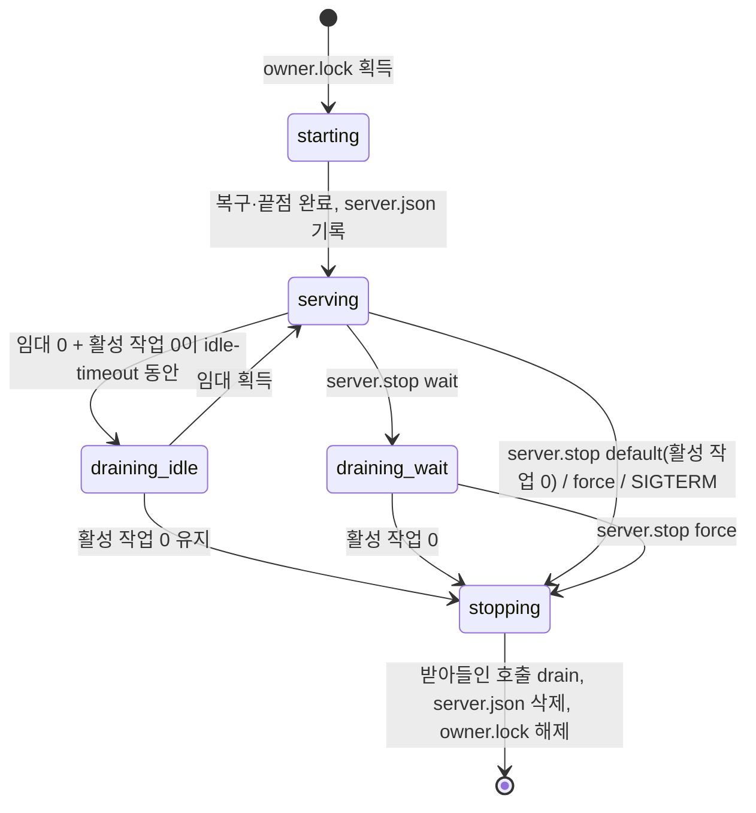

# 서버 생명주기 계약

research R4–R6·R9·R10.

## 1. 실행 파일

`agentic-workbench-server <subcommand>`

| subcommand | 동작 | 종료 코드 |
|---|---|---|
| `serve --data-dir <dir> [--idle-timeout <sec>] [--log <file>]` | 소유 잠금을 잡고 데이터 디렉터리를 연 뒤, 시작 복구 → 끝점 → 준비 → 안내 파일 순으로 진행하고 서빙한다 | 0 정상 정지, 3 이미 서버 있음(안내 파일 내용을 stderr JSON으로), 4 저장 형식 거절, 1 그 밖 |
| `ensure --data-dir <dir>` | 시작 절차(§3). 준비된 서버의 안내 파일 JSON을 stdout에 쓴다(자격 증명 제외) | 0 준비됨, 1 실패 |
| `status --data-dir <dir>` | 안내 파일로 붙어 `server.status` 결과를 쓴다 | 0, 2 서버 없음 |
| `stop --data-dir <dir> [--wait\|--force]` | `server.stop` | 0, 5 활성 작업으로 거절(blocker JSON) |

## 2. 파일 (`<data-dir>/workbench/server/`, 디렉터리 0700)

| 파일 | 권한 | 쓰는 이 | 내용 |
|---|---|---|---|
| `owner.lock` | 0600 | 서버(실행 내내 배타 잠금) | 비어 있음 |
| `startup.lock` | 0600 | 시작 절차(짧게 배타 잠금) | 비어 있음 |
| `server.json` | 0600 | 준비된 서버(임시 파일 → fsync → rename) | 아래 |
| `server.log` | 0600 | 서버 | 기동·상태 전이·경고 |

`server.json`:

```json
{
  "formatVersion": 1,
  "instanceId": "uuid",
  "serverEpoch": "uuid",
  "pid": 12345,
  "baseUrl": "http://127.0.0.1:53123",
  "serverVersion": "…",
  "protocolVersions": [1],
  "storageSchemaVersion": 2,
  "ownerToken": "base64url 32바이트",
  "startedAt": "RFC 3339"
}
```

- `pid`는 진단용이다. 살아 있음·동일성 판단에 쓰지 않는다(§3).
- 서버는 정지할 때 `instanceId`가 자기 것일 때만 지운다.

## 3. 시작 절차(ensure)

1. `startup.lock` 배타 잠금(상한 20초, 넘으면 실패).
2. `server.json`이 있으면:
   - **먼저 `POST /v1/system/identify {nonce}`(인증 없음)로 신원을 확인한다.** 응답 `{instanceId, proof}`의 `proof`를 안내 파일의 `ownerToken`으로 검증한다(`HMAC-SHA256(ownerToken, nonce ‖ instanceId)`). 틀리면 그 끝점에 자격 증명을 보내지 않고 "확인 실패"로 3단계로 간다.
   - handshake로 `instanceId`가 일치하는지, 프로토콜·저장 형식을 지원하는지 확인한다.
   - 소유자 토큰으로 `server.status`를 불러 인증과 상태를 확인한다.
   - 상태가 `serving`이면 3을 건너뛰고 끝낸다.
3. 확인이 실패했거나 파일이 없으면 `owner.lock`에 `try_lock`을 시도한다.
   - **잡힘** = 서버 없음: 남은 `server.json`을 지우고 잠금을 푼다. 서버를 띄운다(분리 프로세스 그룹, 표준 입출력 null).
   - **잡히지 않음** = 서버가 있지만 준비 전이거나 비우는 중: `server.json`이 확인을 통과할 때까지 기다린다(상한 20초).
   - 상태가 `draining`/`stopping`이면 그 서버가 끝나기를 기다렸다가 새로 띄운다.
4. 새 `server.json`이 확인을 통과하면 `startup.lock`을 풀고 결과를 돌려준다.

## 4. 새 operation (계약 생성 대상)

| operation | 종류 | 권한 | 입력 → 출력 |
|---|---|---|---|
| `server.status` | query | 소유자 | `{}` → `{state, instanceId, serverEpoch, activeWork{busyRuns, orchestrationTasks, queuedTasks, pendingExchanges, pendingNotifications, pendingOperations, acceptedCalls, reservations}, idleRuns, leases, unresolvedOperations, undeliverableExchanges, failedExchangeDeliveries, deferredTasks, idleSince?, notYetDerived}`. `deferredTasks`는 배정할 쪽(바쁜 coordinator·미전달 알림)이 없어 활동으로 세지 않은 비우기 전 준비 task id다(research R7 정책 변경). 아직 파생하지 않는 수·목록은 `null`(0/빈 배열 아님)이고 그 JSON 경로를 `notYetDerived`에 싣는다. 정지 판정은 `null`을 활동 작업으로 본다(`ActiveWorkDto::blocks_stop`) |
| `server.stop` | command | 소유자 | `{mode: "default"\|"wait"\|"force"}` → `{state}`. `default`는 활성 작업이 있으면 `conflict`와 `details.activeWork` |
| `lease.acquire` | command | 소유자 | `{clientKind: "desktop"\|"cli"\|"test", clientId}` → `{leaseId, ttlSeconds}` |
| `lease.renew` | command | 소유자 | `{leaseId}` → `{ttlSeconds}`. 모르는 임대는 `notFound` |
| `lease.release` | command | 소유자 | `{leaseId}` → `{}`(없어도 성공) |
| `desktop.issueWindowToken` | command | 소유자 | `{label, incarnation, origin}` → `{token, expiresAt}`. 출처는 WebView 허용 목록만. 폐기된 주체(tombstone)면 `forbidden` |
| `desktop.retireWindow` | command | 소유자 | `{label, incarnation, closeBench}` → `{revokedTokens, closedBenches}`. `closeBench`면 그 창 주체가 **연** 작업대를 모두 닫는다(레지스트리의 `opened_by` 조회) |
| `bench.list` | query | 모든 주체 | `{}` → `[{benchId, workingDirectory, owner, runs:[{runId, state}]}]`. 소유자는 전부, 그 밖은 자기 작업대만 |

- 새 scope `server:admin`은 소유자만 갖는다.
- 소유자 주체(`PrincipalKind::Owner`, 주체 `local:owner`)는 작업대 소유 판정을 통과한다: 모든 작업대의 run 조회·구독·취소와 `bench.close`. 우회 지점은 다음 두 곳이며 각각 시험한다(설계 리뷰 D2):
  - 작업대 레지스트리의 `resolve`·`admit`·`close_as`(주체 비교)
  - 이벤트 hub의 스트림 구독 판정(`run:`·`exchange:`·`bench:`·`orchestration:` claim)
- 소유자는 agent 전용 operation(orchestration 자식 보고 도구 등, 호출자 run이 필요한 것)에는 우회를 받지 않는다(`forbidden`).
- `/v1/system/identify`(인증 없음): `{nonce}` → `{instanceId, proof}`. 자격 증명을 보내기 전 신원 확인용이다(§3).
- `run.sendPrompt` 입력에 `continuation?: {exchangeRequestId}`를 더한다(`drain-classification.md` K).

## 5. 상태 기계



- `force`와 `SIGTERM`은 `stopping` 전에 `close_all_benches`를 한다.
- handshake와 `server.status`의 `state`에 현재 상태를 싣는다. 준비 상태 = `serving`.

## 6. 오류

| 상황 | fault |
|---|---|
| 비우는 중 N 호출 | `draining`, `outcome: notApplied` |
| 정지 중 새 호출 | HTTP 503(042) |
| 소유자 전용 op를 다른 주체가 부름 | `forbidden` |
| `default` 정지에 활성 작업 | `conflict`, `details.activeWork` |
| 폐기된 창 토큰 | `unauthenticated`(401) |
