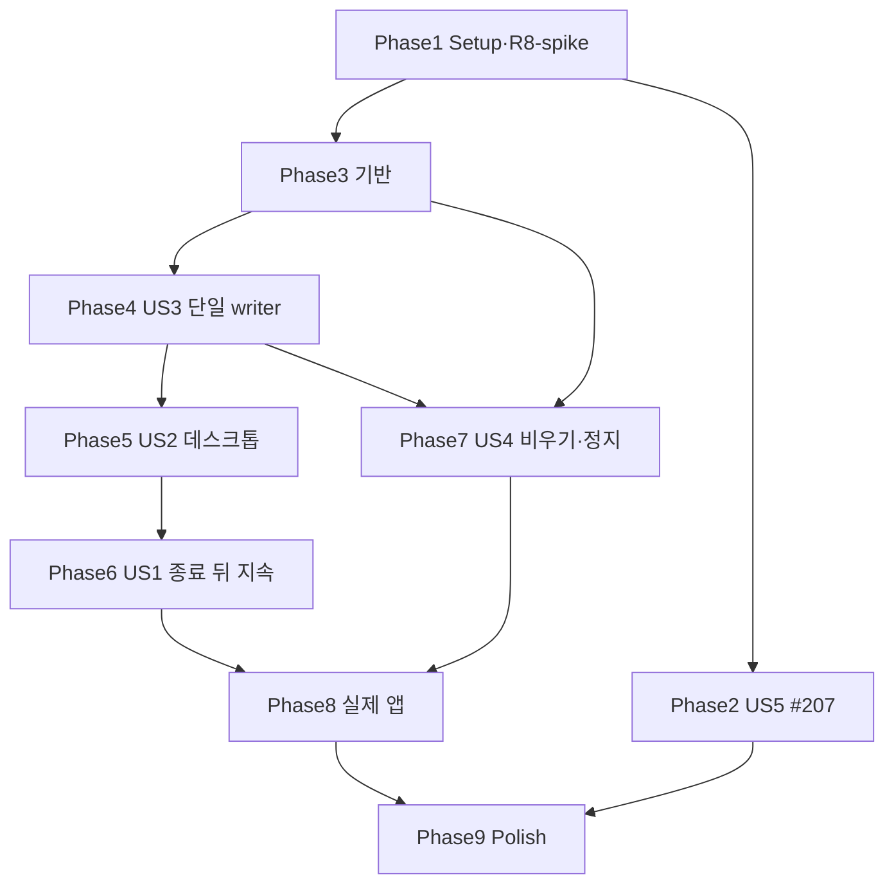

# Tasks: Workbench 독립 서버 분리 (044, 5단계 첫 증분)

**Input**: `specs/044-standalone-server/` (spec, plan, research R1–R14, data-model, contracts, quickstart, reviews/design-review.md)

**Tests**: TDD. 각 실패 시나리오 시험은 구현 **전에** 쓰고 실패(red)를 기록한다. 컴파일 실패로 인한 red와 동작 red를 구분해 적는다. 검증은 한 번 실행·로그 저장·원 명령 종료 코드를 기록한다(임의 sleep·기대값 완화 금지). 증거는 `specs/044-standalone-server/reviews/implementation-evidence.md`에 쌓는다.

**Organization**: 사용자 이야기별. 의존 때문에 단계 순서는 US5 → 기반 → US3 → US2 → US1 → US4다. 이야기 라벨은 spec 번호다.

## Format: `[ID] [P?] [Story] Description`

---

## Phase 1: Setup (선행 확인)

- [X] T001 기준선: main `cb0bd4c`에서 `cargo test --workspace --all-targets`, `pnpm check-types`, `pnpm test`, 두 `test:integration`을 한 번씩 실행해 결과·종료 코드를 `specs/044-standalone-server/reviews/baseline.md`에 기록
- [X] T002 **R8-spike**: AW `lib.rs`에 debug 전용 이벤트 로거를 임시로 붙인다(창 `CloseRequested`·`Destroyed`, `RunEvent::ExitRequested`·`Exit`, 메뉴 이벤트, 시각·label). 실제 앱(격리 identifier `…smoke044`)에서 종료 경로 (a) 빨간 버튼, (b) Cmd+W, (c) 앱 메뉴 Quit, (d) Dock Quit, (e) AppleScript `quit`, (f) 마지막 창 닫기, (g) `SIGTERM`, (h) 로그아웃(자동화 불가면 관측 불가로 기록)을 실행한다. 순서를 `specs/044-standalone-server/research.md` R8에 표로 기록. 로거는 기록 뒤 제거(커밋하지 않음)
- [X] T003 T002 결과로 R8의 창 닫기 판정 규칙과 종료 의도 수단을 확정해 `research.md` R8·`contracts/desktop-client.md` §3에 적는다. 관측된 각 종료 경로를 T048·T052의 검증 목록으로 옮긴다
- [ ] T004 [P] 새 crate 골격 `crates/workbench-host/Cargo.toml`·`src/lib.rs`, 새 앱 골격 `apps/agentic-workbench-server/Cargo.toml`·`src/main.rs`(빈 `main`), 루트 `Cargo.toml` workspace members에 `apps/agentic-workbench-server` 추가. `cargo check --workspace` 통과

---

## Phase 2: US5 — 종료와 멱등성이 경합하지 않는다 (#207, Priority: P2, 독립)

**Goal**: 닫힌 작업대의 epoch 멱등 기록이 되살아나지 않는다. **Independent Test**: 작업대 닫기와 그 작업대 변경 호출의 완료 순서를 뒤집은 시험.

- [ ] T005 [US5] 결정적 재현 시험 `crates/workbench-core/tests/bench_close_idempotency.rs`: 시험 엔진의 prompt 완료를 gate로 붙잡고 `run.sendPrompt`(epoch 멱등) → `close_all_benches` → gate 해제 → 호출 `Ok` → 같은 키 재시도가 `notFound`인지 단정. **수정 전 실패(`Complete`)를 기록**
- [ ] T006 [US5] `crates/workbench-core/src/application/epoch_idempotency.rs`에 세대 범위 `closed_benches` tombstone 추가: `drop_bench`가 세우고, `record`·실행 전 조회가 tombstone scope를 비어 있는 것으로 본다. T005 green. `acp_permission_exit` 원 시험 20회 반복 실행 결과 기록

---

## Phase 3: 기반 (모든 이야기의 전제)

- [ ] T007 protocol 새 operation 8개(`server.status`·`server.stop`·`lease.acquire`·`renew`·`release`·`desktop.issueWindowToken`·`desktop.retireWindow`·`bench.list`)와 `run.sendPrompt` 입력 `continuation?`을 `crates/workbench-protocol/src/call.rs`·`operations/{server,lease,desktop}.rs`·`operations/run.rs`에 정의. `PrincipalKind::Owner`(`local:owner`)·`Scope::ServerAdmin`을 `principal.rs`에. OpenAPI·`packages/workbench-client` 생성물 재생성(`pnpm --filter @yoophi/workbench-client generate`), operation kinds 표 갱신, drift 검사 통과
- [ ] T008 **분류 대조 시험 먼저**: `crates/workbench-core/tests/drain_classification.rs`가 `contracts/drain-classification.md` 표를 파싱해 `OperationId::ALL`·operation 종류와 대조한다(모든 op가 정확히 한 행, query는 Q). red 기록(컴파일 red)
- [ ] T009 `crates/workbench-core/src/application/drain.rs`: `DrainClass{Q,C,K,N}`, command마다 빠짐없는 match `drain_class(OperationId, &input)`. K 조건 판정은 T027·T037에서 채운다(자리만). T008 green
- [ ] T010 **R14 작업 관문 시험 먼저**: `crates/workbench-core/tests/work_gate.rs`에 E1 실패 순서를 쓴다. (i) 대기열 prompt만 남은 구간에서 활동 0 아님, (ii) RPC 오류로 끝난 prompt 뒤 활동 0, (iii) 정지 판정과 예약 교차 1000회에서 "멈춘 뒤 실행" 0, (iv) 시작 중·Ralph 반복 사이 활동 0 아님(시험 엔진). red 기록
- [ ] T011 `crates/workbench-core/src/application/work_gate.rs`: 잠금 G 아래 서버 상태·활동 예약 표(A-turn·X-deliver·T-start·N-notify·C-call, drop 해제 guard)·교환 소비 표·기동 토큰 표·정지 판정. `WorkbenchRuntime`에 연결(`active_work()`, 상태 조회)
- [ ] T012 엔진 실행 수명 계약: `crates/workbench-core/src/infrastructure/run/acp_run_engine.rs`의 `send_prompt`(세션 `send_prompt` future를 직접 spawn)·`queue_prompt`·`steer`·`send_and_wait`에 A-turn guard. `crates/workbench-core/src/testing/scripted_run_engine.rs`도 같은 계약
- [ ] T013 `acp-agent-core` 선택 인자: `crates/acp-agent-core/src/application/start_agent_run.rs`와 runner에 활동 guard 공급자(초기 prompt 순서·Ralph 반복을 순서 끝까지 덮음)와 `start_gate`(준비 뒤 실행 허용) 선택 인자 추가. 넘기지 않으면 오늘과 같다. T010 green. **소비자 검증**: `cargo test -p acp-agent-core`, ask-code·hushline `src-tauri` `cargo test`·`cargo check` 기록
- [ ] T014 [P] 조립 이동: `crates/workbench-host/src/assembly.rs`(런타임 `bootstrap_with` + HTTP 상태: 발급기·표·resolver·출처 정책 + MCP)에 AW `workbench_http.rs`·`lib.rs` 조립을 옮긴다. `WorkbenchHttpState`의 `tauri::async_runtime::spawn`을 tokio로
- [ ] T015 [P] MCP 이동: `apps/agentic-workbench/src-tauri/src/infrastructure/mcp/*` → `crates/workbench-host/src/mcp/`(런타임 직접 주입, `AppHandle` 제거). MCP 시험도 함께 옮겨 green
- [ ] T016 `crates/workbench-host/src/launch.rs` `McpLaunchDecorator`(창 무관 MCP 연결 주입)와 no-op 데스크톱 브리지. 기존 run.start MCP 주입 시험 green
- [ ] T017 시험 host `crates/workbench-core/examples/http_test_host.rs`를 host 조립으로 바꾸고(가짜 엔진 `test-hooks` 유지), 043 통합 suite(`pnpm --filter @yoophi/workbench-client test:integration`) green 기록

---

## Phase 4: US3 — 한 데이터 디렉터리에 서버는 하나만 쓴다 (Priority: P1)

**Goal**: 단일 writer, 안내 파일, 신원 증명, 복구. **Independent Test**: 같은 데이터 디렉터리 동시 시작, kill -9 뒤 복구, 권한.

- [ ] T018 [US3] **프로세스 시험 먼저** `apps/agentic-workbench-server/tests/process.rs`: (i) 동시 `serve` 10개 → 데이터 여는 서버 1개, 나머지 종료 코드 3, (ii) `kill -9` 뒤 `ensure`가 5초 안에 준비, (iii) `server.json`·디렉터리 권한 0600·0700, (iv) 다른 데이터 디렉터리는 따로 뜸, (v) 모르는 저장 형식 데이터 디렉터리는 종료 코드 4·데이터 무변경. red 기록
- [ ] T019 [P] [US3] `crates/workbench-host/src/lifecycle/lock.rs`: `owner.lock`·`startup.lock`(표준 파일 잠금), `workbench/server/` 0700 생성
- [ ] T020 [P] [US3] `crates/workbench-host/src/lifecycle/descriptor.rs`: `server.json` 원자적 쓰기(0600 임시 → fsync → rename), 자기 인스턴스일 때만 삭제, 32바이트 소유자 토큰
- [ ] T021 [US3] **신원 증명 시험 먼저** `crates/workbench-host/tests/identify.rs`: 남은 안내 파일의 포트에 가짜 서버를 띄우면 `ensure`가 소유자 토큰을 **보내지 않음**(가짜 서버가 받은 헤더 0건), 올바른 서버는 HMAC 증명 통과. red 기록
- [ ] T022 [US3] `/v1/system/identify`(`crates/workbench-server/src/routes`, 인증 없음, `HMAC-SHA256(ownerToken, nonce ‖ instanceId)`)와 `ServerInfo`에 증명 함수. 소유자 resolver(`crates/workbench-host/src/assembly.rs`, 토큰 digest 비교 → `Owner` 주체). T021 green
- [ ] T023 [US3] `crates/workbench-host/src/lifecycle/ensure.rs`: 시작 절차(contracts/server-lifecycle.md §3), 실행 파일 spawn은 `process_group(0)`·null stdio·로그 파일
- [ ] T024 [US3] `apps/agentic-workbench-server/src/main.rs`: `serve`·`ensure`·`status`·`stop`(종료 코드 계약), 시작 복구 뒤 준비 → 안내 파일. T018 green 기록

---

## Phase 5: US2 — 데스크톱은 서버를 찾거나 띄워 붙는다 (Priority: P1)

**Goal**: 외부 모드 thin client. **Independent Test**: 서버 없음·있음에서 앱 연결, 창 닫기 뒤 토큰 거절·작업대 닫힘, 연결 실패 화면.

- [ ] T025 [US2] **창 폐기 단조성 시험 먼저** `crates/workbench-host/tests/window_tokens.rs`(C4): 폐기 완료 뒤 지연된 발급 → `forbidden`, 같은 label 새 incarnation → 성공, 발급·폐기 동시 100회 → 폐기 뒤 유효 토큰 0, 폐기 뒤 표로 구독 불가. red 기록
- [ ] T026 [US2] core 핸들러: `desktop.issueWindowToken`(발급기 잠금 아래 tombstone 확인)·`desktop.retireWindow`(토큰·표 폐기 + tombstone + `closeBench`면 그 주체가 연 작업대 모두 닫기)·`lease.*`·`bench.list`·`server.status`. 소유자 전용 scope 검사. T025 green
- [ ] T027 [US2] 소유자 우회 두 지점: `crates/workbench-core/src/application/bench_service.rs`(`resolve`·`admit`·`close_as`)와 이벤트 hub 스트림 구독 판정. agent 전용 op는 우회 제외. 시험 `crates/workbench-core/tests/owner_principal.rs`(소유자는 모든 작업대 조회·구독·취소, 창·agent는 여전히 자기 것만, agent 전용 op는 `forbidden`) — 시험 먼저 red
- [ ] T028 [US2] AW 모드 선택(`apps/agentic-workbench/src-tauri/src/lib.rs`): 기본 external = 런타임 관리 상태 없음 + `infrastructure/server_client.rs`(host `ensure`, 임대 10초 갱신, 창 토큰 발급, `retireWindow`), `embedded` = host 조립 + 같은 `owner.lock` + 안내 파일 `mode: embedded`. 서버 실행 파일 탐색 규칙(contracts/desktop-client.md §1)
- [ ] T029 [US2] command 외부 모드(`inbound/tauri_commands.rs`): `get_workbench_connection`(ensure + 창 토큰), `ensure_window_bench`(창 토큰으로 `bench.open`·조회), 전달 선언 no-op, compat 서버 소유 command는 정해진 오류(런타임 `Option`), 신규 `apply_window_title`. `no-direct-invoke.test.ts` 허용 목록 갱신
- [ ] T030 [US2] **창 닫기 판정 시험 먼저**: T003에서 확정한 규칙으로 순수 함수 `apps/agentic-workbench/src-tauri/src/application/window_close_intent.rs`의 시험(관측한 이벤트 순서 조합마다 CloseBench/KeepBench). red 기록 → 구현 → green
- [ ] T031 [US2] 창·앱 수명 연결(`infrastructure/window_lifecycle.rs`, `lib.rs`): 닫기 의도·종료 의도 기록(T003 수단), `Destroyed`에서 `retireWindow{closeBench}`, 외부 모드 종료 경로는 `close_all_benches` 없이 `lease.release` + 대기 `retireWindow` 2초 상한
- [ ] T032 [P] [US2] 화면: `apps/agentic-workbench/src/app/bootstrap-transport.ts` 외부 모드는 대체 없음 → 연결 실패 상태, `src/shared/ui/connection-failure.tsx`(이유 + 다시 시도) + Storybook 이야기, `src/app/App.tsx`에서 제목 이벤트 → `apply_window_title`. 부팅 시험 갱신(외부 모드 실패 → compat로 가지 않음)
- [ ] T033 [US2] 043 화면 시험·통합 시험을 외부 서버 경로(시험 host)로 실행해 기대값 변경 없이 통과 기록(SC-010 일부)

---

## Phase 6: US1 — 앱을 꺼도 run이 계속되고, 앱 없이 볼 수 있다 (Priority: P1)

**Goal**: 완료 기준 (a)의 서버 쪽. **Independent Test**: 실제 앱 종료 뒤 소유자 클라이언트로 조회·출력·취소.

- [ ] T034 [US1] host 통합 시험 `crates/workbench-host/tests/owner_after_desktop.rs`: 창 토큰으로 run 시작 → 창 임대 해제(앱 종료 흉내, 작업대 닫지 않음) → 소유자 클라이언트가 `bench.list`에서 run을 보고, `run.replay` + 구독으로 출력 이어 받기, `run.cancel`로 agent 프로세스 종료 확인(시험 엔진 + 가짜 ACP agent 둘 다)
- [ ] T035 [US1] 앱 스모크 probe 확장(`apps/agentic-workbench/src-tauri/src/infrastructure/http_probe.rs`): 외부 모드 연결 확인, 시나리오 `quit`(run 시작 뒤 결과 기록하고 앱 종료 신호 대기). 스모크 스크립트 `specs/044-standalone-server/reviews/app-smoke/owner-check.py`(안내 파일로 신원 증명 → 소유자 토큰 → `bench.list`·`run.replay`·구독·`run.cancel`)
- [ ] T036 [US1] 실제 앱 043 스모크(출력 + 강제 재연결, 새로고침 1회 전달)를 외부 서버 모드로 개발·배포 출처 각각 실행(SC-010)

---

## Phase 7: US4 — 서버는 스스로 비우고 멈춘다 (Priority: P2)

**Goal**: 상태 기계, 분류, 임대·유휴, 정지 세 방식, R14 전이. **Independent Test**: 유휴·정지 세 방식, 실제 경로 wait-stop.

- [ ] T037 [US4] **K·C5·E2 시험 먼저** `crates/workbench-core/tests/exchange_delivery_drain.rs`: K 조건(작업대·대상 run·배달 방식·`rejected` 아님·미소비·키) 충족·불충족, 같은 교환 둘째 prompt(다른 키·다른 내용·동시) 거절·효과 1회, 알림 prompt가 먼저 turn을 잡아도 교환 prompt가 엔진 대기열로 전달. red 기록 → `run.sendPrompt(continuation)`의 대기열 경로·소비 구현 → green
- [ ] T038 [US4] **E3·E4·F1 시험 먼저** `crates/workbench-core/tests/child_assign_atomic.rs`: 서로 다른 키 동시 배정 100회 → task마다 run 1개, 배정·취소 경합, 시작 장벽 지점별(예약 전·spawn 뒤·attach 전·전이 전·장벽 전) 취소와 abort → 취소 성공이면 launcher·prompt 실행 0·예약 누락 0, 등록 뒤 취소는 실제 run 취소, `bind_child_run`이 취소된 task 거절. red 기록 → 저장소 RMW 비교 후 변경·기동 토큰·`start_gate` 연결(`agent_tools.rs`·`service.rs`·`engine_agent_worker.rs`) → green
- [ ] T039 [US4] **F2·G1·G2 시험 먼저** `crates/workbench-core/tests/notification_reservation.rs`: 전달기 첫 poll gate(보고·자식 turn 끝난 뒤 wait 멈추지 않음 → 해제 → 전달 → 멈춤), 재시도 가능 실패 뒤 서버 재전달, `Dispatching` 저장 직후 abort·결과 저장 실패 → 회수·재전달, 결과 transaction 직전 gate에서 회수 → 변경 0, 같은 지점 abort → 회수. red 기록 → N-notify·`attemptId`·회수 구현(`notification_dispatcher.rs`) → green
- [ ] T040 [US4] 입구 판정: `WorkbenchRuntime::call`에서 `draining`이면 `drain_class`로 N 거절(`draining`, notApplied)·K 조건 판정, `stopping`이면 503(서버). operation마다 판정 시험(K는 양쪽)
- [ ] T041 [US4] `crates/workbench-host/src/lifecycle/{state,lease,idle}.rs`: 임대 TTL·유휴 판정(활동 작업 정의 R14, `unknown` 비차단, 임대 없을 때 미소비 교환 비차단), `server.stop` 세 방식, SIGTERM·SIGINT = force(30초 상한), 정지 때 쉬는 세션 취소·안내 파일 삭제
- [ ] T042 [US4] **실제 경로 wait-stop 시험** `crates/workbench-host/tests/wait_stop.rs`(실제 조립 + HTTP + 가짜 ACP agent): (a) 권한 대기 → 응답 → 세션 살아 있어도 정지, (b) 대상 run 바쁨 → 교환 요청 → 확인이 전송보다 먼저 → turn 뒤 `continuation` 전달 → 정지, (c) 자식 보고·결과(MCP) → 알림 전달 → 정지, (d) 동시 상한 1 task 둘 → 둘째 K 배정 → 정지, (e) 대기 자식 명령 전달 → 정지. 각 경우 대조 변이(C·K를 N으로, (a)는 세션 수로 세기)에서 상한 안에 멈추지 않음 단정
- [ ] T043 [US4] 043 소비자 코드로 wait-stop 중 교환 전달: `apps/agentic-workbench/src/shared/api/transport/drain-exchange.itest.ts`(실제 시험 host, `createNetworkEvents` + `createExchangeReconciler`, 교환 원장·패널 전달에 `continuation` 싣기) — 화면 원장 변경(`features/agent-run/model/exchange-reconciler.ts`, `entities/agent-run/api`) 포함
- [ ] T044 [US4] 프로세스 시험 추가(`apps/agentic-workbench-server/tests/process.rs`): 임대·활동 없음 → `--idle-timeout` 뒤 정지·안내 파일 삭제, 활동 있음 → 정지 안 함, `stop` default(활동 있음 → 종료 코드 5)·`--wait`·`--force`, `unknown`만 남은 서버의 정지, 비우는 중 N 거절

---

## Phase 8: 실제 앱 검증 (US1·US2 완료 조건)

- [ ] T045 [US1] 실제 앱 `quit` 스모크: T003에서 관측한 **종료 경로마다** run 시작 → 그 경로로 종료 → PID 소멸 확인 → `owner-check.py`로 run 진행·출력 이어짐·취소. 개발 출처와 배포 출처(`tauri build --debug --no-bundle` + 옆 서버 실행 파일) 각각. 결과 JSON을 `specs/044-standalone-server/reviews/app-smoke/`에. **관측 경로 중 하나라도 실패·미실행이면 SC-001 미완료로 둔다**
- [ ] T046 [US2] 창 닫기 대조: 관측한 창 닫기 경로((a)·(b))에서 그 작업대의 run이 취소되고 그 창 토큰이 거절됨(SC-006)
- [ ] T047 [US2] 서버 실행 파일이 없을 때 앱의 연결 실패 화면과 다시 시도, 서버가 떠 있을 때 새로 띄우지 않음, 서버 없을 때 한 번만 띄움(SC-005)
- [ ] T048 [US1] 관측 불가 경로(예: 로그아웃)와 Windows·Linux를 `specs/044-standalone-server/reviews/app-smoke.md`의 미검증 목록에 적는다(완료로 세지 않음)

---

## Phase 9: Polish

- [ ] T049 [P] ADR 두 건: `docs/adr/0009-standalone-server-and-owner-principal.md`, `docs/adr/0010-app-quit-is-not-window-close.md`
- [ ] T050 [P] `docs/workbench-seam.md` "독립 서버(044)" 절, `crates/workbench-core/CONTEXT.md` 용어(서버 인스턴스·소유자 주체·임대·비우기 분류·작업 관문)
- [ ] T051 5단계 완료 기준 추적 표를 `specs/044-standalone-server/reviews/implementation-review.md`에 옮기고, 044 완료 항목과 **후속 미완료**((d) 프로세스 트리 가두기, (e) 백업·복원·단계적 이전, (f) 설치본 포함·서명·공증·버전별 캐시·업데이트 preflight, CLI(6단계), 재부착 화면, 교환 전달 서버 소유, 관측 불가 종료 경로, Windows·Linux)를 구분해 적는다
- [ ] T052 최종 게이트 1회 실행·기록(`implementation-review.md`): fmt, clippy `-D warnings`, `cargo test --workspace --all-targets`(ask-code·hushline 포함), `check-types`, `pnpm test`, `build`, 두 `test:integration`
- [ ] T053 OCR 구현 리뷰 → Codex `--wait` 구현 리뷰 → 반영·재검증 기록(`implementation-review.md`) 후 PR

---

## Dependencies

- US5는 독립(Phase 1 뒤 언제든).
- T003(R8 확정)은 T030·T031·T045·T046의 전제다.
- T013(acp-agent-core)은 T038의 시작 장벽 전제다.

## Parallel Examples

- 기반: T014·T015는 다른 파일(조립·MCP)이라 병렬.
- US3: T019·T020 병렬.
- US2: T032(화면)는 T029와 병렬.
- Polish: T049·T050 병렬.

## Implementation Strategy

1. R8-spike와 #207을 먼저 끝낸다(설계 확정 + CI flaky 원인 제거).
2. 기반(분류·작업 관문·조립 이동) → 단일 writer → 데스크톱 연결 순서로, 매 단계 기존 043 시험을 유지한다.
3. US1의 실제 앱 종료 검증과 US4의 실제 경로 wait-stop이 044 완료 조건이다. 둘 중 하나라도 미완료면 044를 완료로 표시하지 않는다.
4. 044 완료는 5단계 완료가 아니다. 후속 미완료 표(T051)를 PR 본문에 싣는다.
