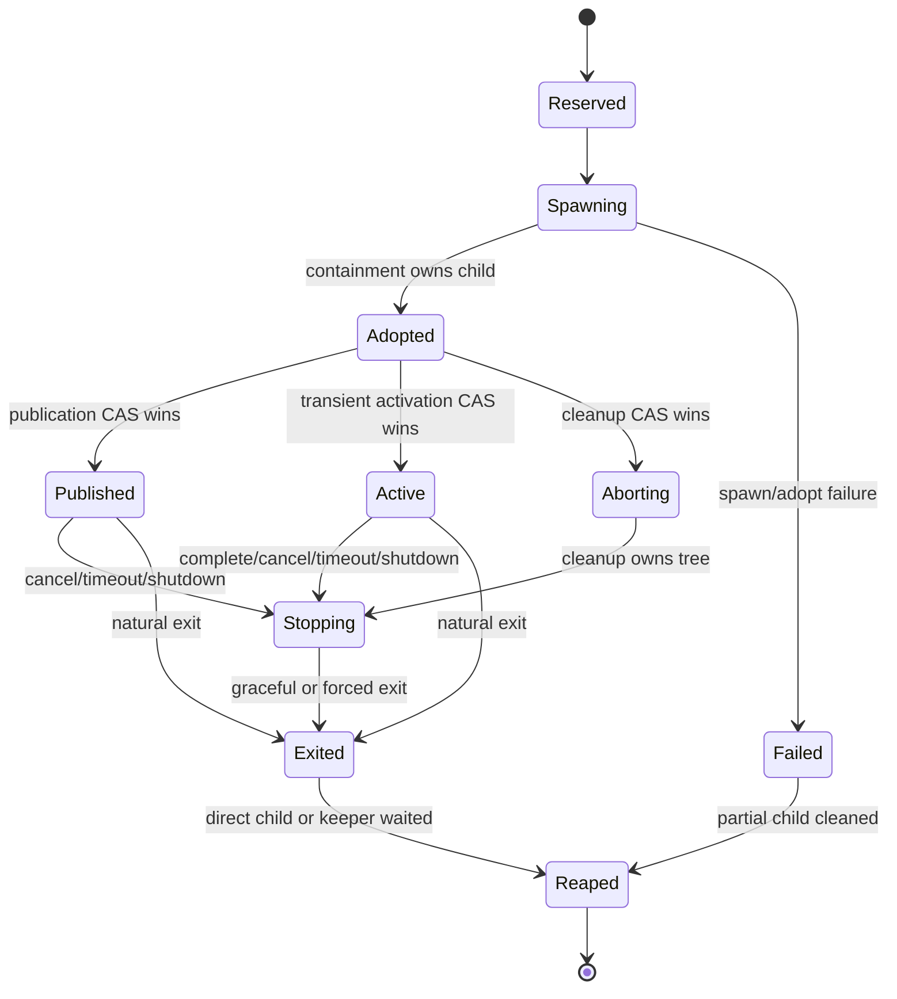

# Data Model: 서버 자식 프로세스 감독

## ProcessOwner

- `kind`: `Run | Terminal | Git | WatcherHelper | CatalogHelper | ShellProbe | Server`
- `owner_id`: domain이 발급한 stable ID
- `attempt_id`: owner 아래 실행 시도를 구분하는 UUID
- `created_at`

규칙:
- durable business owner는 spawn 전에 domain state에 예약된다. read-only helper owner의 domain 의미는 authenticated request/server 수명 안에서 transient다.
- domain reservation과 별개로 모든 ServerOwned child는 spawn 전에 durable containment recovery anchor를 가진다.
- 같은 owner의 새 attempt는 이전 attempt의 late stop/exit/output을 받지 않는다.

## ProcessSpec

- `program`: 실행 파일 경로/이름
- `args`: 분리된 argv
- `cwd`: server-host 절대 경로
- `env`: 값은 secret 취급하는 key/value 목록
- `owner`: `ProcessOwner`
- `purpose`: 고정된 진단 label
- `stdin_policy`
- `stdout_policy`, `stderr_policy`
- `timeout_policy`
- `termination_policy`

검증:
- shell command 문자열을 받지 않는다.
- 빈 program, 상대 cwd escape, 중복 env key, 0 또는 상한 밖 timeout을 거절한다.
- Debug/Display는 env value를 출력하지 않는다.

## SupervisedProcess

- `process_id`: supervisor 내부 UUID
- `owner`
- `state`
- `platform_identity`: Unix keeper/payload PID+start identity+nonce 또는 Windows Job/process handle identity
- `descendant_identities`: Unix에서 nonce+start identity로 확인한 live/terminated descendant 집합 또는 Windows Job accounting snapshot
- `started_at`, `published_at`, `exited_at`, `reaped_at`
- `exit_reason`
- `stdout_state`, `stderr_state`

상태 전이:

불변식:
- `published_at`은 containment adoption보다 빠를 수 없다.
- terminal outcome은 한 번만 정해진다.
- Reaped 전 registry entry를 제거하지 않는다.
- Unix cleanup은 process group과 descendant identity 집합이 모두 0으로 수렴하기 전 Reaped가 아니다.

## ProcessAttemptRecord (SQLite schema v3 containment anchor)

- `attempt_id` primary key
- `owner_kind`, `owner_id`, optional `parent_owner_id`
- optional `operation_execution_id`
- `lifecycle_state`: `reserved | spawning | adopted | published | active | aborting | terminal`
- `domain_mode`: `durable_publication | transient_execution`
- `platform_kind`
- non-secret `containment_nonce`
- leader/keeper start identity metadata
- `created_at`, `updated_at`, optional `terminal_reason`

규칙:
- 모든 ServerOwned child가 spawn 전에 durable row를 만든다. 이 row는 crash containment용이며 transient helper를 durable business command로 바꾸지 않는다.
- env/argv payload, credential, protocol content는 저장하지 않는다.
- `Adopted → Published|Active|Aborting`은 동일 행을 조건부 갱신하는 단일 CAS다. 최초 성공 전이만 승자다.
- Published commit이 caller ack보다 정본이다. ack 유실 시 resolver가 이 값과 outbox를 읽는다.
- startup recovery는 unfinished row를 읽고 platform identity를 재검증한다.
- Reaped 뒤 anchor는 terminal tombstone/진단 보존 기간 후 GC한다.

## ProcessPublicationOutbox (SQLite schema v3)

- `event_id`: `(attempt_id, event_kind)`에서 결정되는 primary key
- `attempt_id` foreign key
- `event_kind`: `accepted | started`
- `payload_json`: 비밀값이 없는 idempotent projection
- `stream_sequence`, `created_at`, optional `delivered_at`

규칙:
- durable domain result, `ProcessAttemptRecord=Published`, outbox insert는 하나의 transaction이다.
- unique event id로 logical publication을 한 번만 만든다. dispatcher 재전송과 reconnect replay는 허용하지만 projection은 중복 적용하지 않는다.
- `Aborting` winner에는 outbox가 없고, 이미 Published인 행에 cleanup CAS를 적용할 수 없다.

## TransientAttempt

- read-only Git/watcher/catalog/PATH helper의 business 의미와 result는 in-memory owner/attempt다.
- spawn 전에 registry와 durable containment anchor를 예약하고 Reaped 뒤 registry를 제거한다.
- server crash 뒤 helper operation/result를 재개하지 않는다. anchor는 escaped descendant cleanup에만 쓰며 새 호출은 새 attempt를 만든다.

## StreamPolicy

### ProtocolFrames

- `framing`: v1은 newline-delimited
- `max_frame_bytes`
- `ingress_capacity`
- `frame_progress_deadline`, `min_progress_bytes_per_interval`
- owner `runtime_deadline`
- overflow/malformed/EOF outcome: typed fatal failure

frame 일부를 성공 데이터로 전달하지 않는다.

### ParsedCapture

- `max_bytes`
- `utf8_policy`: consumer가 선택하되 overflow는 typed failure
- complete output만 성공 결과로 반환한다.

### DisplayLog

- `max_retained_bytes`
- `max_event_bytes`
- `events_per_interval`
- `dropped_bytes`, `dropped_events`, `truncated`

### Null

- pipe를 만들지 않거나 즉시 폐기한다.

## ExitReason

- `Completed(status)`
- `SpawnFailed(kind)`
- `AdoptFailed(kind)`
- `Cancelled`
- `TimedOut`
- `ProtocolFrameTooLarge { limit, observed_at_least }`
- `ProtocolMalformed`
- `ProtocolUnexpectedEof`
- `ProtocolProgressTimeout`
- `CaptureOverflow { stream, limit }`
- `GracefulTimeout`
- `ForceKilled`
- `ServerShutdown`
- `ParentLost` (keeper가 server control EOF를 관측)
- `PlatformFailure(kind)`

## ProcessInventoryEntry

- `source_pattern`
- `category`: `ServerOwned | DaemonBootstrap | DesktopNative | Build | Fixture | OtherApp`
- `owner_kind`
- `stream_contract`
- `supervised`: bool
- `rationale`
- `validation_target`

`ServerOwned`는 `supervised=true`여야 한다. 나머지는 별도 owner와 제외 근거가 필수다.
