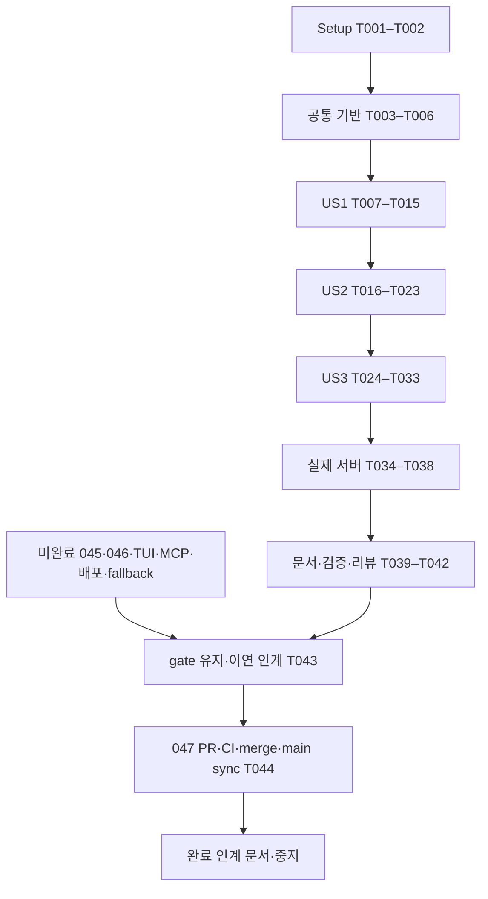

# Tasks: Rust client와 public CLI

입력: spec.md, plan.md, data-model.md, research.md, contracts/*.md, quickstart.md. 설계 bd6099c에 OCR → Codex approve 완료. macOS만 대상이다. 최신 사용자 지시(2026-09-29)에 따라 047 구현/계약·actual server 검증/순차 리뷰/PR·CI/squash merge/main sync/인계 기록 후 중지한다. 원 전체 전환 목표는 superseded 이력으로 보존하며 045/046 등 후속 구현은 시작하지 않는다. 체크는 실제 구현·검증 증거가 있을 때만 갱신한다.

## Phase 1: Setup

- [x] T001 `crates/workbench-client/Cargo.toml`, `src/lib.rs`, `apps/aw-cli/Cargo.toml`, `src/main.rs`와 root `Cargo.toml`에 독립 client/CLI를 등록하고 domain/ports/application/infrastructure 경계를 만든다. production dependency에는 protocol만 공유하고 host/core/server/Tauri를 넣지 않는다.
- [x] T002 `specs/047-rust-client-cli/validation.md`에 Cargo metadata/tree, macOS host, 기존 lock의 hyper/tungstenite 및 새 standard hmac resolution 근거를 기록한다. lock은 필요한 dependency만 변경한다.

## Phase 2: 공통 기반

- [x] T003 `crates/workbench-client/tests/limits.rs`에 nonzero bounds, body/input/frame/queue exact/+1, duration overflow fixture를 먼저 작성하고 `src/domain/limits.rs`에 validated limits를 구현한다.
- [x] T004 `crates/workbench-client/tests/attempt.rs`에 unknown/retry/epoch/immutable input/key/generation 및 stale completion fixture를 먼저 작성하고 `src/domain/attempt.rs`에 attempt state와 full outcome을 구현한다. Applied/Unknown/NotApplied를 혼동하지 않는다.
- [x] T005 `crates/workbench-client/tests/admission.rs`와 `src/application/admission.rs`에 catalog 전체 operation classification과 closed production allowlist, agent owner fallback0, missing045/046 gate 및 generic/explicit command parity를 구현한다. 새 operation은 기본 거절한다.
- [x] T006 `crates/workbench-client/src/ports/mod.rs`에 verified connection/credential, call transport, retry-store CAS, event consumer와 snapshot port를 정의하고 `tests/reuse.rs`의 독립 fixture consumer로 재사용을 확인한다. secret/private payload는 Debug에 노출하지 않는다.

## Phase 3: US1 안전한 기존 서버 호출 (P1)

독립 검증: 격리 loopback peer의 identity/credential, full fault/replay, replacement/cancellation fixtures. 실제 서버 검증은 T035–T038도 필요하다.

- [x] T007 [P] [US1] `crates/workbench-client/tests/locator.rs`에 symlink/부모 경로/uid/mode/type/size/replacement 및 agent descriptor fallback 거절 시험을 먼저 작성한다.
- [x] T008 [P] [US1] `crates/workbench-client/tests/identity.rs`에 literal HMAC golden vector와 원 host 비교, identify 실패 credential0, proof 뒤 socket close/replacement 및 WS socket proof 시험을 먼저 작성한다.
- [x] T009 [US1] `crates/workbench-client/src/infrastructure/locator.rs`에 readonly no-follow FD descriptor read, loopback IP URL validation, protocol/storage compatibility, missing server unavailable을 구현한다. spawn/ensure/migrate 없음.
- [x] T010 [US1] `crates/workbench-client/src/infrastructure/identity.rs`에 standard hmac/sha2 proof verification과 redacted secret type을 구현한다. owner token은 credential provider 밖의 diagnostics에 넣지 않는다.
- [x] T011 [US1] `crates/workbench-client/src/infrastructure/http.rs`에 owned TCP HTTP1 sender/driver, same-socket identify→handshake→call, 새 socket fresh proof, proxy/redirect/automatic retry0 및 bounded headers/body/deadline을 구현한다.
- [x] T012 [P] [US1] `crates/workbench-client/tests/call_protocol.rs`에 malformed/status/requestId/kind/oversize/unknown body 및 full fault details/revision/replayed 보존 fixtures를 작성한다.
- [x] T013 [US1] `crates/workbench-client/src/application/call.rs`에 catalog input validation과 admission, exact request identity, typed protocol/transport failures, explicit retry 및 401/epoch 정책을 구현한다. timeout/local cancel 뒤 자동 server cancel0.
- [x] T014 [US1] `crates/workbench-client/tests/http_lifecycle.rs`에 slow headers/body, failed handshake, dropped caller, connect/proof/call cancellation과 driver/socket bounded settle를 검증한다.
- [x] T015 [US1] `crates/workbench-client/tests/call_retry.rs`에 response-loss same-key effect1, new epoch resubmit0, old generation completion0과 independent consumer parity를 검증한다.

## Phase 4: US2 machine CLI와 durable retry (P1)

독립 검증: CLI subprocess stdout/stderr/exit golden, private retry file crash/reopen/CAS 및 no raw payload diagnostics.

- [X] T016 [P] [US2] `apps/aw-cli/tests/finite.rs`에 finite result/error envelope, 현재 production gate에서 도달 가능한 exit family, stdin limits/UTF8/schema, secret sentinel, command alias parity golden을 먼저 작성한다. RunCancel prerequisite로 도달 불가한 cancel-rejected exit6은 미검증/이연으로 명시하여 최종 리뷰받고 explicit/generic gate parity를 유지한다. gate를 해제하거나 production proof로 계산하지 않는다.
- [x] T017 [P] [US2] `crates/workbench-client/tests/retry_store.rs`에 pre-send persistence failure=request0, fsync/crash-before-output/reopen, no-follow/owner/mode/size, cross-process CAS/active attempt 경쟁 fixtures를 먼저 작성한다.
- [x] T018 [US2] `crates/workbench-client/src/infrastructure/retry_store.rs`에 caller runtime-control 전용 private retry state, immutable input/key/operation/protocol/instance/epoch와 durable atomic publish/CAS를 구현한다. server user-data store와 분리한다.
- [x] T019 [US2] `apps/aw-cli/src/inbound.rs`에 operations/project list/run start/watch/cancel/server status/call/events watch parsing 및 bounded stdin을 구현한다. token/prompt/goal argv를 받지 않는다.
- [x] T020 [US2] `apps/aw-cli/src/application.rs`에 explicit/generic 동일 admission과 request projection, first-send retry-state publish, --retry-state exact replay 및 mismatched key/input/epoch 전송0을 연결한다.
- [x] T021 [US2] `apps/aw-cli/src/infrastructure/output.rs`에 safe finite output/error projection, full library outcome 보존과 stdout contamination0, bounded human stderr를 구현한다. arbitrary fault details/private fingerprint를 console로 dump하지 않는다.
- [x] T022 [US2] `apps/aw-cli/tests/cancellation.rs`와 `src/main.rs`에 SIGINT130, local deadline, broken pipe, malformed input의 bounded exit와 implicit server cancel0을 검증한다. panic/dependency logs의 stdout 혼합0을 확인한다.
- [x] T023 [US2] `apps/aw-cli/tests/retry_process.rs`에 실제 CLI 연속 invocation의 same-key replay, unknown crash/reopen, epoch change 및 concurrent completion CAS를 검증한다.

## Phase 5: US3 applied cursor와 event recovery (P2)

독립 검증: TS transition fixtures와 controlled WS peer, 지연 소비/gap/재바인딩/epoch/취소 race. 실제 CLI JSONL은 T033/T038에서 검증한다.

- [x] T024 [P] [US3] `crates/workbench-client/tests/event_reducer.rs`에 received/applied 분리, all-consumer minimum, unregister/failure/old promise, same revision different sequence 및 binding replacement fixtures를 먼저 작성한다.
- [X] T025 [P] [US3] `crates/workbench-client/tests/recovery.rs`에 live-first hello→snapshot→reset→buffer filtering, snapshot 실패/new gap/new epoch, stale generation과 backoff exhausted fixtures를 먼저 작성한다. 원 `packages/workbench-client` race fixture를 대조한다.
- [x] T026 [US3] `crates/workbench-client/src/domain/events.rs`에 stream/epoch/consumer generation과 ACK reducer, non-retaining worktree resnapshot 및 retained stream replay 정책을 구현한다.
- [x] T027 [US3] `crates/workbench-client/src/application/events.rs`에 live-first bounded recovery, snapshot port, cancellation/task ownership과 consumer failure/reset를 연결한다.
- [x] T028 [US3] `crates/workbench-client/src/infrastructure/websocket.rs`에 ticket POST, 별도 owned TCP의 identify proof 뒤 같은 socket upgrade, hello identity/cursor 검증과 message/frame/queue limits를 구현한다. URL credential·ticket diagnostics 금지.
- [x] T029 [US3] `crates/workbench-client/tests/ws_protocol.rs`에 wrong hello, ticket expiry, fragmented oversize, queue pressure, unknown schema/stream, disconnect 및 max attempts fixtures를 검증한다.
- [x] T030 [US3] `apps/aw-cli/src/application.rs`와 `src/infrastructure/output.rs`에 events watch/run watch 공통 JSONL consumer를 연결하고 complete newline write 이후만 ACK한다. open 전 finite error, open 뒤 stream.end/exit contract를 지킨다.
- [x] T031 [US3] `apps/aw-cli/tests/stream_output.rs`에 partial write/broken pipe/slow output/SIGINT, unknown frame, same revision 두 event, old generation 완료의 ACK0 및 bounded shutdown을 검증한다.
- [x] T032 [US3] `crates/workbench-client/tests/event_ordering.rs`에 contracts/client.md D-C2의 reply-before-events/events-before-reply를 barrier로 강제하고 bootstrap s,r→runtimeReconciled s+1,r+1→notificationRecovery s+2,r+1 exact 결과를 검증한다.
- [x] T033 [US3] `apps/aw-cli/tests/stream_process.rs`에 실제 aw subprocess stdin cursor, bootstrap 및 두 event stdout JSONL, stream.end/exit130/reap와 independent fixture consumer parity를 검증한다.

## Phase 6: 실제 서버 통합과 047 완료·인계 조건

- [x] T034 `apps/aw-cli/tests/support/process_guard.rs`에 private temp data/control root, startup deadline, cancel/panic/error kill+bounded wait/reap fixture ownership을 구현하고 `specs/047-rust-client-cli/validation.md`에 cleanup 실패도 기록한다.
- [x] T035 `scripts/test-workbench-client-wire.sh`에서 exact merged044 `20fcd5fdcf633ae06792d51a9b963e3857909440` 소스의 실제 server binary를 별도 build directory에서 빌드하고 commit/artifact SHA를 기록한다. 현 branch binary를 옛 binary로 위장하지 않는다.
- [x] T036 `apps/aw-cli/tests/actual_server.rs`에 명시적 private server1회 시작과 Rust client/aw subprocess identity→handshake→system.describe/project.list→project CRUD/same-key replay를 검증한다. CLI 자동 daemon ensure0.
- [x] T037 `apps/aw-cli/tests/actual_server.rs`에 bench.open→empty bootstrap의 Main1/currentRunId null/active generation null 및 tasks/generations/reports/commands/notifications/dispatch0/in-flight0을 확인한다. nonempty면 recover0/fail, generic production recover는 gate 유지.
- [x] T038 `apps/aw-cli/tests/actual_server.rs`에 실제 events watch subprocess로 반환 eventStreamId/epoch/cursor0을 보내 bootstrap JSONL 뒤 empty recover를1회 실행한다. D-C2/D-C3/D-C4의 두 exact event ACK, HTTP reply, 최종 snapshot r+1 및 agent/child launch0·user root 접근0·server/CLI 잔존0 증거를 수집한다.
- [x] T039 `docs/workbench-rust-client-cli.md`에 명령/오류/retry/recovery/권한/지원 범위와 pending gate를 한국어 및 Mermaid로 문서화하고 `specs/047-rust-client-cli/quickstart.md`를 실제 명령으로 갱신한다.
- [x] T040 `specs/047-rust-client-cli/validation.md`에 client/CLI tests와 strict clippy, affected protocol/host/server/AW Rust checks 및 TS consumer 회귀의 실제 명령/exit/test 수를 기록한다. 변경 없는 경로는 검증 N/A 근거를 명시한다.
- [X] T041 `specs/047-rust-client-cli/review-ledger.md`에 구현 전체 diff OCR delegate→Codex adversarial --wait 순차 리뷰와 valid findings 수정/재검증을 기록한다.
- [X] T042 `specs/047-rust-client-cli/validation.md`에 최종 root package.json 8단계 gate와 exact HEAD를 기록한다. 실행하지 않은 macOS14+/signed bundle/desktop-CLI-TUI matrix를 PASS로 표시하지 않는다.
- [X] T043 `specs/047-rust-client-cli/validation.md`에 FR019/020·SC006의 045/046 prerequisites, 실제 desktop 종료 후 run 관찰/취소, TUI/MCP, signed CALVER packaging/update와 desktop business fallback 제거의 미완료 사실·미실행 검증·production gate·재개 조건을 명시하고 인계 문서에 연결한다. 원 전체 roadmap 구현 완료는 최신 047 종료 전제가 아니다. 가능한 047 검증/actual server 시험은 생략하지 않으며 전체 전환 완료로 선언하지 않는다.
- [X] T044 `specs/047-rust-client-cli/review-ledger.md`에 047 최종 PR/CI, origin/main squash merge, main checkout 및 pull 증거를 남긴다. 이후 `docs/047-completion-handoff.md`에 완료범위/commit·PR/검증근거/미완료 선행조건/후속작업/재개방법을 기록하고 중지한다. 전체 전환 완료나 후속 prerequisites 충족으로 확대하지 않는다.

## 의존성과 실행 전략

최초 검증 단위는 US1이다. 최신 완료 범위는 047 자체이며 원 전체 roadmap은 후속 이연 이력으로 보존한다. US2 parser/renderer fixture는 US1 network 완성을 기다리지 않고 fake port로 검증 가능하지만 최종 composition은 US1을 필요로 한다. US3 reducer는 공통 기반 뒤 독립 검증할 수 있고 CLI 결합은 US2 뒤다. 각 phase 내 시험을 먼저 실행해 실패를 확인한 뒤 구현한다. [P]는 서로 다른 파일의 독립 작업 가능성을 표시하며 실제 실행은 현재 Herdr pane에서 순차 수행한다.

병렬 가능 예: US1 T007(locator)과 T008(identity), US2 T016(output)과 T017(retry store), US3 T024(ACK)와 T025(recovery). 이를 이유로 사용자 지정 실행 위치나 리뷰 순서를 바꾸지 않는다.

요구사항 대응: FR001–006/015–016은 T004–T015, FR007–011은 T016–T023, FR012–014/017은 T024–T033, FR018–021 및 SC006–007은 T034–T044. SC001=T007–T014, SC002=T016/T021/T022, SC003=T004/T015/T017/T023, SC004=T024–T033, SC005=T014/T022/T029/T031/T034. 미완료 prerequisites는 후속 구현 완료로 세지 않는다. T043의 완료는 미완료 사실·gate 유지·인계 정확성의 검증을 의미한다.

## US2 checkpoint 상태 (2026-09-29)

T018–T021/T023의 private store·finite CLI·실제 subprocess retry는 validation.md의85개/exit0 근거로 체크했다. T016은 reachable fault14종과 SIGINT/deadline/usage/출력 오류를 검증했으나 cancel-rejected6은 production RunCancel gate가 닫혀 있어 실제 proof가 없다. T017은 최초/CAS fsync/rename 경계 오류 주입 및 CLI가 공유하는 publish-before-send use case의 owned HTTP command0 연결까지 검증했다. T022는 동일 production hook을 쓰는 격리 test subprocess의 실제 panic/JSON1/exit1/raw sentinel0/bounded reap까지 추가 검증했다. T008 WS proof와 T024 이후 event/actual server/전체 readiness는 미완료다.

T024/T026 reducer13개는 received/applied·all-consumer min ACK·실패/제거/옛 delivery/reset·notification resnapshot 정책·binding/epoch 교체·같은 revision의 두 sequence와 bounded queue를 검증했다. ConsumerId/Delivery/Reset은 고유 reducer owner에 묶였다. earlier join의 live2→replay1 순서는 reducer에서 실패 재현 후 ordered queue/연속 ACK로 수정했으며, T025/T027의 async recovery/socket/snapshot 교차 시험은 별도로 남아 있다. WS나 recovery 완료로 계산하지 않는다.

T025 recovery22개는 원 TS race/listener/gap/reconnect fixture와 대조했다. live-first hello 이후 snapshot/reset, earlier listener live2→replay1, pending load/reset 중 listener join/removal, epoch 모든 gap reason 및 old load 성공/실패·reset 거절, stream exhaustion의 listener load/reset/delivery 무효화와 listener-only exhaustion을 구분해 검증했다. callback/snapshot OwnedJob의 pending 취소·Drop·deadline·panic completion은 검증했지만 실제 session이 모든 socket/task를 취소하고 bounded join하는 연결은 T027에 남아 있다. 현재 전체126tests/strict clippy exit0이며 T027/T028 이후와045/046 전체 gate 미완료를 유지한다.

T008 별도 WS socket의 fresh nonce proof·same-socket upgrade와 replacement listen-before-release(연결0/Authorization0/ticket0)까지 controlled peer에서 검증해 체크했다. WS adapter 초안14개와 전체140tests/strict clippy exit0. T027 managed session의 snapshot/consumer/socket task 취소·bounded join 연결, T028 aggregate queue 연결, T029 queue pressure/recovery race 실제 socket 연결과 T030 이후는 미완료다. 따라서 transport 초안을 US3/actual merged044 wire/전체 readiness 완료로 계산하지 않는다.

## US3 owned session checkpoint (2026-09-29)

T027–T029의 managed session 및 controlled socket proof를 완료했다. session15개와 기존 ws_protocol14개, 전체155개(client133/CLI22)/strict clippy exit0 근거는 validation.md에 기록했다. T028 체크는 구현과 controlled transport 검증 범위이며 실제 merged044 adapter wire conformance/US3 전체/047 readiness 완료를 뜻하지 않는다. T030–T038의 JSONL·actual binary/subprocess, T016 production cancel6,045/046 및 전체 전환 gate는 그대로 남는다.

opened callback은 recovery round 취소와 별도로 소유하여 성공한 opened 이전 reset/consume0을 보장한다. reader가 channel/pending-send에 보유한 frame과 reducer/inflight queue를 같은 item/byte budget에 포함한다. 실제 socket disconnect 뒤 첫 TCP Unavailable→다음 성공, bounded exhaustion 및 identity/protocol/auth terminal을 검증했다. 완전한 snapshot/reset Live 성공은 새 reconnect budget을 시작하며 hello/일부 reset/부분 소비 ACK는 budget을 초기화하지 않는다. 이벤트 없는 정상 복구6회 및 slow reset pending+fast ACK에서 연결 횟수를 exact 비교했다. notification stream의 실제 disconnect→verified live hello→pending snapshot→reset→buffer filtering도 검증했다. 소스 task/fixture consumer의 proof이며 production snapshot HTTP adapter는 T030 이후 연결 대상이다.

T030 준비 중 JSONL consumer6개와 종료 직전 성공 ACK1 회귀를 추가했다. 전체162개/strict clippy exit0. T030/T031은 아직 체크하지 않는다: 실제 CLI command 연결, production snapshot source, OS stdout/SIGINT 및 old-generation 출력 경계가 남는다. 실제 명령과 failure→fix 근거는 validation.md의 JSONL consumer checkpoint에 있다.

## 최신 종료 기준 변경 (2026-09-29)

위 과거 checkpoint의 전체 readiness/047 merge 금지 문구는 당시 범위의 이력이다. 최신 지시로 후속 roadmap 구현은 047 종료 전제에서 제외됐다. T016은 도달 가능한 exit·입력·SIGINT/deadline·출력·alias 검증과 exit6 이연/gate parity가 범위이며 최종 리뷰 전까지 unchecked다. T043/T044는 위 수정한 이연 인계/047 PR·CI/merge/main sync/최종 문서·중지 기준을 적용한다. T030 이후 자체 계약과 actual exact20fcd5f 통합은 필수로 계속 수행한다.

## US3 CLI streaming 및 ordering checkpoint (2026-09-29)

T030–T033 구현·controlled 검증 완료. 실제 owner readonly HTTP snapshot adapter, 공통 JSONL consumer, OS stdout writer 및 aw watch subprocess를 연결했다. generic/explicit Run watch는 동일 미충족 production gate를 유지한다. stdout flags는 동일 open-file-description의 원 flags를 별도 FD lease로 복구하고 /dev/null만 비등록 character device로 지원한다. 정상/SIGINT/registration 실패·partial/broken/slow pipe와 old generation의 성공 delivery/reset ACK0을 검증했다. T032는 실제 recover 요청 수신 barrier 뒤 HTTP reply-first/events-first를 강제하며 owned task timeout/panic 경계에서 abort+bounded join한다. T033 actual subprocess는 bootstrap→recover 두 exact event→snapshot→SIGINT end/130/reap와 독립 consumer 결과를 비교했다. 전체187개(client136/CLI51), strict Clippy exit0; 상세 명령/실패·수정 근거는 validation.md. 이는 controlled fixture이며 actual exact20fcd5f wire/T034–T044와 최종 리뷰·PR·merge·인계는 아직 미완료다. T016 exit6 이연과045/046 production gate 유지, 후속 구현 시작0.

## Actual merged044 wire checkpoint (2026-09-29)

T034–T039의 구현/실행 증거는 validation.md에 연결했다. process guard의5개는 startup/exit deadline, pending future Drop, panic/error/normal exit와 root lifetime, owned call timeout/socket EOF까지 bounded kill/reap를 검증한다. exact20fcd5f archive의 locked server build exit0, SHA/provenance 및 실제 private-root server1회와 Rust client/aw subprocess wire 시험1개 exit0. actual bootstrap s1/r0→runtimeReconciled2/r1→notificationRecovery3/r1을 양 consumer에서 exact ACK3·final snapshot1로 비교했다. Main1/run0/empty vectors·business reservations0/관측용 accepted query1·server child0, positive private/home deny/fork deny bounded probe, copied CLI 동일 SHA와 CLI130/server reap를 검증했다. 이는045 production containment/signed bundle proof가 아니며 gate 활성화0이다. 새 한국어 사용 문서와 실제 quickstart를 추가했다. 최종 순차 리뷰/affected checks/root8gate/PR·CI/merge/main sync/완료 인계는 아직 남는다.

### 구현2 수정 checkpoint

Codex2 needs-attention Medium2를 반영해 RetryState 독립 상한/정규화 예약과 active 공유 stdout lease 계약·concurrent parent writer 회귀를 추가했다. client143/CLI59=202passed/ignored actual1, actual 별도1passed, strict Clippy exit0. 실제 명령/exit/실패 후 수정 근거는 validation의 Codex 구현2 checkpoint다. T041/T042는 새 고정 HEAD의 root8 및 OCR→Codex 승인 전까지 미체크, T043/T044는 이연/gate/인계 및 실제 PR/merge/main sync 전까지 미체크다.

### 구현3 수정 checkpoint

be63aaf root8 all exit0/workspace1221passed 뒤 Codex3 needs-attention Medium I-C4를 반영했다. snapshot owner/generation/scope 우선 검증·terminal cause 보존/추가요청0·transient shared policy 및 late stream/listener/foreign token 새 Live 영향0을 model/actual WS/actual aw로 검증했다. 기본207passed/ignored actual1, model26, actual 별도1passed, strictClippy 및 contract drift0. 실제 명령·exit/실패 후 수정은 validation에 기록한다. 최종 순차 승인과 root8·PR/CI·merge/main sync·인계 전 T041–T044는 계속 미체크다.

### 구현4 표현 예산 수정 checkpoint

Codex4 I-C5와 사용자 raw/normalized/wrapper 보완을 반영해 Body8MiB·WS/queue를 유지하고 Snapshot192MiB/JsonlRecord256MiB를 분리했다. cursor max-u64/input 표현 예약, overflow/부족 거절 및 actual near8MiB reset/ACK6·raw exponent model·event/reset/error-end/newline/큰 metadata 회귀가 기본212passed/ignored actual1에서 통과했다. strictClippy와 actual 별도1passed. 상세 명령/exit/red는 validation에 기록하며 최종 root8/순차 승인 전 T041–T044는 계속 미체크다.

### snapshot backoff 최신 checkpoint

Codex5 I-C6 Evicted 및 사용자 listener 직접 snapshot 경로의 transient burst를 수정했다. owned delay·actor 취소/새 generation stale 격리·동일cursor·정확attempt상한을 model 가상시간과 actual verified WS 성공/소진/취소 matrix로 검증했다. 기본215passed/actual 별도1passed/strictClippy exit0이며 실제 명령과 초기tick failure/red검출은 validation에 기록했다. 최종 수정 HEAD의 root8/순차 approve 및 PR/merge/main sync/인계 전 T041–T044는 미체크다.

### 최종 source 검증/리뷰 완료

f8df5dc root8 all exit0/workspace1234passed·ignored8 및 OCR73/73(skipped0)→Codex6 actualexit0/approve를 validation/review-ledger에 기록했다. T016 체크는 reachable 계약/명시 exit6 이연과 현재 gate parity의 최신 scoped 완료이며 production cancel-rejected6 pass가 아니다. T041/T042 source 검증/순차 승인 완료, T043 최종인계연결/T044 PR/CI·merge/main sync·인계/중지는 미완료다. 이 기록 commit은 실행 source를 변경하지 않는다.

### 047 종료 조건 충족

T043 이연/gate/재개 경계는 docs/047-completion-handoff.md와 연결했고 T044 구현PR209의 CI success→expectedhead squashc3973ee→main checkout/pull exit0/local=origin main→인계 기록을 실제 완료했다. 전체44tasks는 최신 사용자047 한정범위 기준으로 체크하며 T016 production exit6 및 후속roadmap은 구현/시험 완료로 확대하지 않는다. 후속 구현을 시작하지 않고 완료 기록 전달 후 중지한다.
