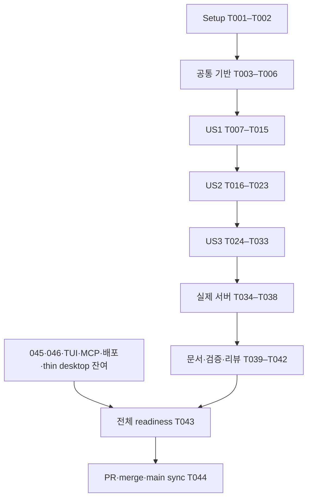

# Tasks: Rust client와 public CLI

입력: spec.md, plan.md, data-model.md, research.md, contracts/*.md, quickstart.md. 설계 bd6099c에 OCR → Codex approve 완료. macOS만 대상이며 045/046 미완료와 원 전체 전환 범위를 유지한다. 체크는 실제 구현·검증 증거가 있을 때만 갱신한다.

## Phase 1: Setup

- [x] T001 `crates/workbench-client/Cargo.toml`, `src/lib.rs`, `apps/aw-cli/Cargo.toml`, `src/main.rs`와 root `Cargo.toml`에 독립 client/CLI를 등록하고 domain/ports/application/infrastructure 경계를 만든다. production dependency에는 protocol만 공유하고 host/core/server/Tauri를 넣지 않는다.
- [x] T002 `specs/047-rust-client-cli/validation.md`에 Cargo metadata/tree, macOS host, 기존 lock의 hyper/tungstenite 및 새 standard hmac resolution 근거를 기록한다. lock은 필요한 dependency만 변경한다.

## Phase 2: 공통 기반

- [x] T003 `crates/workbench-client/tests/limits.rs`에 nonzero bounds, body/input/frame/queue exact/+1, duration overflow fixture를 먼저 작성하고 `src/domain/limits.rs`에 validated limits를 구현한다.
- [x] T004 `crates/workbench-client/tests/attempt.rs`에 unknown/retry/epoch/immutable input/key/generation 및 stale completion fixture를 먼저 작성하고 `src/domain/attempt.rs`에 attempt state와 full outcome을 구현한다. Applied/Unknown/NotApplied를 혼동하지 않는다.
- [x] T005 `crates/workbench-client/tests/admission.rs`와 `src/application/admission.rs`에 catalog 전체 operation classification과 closed production allowlist, agent owner fallback0, missing045/046 gate 및 generic/explicit command parity를 구현한다. 새 operation은 기본 거절한다.
- [x] T006 `crates/workbench-client/src/ports/mod.rs`에 verified connection/credential, call transport, retry-store CAS, event consumer와 snapshot port를 정의하고 `tests/reuse.rs`의 독립 fixture consumer로 재사용을 확인한다. secret/private payload는 Debug에 노출하지 않는다.

## Phase 3: US1 안전한 기존 서버 호출 (P1)

독립 검증: 격리 loopback peer의 identity/credential, full fault/replay, replacement/cancellation fixtures. 실제 서버 검증은 T035–T038도 필요하다.

- [x] T007 [P] [US1] `crates/workbench-client/tests/locator.rs`에 symlink/부모 경로/uid/mode/type/size/replacement 및 agent descriptor fallback 거절 시험을 먼저 작성한다.
- [ ] T008 [P] [US1] `crates/workbench-client/tests/identity.rs`에 literal HMAC golden vector와 원 host 비교, identify 실패 credential0, proof 뒤 socket close/replacement 및 WS socket proof 시험을 먼저 작성한다.
- [x] T009 [US1] `crates/workbench-client/src/infrastructure/locator.rs`에 readonly no-follow FD descriptor read, loopback IP URL validation, protocol/storage compatibility, missing server unavailable을 구현한다. spawn/ensure/migrate 없음.
- [x] T010 [US1] `crates/workbench-client/src/infrastructure/identity.rs`에 standard hmac/sha2 proof verification과 redacted secret type을 구현한다. owner token은 credential provider 밖의 diagnostics에 넣지 않는다.
- [x] T011 [US1] `crates/workbench-client/src/infrastructure/http.rs`에 owned TCP HTTP1 sender/driver, same-socket identify→handshake→call, 새 socket fresh proof, proxy/redirect/automatic retry0 및 bounded headers/body/deadline을 구현한다.
- [x] T012 [P] [US1] `crates/workbench-client/tests/call_protocol.rs`에 malformed/status/requestId/kind/oversize/unknown body 및 full fault details/revision/replayed 보존 fixtures를 작성한다.
- [x] T013 [US1] `crates/workbench-client/src/application/call.rs`에 catalog input validation과 admission, exact request identity, typed protocol/transport failures, explicit retry 및 401/epoch 정책을 구현한다. timeout/local cancel 뒤 자동 server cancel0.
- [x] T014 [US1] `crates/workbench-client/tests/http_lifecycle.rs`에 slow headers/body, failed handshake, dropped caller, connect/proof/call cancellation과 driver/socket bounded settle를 검증한다.
- [x] T015 [US1] `crates/workbench-client/tests/call_retry.rs`에 response-loss same-key effect1, new epoch resubmit0, old generation completion0과 independent consumer parity를 검증한다.

## Phase 4: US2 machine CLI와 durable retry (P1)

독립 검증: CLI subprocess stdout/stderr/exit golden, private retry file crash/reopen/CAS 및 no raw payload diagnostics.

- [ ] T016 [P] [US2] `apps/aw-cli/tests/finite.rs`에 finite result/error envelope, 모든 exit family, stdin limits/UTF8/schema, secret sentinel, command alias parity golden을 먼저 작성한다.
- [x] T017 [P] [US2] `crates/workbench-client/tests/retry_store.rs`에 pre-send persistence failure=request0, fsync/crash-before-output/reopen, no-follow/owner/mode/size, cross-process CAS/active attempt 경쟁 fixtures를 먼저 작성한다.
- [x] T018 [US2] `crates/workbench-client/src/infrastructure/retry_store.rs`에 caller runtime-control 전용 private retry state, immutable input/key/operation/protocol/instance/epoch와 durable atomic publish/CAS를 구현한다. server user-data store와 분리한다.
- [x] T019 [US2] `apps/aw-cli/src/inbound.rs`에 operations/project list/run start/watch/cancel/server status/call/events watch parsing 및 bounded stdin을 구현한다. token/prompt/goal argv를 받지 않는다.
- [x] T020 [US2] `apps/aw-cli/src/application.rs`에 explicit/generic 동일 admission과 request projection, first-send retry-state publish, --retry-state exact replay 및 mismatched key/input/epoch 전송0을 연결한다.
- [x] T021 [US2] `apps/aw-cli/src/infrastructure/output.rs`에 safe finite output/error projection, full library outcome 보존과 stdout contamination0, bounded human stderr를 구현한다. arbitrary fault details/private fingerprint를 console로 dump하지 않는다.
- [x] T022 [US2] `apps/aw-cli/tests/cancellation.rs`와 `src/main.rs`에 SIGINT130, local deadline, broken pipe, malformed input의 bounded exit와 implicit server cancel0을 검증한다. panic/dependency logs의 stdout 혼합0을 확인한다.
- [x] T023 [US2] `apps/aw-cli/tests/retry_process.rs`에 실제 CLI 연속 invocation의 same-key replay, unknown crash/reopen, epoch change 및 concurrent completion CAS를 검증한다.

## Phase 5: US3 applied cursor와 event recovery (P2)

독립 검증: TS transition fixtures와 controlled WS peer, 지연 소비/gap/재바인딩/epoch/취소 race. 실제 CLI JSONL은 T033/T038에서 검증한다.

- [x] T024 [P] [US3] `crates/workbench-client/tests/event_reducer.rs`에 received/applied 분리, all-consumer minimum, unregister/failure/old promise, same revision different sequence 및 binding replacement fixtures를 먼저 작성한다.
- [ ] T025 [P] [US3] `crates/workbench-client/tests/recovery.rs`에 live-first hello→snapshot→reset→buffer filtering, snapshot 실패/new gap/new epoch, stale generation과 backoff exhausted fixtures를 먼저 작성한다. 원 `packages/workbench-client` race fixture를 대조한다.
- [x] T026 [US3] `crates/workbench-client/src/domain/events.rs`에 stream/epoch/consumer generation과 ACK reducer, non-retaining worktree resnapshot 및 retained stream replay 정책을 구현한다.
- [ ] T027 [US3] `crates/workbench-client/src/application/events.rs`에 live-first bounded recovery, snapshot port, cancellation/task ownership과 consumer failure/reset를 연결한다.
- [ ] T028 [US3] `crates/workbench-client/src/infrastructure/websocket.rs`에 ticket POST, 별도 owned TCP의 identify proof 뒤 같은 socket upgrade, hello identity/cursor 검증과 message/frame/queue limits를 구현한다. URL credential·ticket diagnostics 금지.
- [ ] T029 [US3] `crates/workbench-client/tests/ws_protocol.rs`에 wrong hello, ticket expiry, fragmented oversize, queue pressure, unknown schema/stream, disconnect 및 max attempts fixtures를 검증한다.
- [ ] T030 [US3] `apps/aw-cli/src/application.rs`와 `src/infrastructure/output.rs`에 events watch/run watch 공통 JSONL consumer를 연결하고 complete newline write 이후만 ACK한다. open 전 finite error, open 뒤 stream.end/exit contract를 지킨다.
- [ ] T031 [US3] `apps/aw-cli/tests/stream_output.rs`에 partial write/broken pipe/slow output/SIGINT, unknown frame, same revision 두 event, old generation 완료의 ACK0 및 bounded shutdown을 검증한다.
- [ ] T032 [US3] `crates/workbench-client/tests/event_ordering.rs`에 contracts/client.md D-C2의 reply-before-events/events-before-reply를 barrier로 강제하고 bootstrap s,r→runtimeReconciled s+1,r+1→notificationRecovery s+2,r+1 exact 결과를 검증한다.
- [ ] T033 [US3] `apps/aw-cli/tests/stream_process.rs`에 실제 aw subprocess stdin cursor, bootstrap 및 두 event stdout JSONL, stream.end/exit130/reap와 independent fixture consumer parity를 검증한다.

## Phase 6: 실제 서버 통합과 전체 완료 조건

- [ ] T034 `apps/aw-cli/tests/support/process_guard.rs`에 private temp data/control root, startup deadline, cancel/panic/error kill+bounded wait/reap fixture ownership을 구현하고 `specs/047-rust-client-cli/validation.md`에 cleanup 실패도 기록한다.
- [ ] T035 `scripts/test-workbench-client-wire.sh`에서 exact merged044 `20fcd5fdcf633ae06792d51a9b963e3857909440` 소스의 실제 server binary를 별도 build directory에서 빌드하고 commit/artifact SHA를 기록한다. 현 branch binary를 옛 binary로 위장하지 않는다.
- [ ] T036 `apps/aw-cli/tests/actual_server.rs`에 명시적 private server1회 시작과 Rust client/aw subprocess identity→handshake→system.describe/project.list→project CRUD/same-key replay를 검증한다. CLI 자동 daemon ensure0.
- [ ] T037 `apps/aw-cli/tests/actual_server.rs`에 bench.open→empty bootstrap의 Main1/currentRunId null/active generation null 및 tasks/generations/reports/commands/notifications/dispatch0/in-flight0을 확인한다. nonempty면 recover0/fail, generic production recover는 gate 유지.
- [ ] T038 `apps/aw-cli/tests/actual_server.rs`에 실제 events watch subprocess로 반환 eventStreamId/epoch/cursor0을 보내 bootstrap JSONL 뒤 empty recover를1회 실행한다. D-C2/D-C3/D-C4의 두 exact event ACK, HTTP reply, 최종 snapshot r+1 및 agent/child launch0·user root 접근0·server/CLI 잔존0 증거를 수집한다.
- [ ] T039 `docs/workbench-rust-client-cli.md`에 명령/오류/retry/recovery/권한/지원 범위와 pending gate를 한국어 및 Mermaid로 문서화하고 `specs/047-rust-client-cli/quickstart.md`를 실제 명령으로 갱신한다.
- [ ] T040 `specs/047-rust-client-cli/validation.md`에 client/CLI tests와 strict clippy, affected protocol/host/server/AW Rust checks 및 TS consumer 회귀의 실제 명령/exit/test 수를 기록한다. 변경 없는 경로는 검증 N/A 근거를 명시한다.
- [ ] T041 `specs/047-rust-client-cli/review-ledger.md`에 구현 전체 diff OCR delegate→Codex adversarial --wait 순차 리뷰와 valid findings 수정/재검증을 기록한다.
- [ ] T042 `specs/047-rust-client-cli/validation.md`에 최종 root package.json 8단계 gate와 exact HEAD를 기록한다. 실행하지 않은 macOS14+/signed bundle/desktop-CLI-TUI matrix를 PASS로 표시하지 않는다.
- [ ] T043 `specs/047-rust-client-cli/validation.md`에 FR019/020·SC006의 045/046 prerequisites, 실제 desktop 종료 후 run 관찰/취소, TUI/MCP, signed CALVER packaging/update와 desktop business fallback 제거의 전체 roadmap 검증 근거를 연결한다. 미완료면 전체 readiness/047 final merge 완료로 선언하지 않는다.
- [ ] T044 `specs/047-rust-client-cli/review-ledger.md`에 최종 PR/CI, origin/main squash merge, main checkout 및 pull 증거를 남긴다. 선행 gate 미완료 상태를 foundation-only 완료로 축소하지 않는다.

## 의존성과 실행 전략

최초 검증 단위는 US1이며 전체 완료 범위를 줄이는 MVP release가 아니다. US2 parser/renderer fixture는 US1 network 완성을 기다리지 않고 fake port로 검증 가능하지만 최종 composition은 US1을 필요로 한다. US3 reducer는 공통 기반 뒤 독립 검증할 수 있고 CLI 결합은 US2 뒤다. 각 phase 내 시험을 먼저 실행해 실패를 확인한 뒤 구현한다. [P]는 서로 다른 파일의 독립 작업 가능성을 표시하며 실제 실행은 현재 Herdr pane에서 순차 수행한다.

병렬 가능 예: US1 T007(locator)과 T008(identity), US2 T016(output)과 T017(retry store), US3 T024(ACK)와 T025(recovery). 이를 이유로 사용자 지정 실행 위치나 리뷰 순서를 바꾸지 않는다.

요구사항 대응: FR001–006/015–016은 T004–T015, FR007–011은 T016–T023, FR012–014/017은 T024–T033, FR018–021 및 SC006–007은 T034–T044. SC001=T007–T014, SC002=T016/T021/T022, SC003=T004/T015/T017/T023, SC004=T024–T033, SC005=T014/T022/T029/T031/T034. 미완료 prerequisites는 완료 task로 세지 않는다.

## US2 checkpoint 상태 (2026-09-29)

T018–T021/T023의 private store·finite CLI·실제 subprocess retry는 validation.md의85개/exit0 근거로 체크했다. T016은 reachable fault14종과 SIGINT/deadline/usage/출력 오류를 검증했으나 cancel-rejected6은 production RunCancel gate가 닫혀 있어 실제 proof가 없다. T017은 최초/CAS fsync/rename 경계 오류 주입 및 CLI가 공유하는 publish-before-send use case의 owned HTTP command0 연결까지 검증했다. T022는 동일 production hook을 쓰는 격리 test subprocess의 실제 panic/JSON1/exit1/raw sentinel0/bounded reap까지 추가 검증했다. T008 WS proof와 T024 이후 event/actual server/전체 readiness는 미완료다.

T024/T026 reducer13개는 received/applied·all-consumer min ACK·실패/제거/옛 delivery/reset·notification resnapshot 정책·binding/epoch 교체·같은 revision의 두 sequence와 bounded queue를 검증했다. ConsumerId/Delivery/Reset은 고유 reducer owner에 묶였다. earlier join의 live2→replay1 순서는 reducer에서 실패 재현 후 ordered queue/연속 ACK로 수정했으며, T025/T027의 async recovery/socket/snapshot 교차 시험은 별도로 남아 있다. WS나 recovery 완료로 계산하지 않는다.
